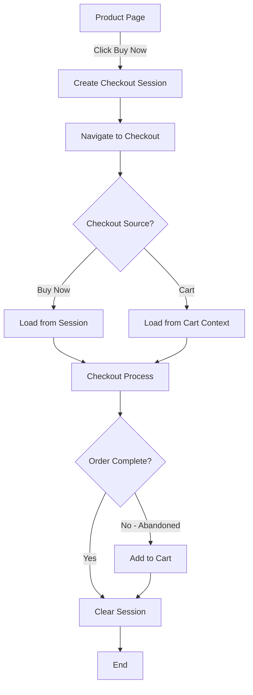
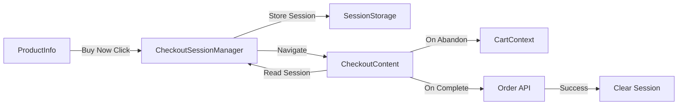

# Design Document: Buy Now Checkout

## Overview

The Buy Now Checkout feature provides a streamlined purchase flow that allows customers to bypass the shopping cart and proceed directly to checkout with a single product. This design maintains complete separation between the Buy Now flow and the traditional cart-based checkout, ensuring cart preservation throughout the process. The implementation leverages existing checkout infrastructure while introducing a new checkout session state management system to track the purchase source and handle abandoned checkout scenarios.

## Architecture

### High-Level Flow



### Component Architecture



## Components and Interfaces

### 1. Buy Now Button Component

**Location**: `frontend/app/[locale]/products/[slug]/ProductInfo.tsx`

**Modifications**:
- Add Buy Now button below Add to Cart button
- Wire button to checkout session creation
- Handle quantity validation
- Apply distinct styling

**Interface**:
```typescript
interface BuyNowButtonProps {
  product: Product;
  quantity: number;
  disabled: boolean;
  onBuyNow: () => void;
}
```

### 2. Checkout Session Manager

**Location**: `frontend/lib/checkout-session.ts` (new file)

**Purpose**: Manages temporary checkout state for Buy Now flow

**Interface**:
```typescript
interface CheckoutSession {
  source: 'buy-now' | 'cart';
  product?: {
    id: string;
    quantity: number;
  };
  createdAt: number;
}

interface CheckoutSessionManager {
  createBuyNowSession(productId: string, quantity: number): void;
  getSession(): CheckoutSession | null;
  clearSession(): void;
  isSessionExpired(): boolean;
}
```

**Implementation Details**:
- Use `sessionStorage` for persistence (clears on tab close)
- Session expires after 30 minutes of inactivity
- Automatically clear on order completion
- Detect abandonment via route changes

### 3. Modified Checkout Content Component

**Location**: `frontend/app/[locale]/checkout/CheckoutContent.tsx`

**Modifications**:
- Detect checkout source on mount
- Load product data for Buy Now flow AFTER authentication check completes
- Skip cart clearing for Buy Now orders
- Handle abandoned checkout detection
- Ensure authentication check happens before Buy Now product loading

**New State**:
```typescript
interface CheckoutState {
  source: 'buy-now' | 'cart';
  buyNowProduct?: {
    product: Product;
    quantity: number;
  };
  // ... existing state
}
```

**Critical Fix**:
The Buy Now product loading must wait for authentication check to complete. If the user is not authenticated, the authentication redirect should take precedence over any Buy Now error handling.

### 4. Abandoned Checkout Handler

**Location**: `frontend/hooks/useAbandonedCheckout.ts` (new file)

**Purpose**: Detect and handle checkout abandonment

**Interface**:
```typescript
interface UseAbandonedCheckoutOptions {
  enabled: boolean;
  productId?: string;
  quantity?: number;
  onAbandon: (productId: string, quantity: number) => void;
}

function useAbandonedCheckout(options: UseAbandonedCheckoutOptions): void;
```

**Detection Strategy**:
- Listen to route changes via Next.js router
- Trigger on navigation away from checkout
- Exclude navigation to order confirmation
- Use `beforeunload` event for browser close/refresh

## Data Models

### Checkout Session Storage Schema

```typescript
// Stored in sessionStorage under key: 'checkout-session'
{
  source: 'buy-now' | 'cart',
  product?: {
    id: string,
    quantity: number
  },
  createdAt: number, // Unix timestamp
  expiresAt: number  // Unix timestamp
}
```

### Modified Order Creation Data

No changes to the existing `CreateOrderData` interface. Buy Now orders use the same structure as cart-based orders:

```typescript
interface CreateOrderData {
  email: string;
  shippingAddressId: string;
  billingAddressId: string;
  shippingMethod: string;
  shippingCost: number;
  paymentMethod: string;
  items: CreateOrderItem[]; // Single item for Buy Now
  promotionCode?: string;
  promotionId?: string;
  notes?: string;
  locale?: 'en' | 'vi';
}
```

## Correctness Properties

*A property is a characteristic or behavior that should hold true across all valid executions of a system—essentially, a formal statement about what the system should do. Properties serve as the bridge between human-readable specifications and machine-verifiable correctness guarantees.*

### Property 1: Translation Completeness

*For any* Buy Now related translation key, both English ('en') and Vietnamese ('vi') translations should exist and be non-empty.

**Validates: Requirements 1.3, 9.1, 9.2**

### Property 2: Button Stock Independence

*For any* product regardless of stock quantity (positive, zero, or negative), the Buy Now button should remain enabled.

**Validates: Requirements 1.4, 7.1, 7.3**

### Property 3: Quantity Respect

*For any* valid quantity value selected in the quantity selector, clicking Buy Now should create a checkout session with that exact quantity.

**Validates: Requirements 1.5, 2.2**

### Property 4: Invalid Quantity Prevention

*For any* invalid quantity value (zero, negative, or non-numeric), the system should prevent Buy Now checkout initiation.

**Validates: Requirements 2.4**

### Property 5: Session Creation and Data Storage

*For any* Buy Now button click with valid quantity, a checkout session should be created with source='buy-now', the correct product ID, and the selected quantity.

**Validates: Requirements 2.2, 2.3, 10.2**

### Property 6: Cart Preservation

*For any* Buy Now checkout flow (from initiation through completion or abandonment), the cart contents should remain identical to the pre-checkout state, and the cart should not be cleared after order completion.

**Validates: Requirements 3.1, 3.2, 3.3**

### Property 7: Promotion Validation

*For any* valid promotion code applied during Buy Now checkout, the system should validate it against the Buy Now product and apply the discount correctly.

**Validates: Requirements 4.3, 4.6**

### Property 8: Shipping Cost Calculation

*For any* Buy Now product and shipping address combination, the shipping cost should be calculated using the same logic as cart-based checkout.

**Validates: Requirements 4.4**

### Property 9: Order Total Accuracy

*For any* Buy Now checkout, the order total should equal (product price × quantity) + shipping cost + tax - discount amount.

**Validates: Requirements 4.5**

### Property 10: Order Structure Consistency

*For any* completed Buy Now order, the order structure should be identical to a cart-based order with a single item, with no special flags or distinguishing fields.

**Validates: Requirements 5.1, 5.2**

### Property 11: Abandoned Checkout Cart Addition

*For any* Buy Now checkout that is abandoned (user navigates away without completing), the product should be added to the cart with the originally selected quantity, and if the product already exists in the cart, the quantity should be increased by the Buy Now amount.

**Validates: Requirements 6.1, 6.2, 6.3**

### Property 12: Successful Checkout No Cart Addition

*For any* Buy Now checkout that completes successfully, the product should NOT be added to the cart.

**Validates: Requirements 6.4**

### Property 13: Error Message Translation

*For any* error that occurs during Buy Now flow, the error message should be displayed in the user's selected language (English or Vietnamese).

**Validates: Requirements 9.4**

### Property 14: Session Source Determination

*For any* checkout page load, the system should correctly determine whether the checkout source is 'buy-now' or 'cart' from the checkout session.

**Validates: Requirements 10.1, 10.3**

### Property 15: Session Cleanup

*For any* checkout session that reaches completion (order created) or abandonment (navigation away), the session should be cleared from storage.

**Validates: Requirements 10.4**

## Error Handling

### Product Availability Errors

**Scenario**: Product becomes unavailable during checkout
**Handling**:
- Display error message in user's language
- Prevent order completion
- Keep session active for retry
- Do NOT add to cart automatically

### Session Expiration

**Scenario**: Checkout session expires (30 minutes)
**Handling**:
- Redirect to product page
- Display expiration message
- Clear expired session
- Suggest adding to cart instead

### Order Creation Failures

**Scenario**: Backend order creation fails
**Handling**:
- Display specific error message
- Keep checkout state intact
- Allow user to retry
- Do NOT clear session on failure
- Do NOT add to cart on failure

### Navigation Errors

**Scenario**: User navigates away during checkout
**Handling**:
- Detect via router events
- Add product to cart
- Clear session
- Show confirmation toast (optional)

### Storage Unavailability

**Scenario**: sessionStorage is disabled or unavailable
**Handling**:
- Fall back to in-memory storage
- Display warning about session persistence
- Feature remains functional within single page session

## Testing Strategy

### Unit Tests

**Focus Areas**:
- Checkout session manager CRUD operations
- Session expiration logic
- Abandoned checkout detection logic
- Button state management
- Translation key existence

**Example Tests**:
```typescript
describe('CheckoutSessionManager', () => {
  it('should create a buy-now session with correct data', () => {
    // Test session creation
  });

  it('should detect expired sessions', () => {
    // Test expiration logic
  });

  it('should clear session on demand', () => {
    // Test cleanup
  });
});

describe('useAbandonedCheckout', () => {
  it('should trigger onAbandon when navigating away', () => {
    // Test abandonment detection
  });

  it('should NOT trigger onAbandon when completing order', () => {
    // Test completion path
  });
});
```

### Property-Based Tests

**Configuration**: Minimum 100 iterations per test

**Property Test 1: Cart Preservation**
```typescript
// Feature: buy-now-checkout, Property 3: Cart Preservation During Buy Now
test('cart contents remain unchanged throughout Buy Now flow', () => {
  // Generate random cart state
  // Generate random product and quantity
  // Execute Buy Now flow
  // Assert cart unchanged
});
```

**Property Test 2: Session Round-Trip**
```typescript
// Feature: buy-now-checkout, Property 2: Checkout Session Creation
test('session data round-trips correctly', () => {
  // Generate random product ID and quantity
  // Create session
  // Retrieve session
  // Assert data matches
});
```

**Property Test 3: Order Structure Consistency**
```typescript
// Feature: buy-now-checkout, Property 5: Order Structure Consistency
test('Buy Now orders match cart-based order structure', () => {
  // Generate random product
  // Create Buy Now order
  // Create equivalent cart-based order
  // Assert structures are identical
});
```

**Property Test 4: Abandoned Checkout Behavior**
```typescript
// Feature: buy-now-checkout, Property 6: Abandoned Checkout Cart Addition
test('abandoned checkouts add product to cart', () => {
  // Generate random product and quantity
  // Start Buy Now flow
  // Simulate abandonment
  // Assert product added to cart with correct quantity
});
```

**Property Test 5: Translation Coverage**
```typescript
// Feature: buy-now-checkout, Property 10: Translation Completeness
test('all Buy Now text has both language translations', () => {
  // Generate list of all Buy Now translation keys
  // For each key, assert 'en' and 'vi' exist
  // Assert translations are non-empty
});
```

### Integration Tests

**Focus Areas**:
- End-to-end Buy Now flow
- Cart preservation across flow
- Abandoned checkout handling
- Order creation with single item
- Multi-language support

**Test Scenarios**:
1. Complete Buy Now purchase (authenticated user)
2. Complete Buy Now purchase (guest user)
3. Abandon Buy Now checkout
4. Buy Now with promotion code
5. Buy Now with zero-price product
6. Buy Now with out-of-stock product
7. Session expiration during checkout
8. Browser refresh during checkout

### Manual Testing Checklist

- [ ] Buy Now button appears with correct styling
- [ ] Buy Now respects quantity selector
- [ ] Checkout loads with single product
- [ ] Cart remains unchanged during checkout
- [ ] Order completes successfully
- [ ] Cart not cleared after Buy Now order
- [ ] Abandoned checkout adds to cart
- [ ] Successful checkout does NOT add to cart
- [ ] Works for authenticated users
- [ ] Works for guest users
- [ ] Works with promotions
- [ ] Works with zero-price products
- [ ] Works with out-of-stock products
- [ ] All text displays in English
- [ ] All text displays in Vietnamese
- [ ] Session persists across page refresh
- [ ] Session clears after completion
- [ ] Session clears after abandonment

## Implementation Notes

### Styling Guidelines

**Buy Now Button**:
- Use green color scheme (vs blue for Add to Cart)
- Slightly larger or bolder text
- Position directly below Add to Cart
- Maintain same width as Add to Cart
- Use consistent border radius and padding

**Example**:
```tsx
<button className="w-full bg-green-600 text-white py-3 px-6 rounded-md font-semibold hover:bg-green-700 transition-colors disabled:opacity-50 disabled:cursor-not-allowed">
  {t('product.buyNow')}
</button>
```

### Translation Keys

**New Keys Required**:
```json
{
  "product": {
    "buyNow": {
      "en": "Buy Now",
      "vi": "Mua Ngay"
    },
    "buyingNow": {
      "en": "Processing...",
      "vi": "Đang xử lý..."
    }
  },
  "checkout": {
    "buyNowCheckout": {
      "en": "Buy Now Checkout",
      "vi": "Thanh toán Mua Ngay"
    },
    "sessionExpired": {
      "en": "Your checkout session has expired. Please try again.",
      "vi": "Phiên thanh toán của bạn đã hết hạn. Vui lòng thử lại."
    },
    "addedToCartOnAbandon": {
      "en": "Product added to your cart",
      "vi": "Sản phẩm đã được thêm vào giỏ hàng"
    }
  }
}
```

### Performance Considerations

- Use `sessionStorage` instead of `localStorage` for automatic cleanup
- Lazy load product data only when needed
- Reuse existing checkout components (no duplication)
- Minimize re-renders by using proper React memoization
- Cache product data during checkout session

### Security Considerations

- Validate product ID and quantity on backend
- Prevent session tampering via client-side validation
- Use same authentication checks as cart checkout
- Validate stock availability at order creation time
- Rate limit order creation API

### Accessibility Considerations

- Buy Now button must have proper ARIA labels
- Keyboard navigation support
- Screen reader announcements for state changes
- Focus management during navigation
- Error messages must be announced

### Browser Compatibility

- `sessionStorage` is supported in all modern browsers
- Fallback to in-memory storage if unavailable
- Test in Chrome, Firefox, Safari, Edge
- Mobile browser support (iOS Safari, Chrome Mobile)

## Migration and Rollout

### Phase 1: Core Implementation
- Implement checkout session manager
- Add Buy Now button to ProductInfo
- Modify CheckoutContent to support both sources
- Add translations

### Phase 2: Abandonment Handling
- Implement abandoned checkout detection
- Wire up cart addition logic
- Add user notifications

### Phase 3: Testing and Polish
- Complete unit and integration tests
- Manual testing across browsers
- Performance optimization
- Accessibility audit

### Phase 4: Deployment
- Deploy to staging environment
- User acceptance testing
- Monitor error rates and performance
- Deploy to production

### Rollback Plan

If issues arise:
1. Feature flag to disable Buy Now button
2. Remove button from ProductInfo component
3. Existing cart checkout remains unaffected
4. No data migration needed (sessions are temporary)

## Future Enhancements

### Potential Improvements

1. **Buy Now from Category Pages**: Add Buy Now to product cards
2. **Quick Buy Modal**: Inline checkout without navigation
3. **Buy Now Analytics**: Track conversion rates vs cart checkout
4. **Saved Payment Methods**: One-click Buy Now for returning customers
5. **Buy Now Bundles**: Purchase multiple related products together
6. **Express Checkout**: Skip address entry for returning customers

### Technical Debt Considerations

- Consider moving to a more robust state management solution (Redux, Zustand) if Buy Now expands
- Evaluate backend session storage for cross-device support
- Consider WebSocket for real-time stock updates during checkout
- Evaluate server-side session management for better security
