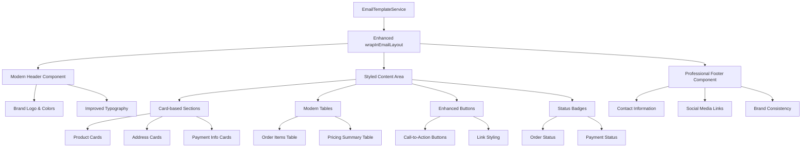

# Design Document

## Overview

This design enhances the visual appeal and user experience of all email templates in the AlaCraft e-commerce application. The enhancement focuses on modernizing the HTML email formatting with improved typography, color schemes, spacing, visual elements, and responsive design while maintaining excellent compatibility across email clients.

The design builds upon the existing email infrastructure and EmailTemplateService, enhancing the `wrapInEmailLayout()` method and introducing new styling components, design systems, and visual elements that create a premium, professional appearance consistent with the AlaCraft brand.

Key improvements include:
- Modern typography hierarchy with improved readability
- Enhanced color palette with brand-consistent colors
- Card-based layouts with subtle shadows and rounded corners
- Improved button and call-to-action design
- Better spacing and visual hierarchy
- Accessibility compliance with WCAG 2.1 AA standards
- Cross-client compatibility with progressive enhancement

## Architecture



## Components and Interfaces

### 1. Enhanced EmailTemplateService

**Purpose**: Generate modern, visually appealing HTML email templates

**Enhanced Interface**:
```typescript
interface ModernEmailStyles {
  colors: {
    primary: string;      // #2c3e50 (dark blue-gray)
    secondary: string;    // #3498db (bright blue)
    accent: string;       // #e74c3c (red for important items)
    success: string;      // #27ae60 (green for success states)
    warning: string;      // #f39c12 (orange for warnings)
    background: string;   // #f8f9fa (light gray background)
    cardBackground: string; // #ffffff (white cards)
    textPrimary: string;  // #2c3e50 (dark text)
    textSecondary: string; // #7f8c8d (lighter text)
    border: string;       // #ecf0f1 (light borders)
  };
  typography: {
    fontFamily: string;   // 'Segoe UI', Tahoma, Geneva, Verdana, sans-serif
    headingFont: string;  // 'Georgia', 'Times New Roman', serif
    fontSize: {
      small: string;      // 12px
      body: string;       // 14px
      large: string;      // 16px
      heading: string;    // 20px
      title: string;      // 24px
    };
    lineHeight: {
      tight: string;      // 1.2
      normal: string;     // 1.5
      relaxed: string;    // 1.7
    };
  };
  spacing: {
    xs: string;          // 4px
    sm: string;          // 8px
    md: string;          // 16px
    lg: string;          // 24px
    xl: string;          // 32px
    xxl: string;         // 48px
  };
  borderRadius: {
    small: string;       // 4px
    medium: string;      // 8px
    large: string;       // 12px
  };
  shadows: {
    subtle: string;      // 0 1px 3px rgba(0,0,0,0.1)
    medium: string;      // 0 4px 6px rgba(0,0,0,0.1)
    strong: string;      // 0 8px 15px rgba(0,0,0,0.1)
  };
}

interface EmailComponent {
  header: string;
  content: string;
  footer: string;
  styles: string;
}

interface ModernButtonStyle {
  primary: string;       // Main CTA buttons
  secondary: string;     // Secondary actions
  success: string;       // Positive actions
  warning: string;       // Caution actions
  link: string;          // Text links
}

interface StatusBadgeStyle {
  pending: string;
  processing: string;
  shipped: string;
  delivered: string;
  cancelled: string;
  refunded: string;
}
```

**New Methods**:
```typescript
class EmailTemplateService {
  // Enhanced layout wrapper with modern styling
  private wrapInModernEmailLayout(content: string, locale: 'en' | 'vi'): string;

  // Component generators
  private generateModernHeader(locale: 'en' | 'vi'): string;
  private generateModernFooter(locale: 'en' | 'vi'): string;
  private generateCardSection(title: string, content: string): string;
  private generateModernTable(headers: string[], rows: string[][]): string;
  private generateModernButton(text: string, url: string, style: 'primary' | 'secondary'): string;
  private generateStatusBadge(status: string, locale: 'en' | 'vi'): string;
  private generateProductCard(product: any, locale: 'en' | 'vi'): string;
  private generateAddressCard(address: any, title: string): string;
  private generatePaymentInfoCard(paymentInfo: any, locale: 'en' | 'vi'): string;
  private generateContactInfoCard(contactInfo: any, locale: 'en' | 'vi'): string;

  // Style generators
  private getModernStyles(): string;
  private getResponsiveStyles(): string;
  private getAccessibilityStyles(): string;
  private getDarkModeStyles(): string;
  private getPrintStyles(): string;
}
```

### 2. Modern Email Components

**Header Component**:
- Enhanced branding with improved logo placement
- Gradient background with brand colors
- Better typography for company name
- Responsive design for mobile devices

**Content Cards**:
- White background with subtle shadows
- Rounded corners for modern appearance
- Proper padding and spacing
- Visual hierarchy with improved typography

**Table Styling**:
- Alternating row colors for better readability
- Improved header styling with brand colors
- Better spacing and alignment
- Mobile-responsive design

**Button Components**:
- Modern gradient backgrounds
- Hover effects (where supported)
- Proper sizing for touch interaction
- Accessibility-compliant contrast ratios

**Status Badges**:
- Color-coded status indicators
- Rounded pill design
- Clear typography
- Semantic color meanings

## Data Models

### Enhanced Email Data Structures

```typescript
interface EnhancedOrderEmailData extends OrderEmailData {
  paymentMethod: {
    type: string;           // 'bank_transfer', 'cash_on_delivery', etc.
    displayName: string;    // Localized display name
    details?: string;       // Additional payment details
    qrCode?: string;        // QR code URL for bank transfers
    instructions?: string;  // Payment instructions
  };
  branding: {
    logoUrl?: string;
    primaryColor: string;
    secondaryColor: string;
    companyName: string;
  };
  customerPreferences: {
    locale: 'en' | 'vi';
    timezone?: string;
    currency: string;
  };
}

interface ModernEmailTemplate {
  subject: string;
  html: string;
  preheader?: string;      // Email preview text
  textVersion: string;     // Plain text fallback
  metadata: {
    templateType: string;
    version: string;
    generatedAt: Date;
  };
}
```

## Correctness Properties

*A property is a characteristic or behavior that should hold true across all valid executions of a system-essentially, a formal statement about what the system should do. Properties serve as the bridge between human-readable specifications and machine-verifiable correctness guarantees.*

### Property 1: Modern typography consistency
*For any* generated email template, the HTML should contain the specified modern font families, font sizes, and typography hierarchy elements
**Validates: Requirements 1.1**

### Property 2: Brand color consistency
*For any* generated email template, the CSS should contain the specified AlaCraft brand colors (primary, secondary, accent) throughout all styling elements
**Validates: Requirements 1.2, 2.3**

### Property 3: Spacing consistency
*For any* generated email template, the CSS should include the specified padding and margin values for improved visual breathing room
**Validates: Requirements 1.3**

### Property 4: Card-based layout structure
*For any* generated email template, content sections should be wrapped in card elements with subtle shadows and rounded corners CSS properties
**Validates: Requirements 1.4**

### Property 5: Visual elements inclusion
*For any* generated email template, the HTML should contain visual icon elements or image references to enhance user experience
**Validates: Requirements 1.5**

### Property 6: Modern button styling
*For any* email template containing buttons, the button elements should have modern CSS styling including gradients, shadows, and hover effects
**Validates: Requirements 1.6, 6.1**

### Property 7: Header branding consistency
*For any* generated email template, the header section should contain branding elements including logo, company name, and brand colors
**Validates: Requirements 2.1**

### Property 8: Background styling consistency
*For any* generated email template, the CSS should include appropriate background properties (patterns or gradients) that enhance visual appeal
**Validates: Requirements 2.2**

### Property 9: Footer completeness
*For any* generated email template, the footer section should contain contact information and social media elements
**Validates: Requirements 2.4**

### Property 10: Template consistency across types
*For any* set of different email template types, they should share common styling elements while allowing template-specific customizations
**Validates: Requirements 2.6**

### Property 11: Modern CSS techniques usage
*For any* generated email template, the CSS should contain CSS Grid and Flexbox properties with appropriate email client fallbacks
**Validates: Requirements 3.1**

### Property 12: Progressive enhancement implementation
*For any* generated email template, the CSS should contain both modern styling and fallback styles for older email clients
**Validates: Requirements 3.2**

### Property 13: Table layout optimization
*For any* email template containing tables, the table elements should have proper structure and modern CSS styling
**Validates: Requirements 3.3, 6.3**

### Property 14: Responsive design implementation
*For any* generated email template, the CSS should contain appropriate media queries for desktop, tablet, and mobile devices
**Validates: Requirements 3.4, 5.1**

### Property 15: Semantic HTML structure
*For any* generated email template, the HTML should use semantic elements and proper accessibility attributes
**Validates: Requirements 3.5, 4.3**

### Property 16: Image accessibility compliance
*For any* email template containing images, all image elements should have alt text and fallback styling
**Validates: Requirements 3.6, 4.2**

### Property 17: Color contrast compliance
*For any* generated email template, all color combinations should meet WCAG 2.1 AA contrast ratio standards
**Validates: Requirements 4.1**

### Property 18: Heading hierarchy compliance
*For any* generated email template, heading elements should follow proper semantic hierarchy (h1, h2, h3)
**Validates: Requirements 4.3**

### Property 19: Keyboard accessibility
*For any* email template containing interactive elements, those elements should have proper tabindex and focus styling
**Validates: Requirements 4.4, 4.6**

### Property 20: Minimum font size compliance
*For any* generated email template, body text elements should have font-size of at least 14px
**Validates: Requirements 4.5**

### Property 21: Cross-client compatibility
*For any* generated email template, the CSS should use email-client-safe properties and have appropriate fallbacks for major email clients
**Validates: Requirements 5.2**

### Property 22: Touch interaction sizing
*For any* email template containing interactive elements, buttons and links should have minimum dimensions appropriate for touch interaction
**Validates: Requirements 5.3**

### Property 23: Dark mode support
*For any* generated email template, the CSS should contain appropriate styling for dark mode scenarios
**Validates: Requirements 5.4**

### Property 24: Image blocking graceful degradation
*For any* email template containing images, the layout should remain functional with appropriate fallback styling when images are blocked
**Validates: Requirements 5.5**

### Property 25: Print-friendly styling
*For any* generated email template, the CSS should contain print media queries with appropriate styling for printing
**Validates: Requirements 5.6**

### Property 26: Product card layout consistency
*For any* email template displaying product information, product sections should use card-based layouts with improved presentation
**Validates: Requirements 6.2**

### Property 27: Status badge styling
*For any* email template containing status information, status elements should use color-coded badges with appropriate styling
**Validates: Requirements 6.4**

### Property 28: Contact information layout
*For any* email template containing contact information, contact sections should use modern card layouts with icons and improved typography
**Validates: Requirements 6.5**

### Property 29: Payment method completeness
*For any* email template displaying order information, the template should include all required payment method fields as shown on order confirmation pages
**Validates: Requirements 6.7**

## Error Handling

### Email Template Generation Errors
- **Fallback Styling**: If modern CSS features fail, provide table-based fallbacks
- **Image Loading Failures**: Include alt text and background colors for all images
- **Font Loading Issues**: Provide web-safe font fallbacks in font stack
- **Color Rendering Problems**: Ensure sufficient contrast with fallback colors

### Cross-Client Compatibility Issues
- **Outlook Specific**: Use VML for gradients and rounded corners in Outlook
- **Gmail Limitations**: Avoid CSS in `<head>` and use inline styles
- **Mobile Client Issues**: Test with major mobile email clients and provide fallbacks
- **Dark Mode Conflicts**: Provide appropriate dark mode overrides

### Accessibility Failures
- **Screen Reader Issues**: Ensure proper semantic structure and ARIA labels
- **Color Blindness**: Don't rely solely on color to convey information
- **Low Vision Support**: Maintain high contrast ratios and scalable text
- **Keyboard Navigation**: Ensure all interactive elements are accessible

## Testing Strategy

### Dual Testing Approach
The testing strategy combines unit testing and property-based testing to ensure comprehensive coverage of email template generation and styling.

**Unit Testing Focus**:
- Specific email template generation scenarios
- Cross-client compatibility edge cases
- Accessibility compliance verification
- Error handling and fallback behavior

**Property-Based Testing Focus**:
- Universal styling consistency across all template types
- Color contrast compliance across all color combinations
- Responsive design behavior across different viewport sizes
- Accessibility attribute presence across all templates

### Property-Based Testing Framework
- **Framework**: Use `fast-check` for TypeScript property-based testing
- **Test Configuration**: Run minimum 100 iterations per property test
- **Generator Strategy**: Create smart generators for email template data that cover edge cases
- **Validation Approach**: Parse generated HTML and verify CSS properties and structure

### Unit Testing Framework
- **Framework**: Use Jest for unit testing with jsdom for HTML parsing
- **Coverage Areas**: Template generation methods, styling helpers, error scenarios
- **Mock Strategy**: Mock external dependencies while testing core template logic
- **Assertion Strategy**: Use CSS selector-based assertions to verify styling

### Cross-Client Testing
- **Email Client Testing**: Test templates in major email clients (Gmail, Outlook, Apple Mail)
- **Device Testing**: Verify responsive behavior on desktop, tablet, and mobile
- **Accessibility Testing**: Use automated tools to verify WCAG compliance
- **Performance Testing**: Ensure templates load quickly and render efficiently

### Testing Requirements
- Each correctness property must be implemented by a single property-based test
- Property-based tests must be tagged with format: '**Feature: email-html-formatting-enhancement, Property {number}: {property_text}**'
- Tests must run minimum 100 iterations to ensure statistical confidence
- Unit tests must cover specific examples and edge cases not covered by properties
- All tests must validate real functionality without mocks for core logic