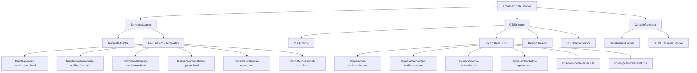
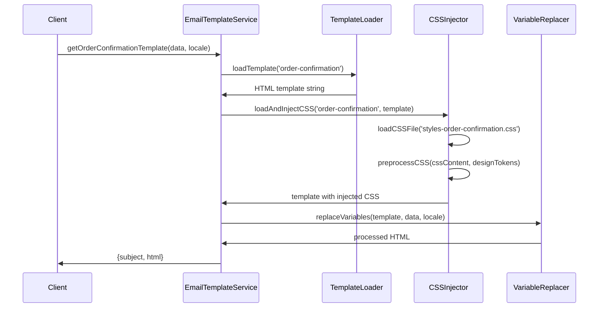

# Design Document: Email Template File System

## Overview

This design document outlines the refactoring of the existing `EmailTemplateService` from programmatic TypeScript HTML generation to a file-based template system with separate CSS design files. The new architecture will use Handlebars.js as the template engine to process HTML template files with variable placeholders, and a CSS injection system to load and apply styling from separate CSS design files, maintaining backward compatibility while improving maintainability and allowing non-developers to modify both email templates and their styling.

The refactoring will preserve all existing functionality, including the sophisticated design system, accessibility features, and email client compatibility, while moving the HTML structure from TypeScript code into separate template files.

## Architecture

### High-Level Architecture



### Template Processing Flow



## Components and Interfaces

### 1. TemplateLoader

**Responsibility**: Load and cache HTML template files from the file system.

```typescript
interface ITemplateLoader {
  loadTemplate(templateName: string): Promise<string>;
  reloadTemplates(): Promise<void>;
  templateExists(templateName: string): boolean;
}

class TemplateLoader implements ITemplateLoader {
  private templateCache: Map<string, string> = new Map();
  private readonly templatesPath: string;
  private readonly isDevelopment: boolean;

  constructor(
    templatesPath: string = 'src/notifications/templates',
    isDevelopment: boolean = process.env.NODE_ENV === 'development'
  ) {}

  async loadTemplate(templateName: string): Promise<string> {
    // Implementation details in tasks
  }

  async reloadTemplates(): Promise<void> {
    // Clear cache and reload all templates
  }

  templateExists(templateName: string): boolean {
    // Check if template file exists
  }
}
```

### 2. VariableReplacer

**Responsibility**: Process templates with Handlebars.js and replace variables with actual data.

```typescript
interface IVariableReplacer {
  replaceVariables(
    template: string,
    data: any,
    locale: 'en' | 'vi'
  ): Promise<string>;
  registerHelper(name: string, helper: Function): void;
}

class VariableReplacer implements IVariableReplacer {
  private handlebars: typeof Handlebars;
  private htmlEscapingService: HTMLEscapingService;

  constructor(htmlEscapingService: HTMLEscapingService) {
    this.handlebars = Handlebars.create();
    this.registerDefaultHelpers();
  }

  async replaceVariables(
    template: string,
    data: any,
    locale: 'en' | 'vi'
  ): Promise<string> {
    // Compile template and execute with data
  }

  registerHelper(name: string, helper: Function): void {
    // Register custom Handlebars helpers
  }

  private registerDefaultHelpers(): void {
    // Register built-in helpers for common operations
  }
}
```

### 3. CSSInjector

**Responsibility**: Load CSS design files, preprocess them with design tokens, and inject them into templates.

```typescript
interface ICSSInjector {
  loadAndInjectCSS(templateName: string, template: string): Promise<string>;
  loadCSSFile(cssFileName: string): Promise<string>;
  preprocessCSS(cssContent: string, designTokens: any): string;
  reloadCSS(): Promise<void>;
}

class CSSInjector implements ICSSInjector {
  private cssCache: Map<string, string> = new Map();
  private readonly stylesPath: string;
  private readonly isDevelopment: boolean;
  private readonly designTokens: any;

  constructor(
    stylesPath: string = 'src/notifications/styles',
    designTokens: any,
    isDevelopment: boolean = process.env.NODE_ENV === 'development'
  ) {}

  async loadAndInjectCSS(templateName: string, template: string): Promise<string> {
    // Load CSS file, preprocess with design tokens, inject into template
  }

  async loadCSSFile(cssFileName: string): Promise<string> {
    // Load and cache CSS file from file system
  }

  preprocessCSS(cssContent: string, designTokens: any): string {
    // Replace design token placeholders with actual values
  }

  async reloadCSS(): Promise<void> {
    // Clear CSS cache and reload all CSS files
  }
}
```

### 4. Refactored EmailTemplateService

**Responsibility**: Orchestrate template loading, CSS injection, processing, and maintain backward compatibility.

```typescript
@Injectable()
export class EmailTemplateService {
  constructor(
    private readonly templateLoader: TemplateLoader,
    private readonly variableReplacer: VariableReplacer,
    private readonly cssInjector: CSSInjector,
    private readonly htmlEscapingService: HTMLEscapingService
  ) {}

  async getOrderConfirmationTemplate(
    data: OrderEmailData,
    locale: 'en' | 'vi' = 'en'
  ): Promise<{ subject: string; html: string }> {
    // Load template, inject CSS, replace variables
  }

  async getAdminOrderNotificationTemplate(
    data: AdminOrderEmailData,
    locale: 'en' | 'vi' = 'en'
  ): Promise<{ subject: string; html: string }> {
    // Load template, inject CSS, replace variables
  }

  // ... other template methods
}
```

## Data Models

### Template Context Data

The template context will include all the existing data interfaces plus additional helper data:

```typescript
interface TemplateContext {
  // Original data (OrderEmailData, AdminOrderEmailData, etc.)
  data: any;

  // Locale-specific translations
  translations: {
    [key: string]: string;
  };

  // Design system tokens
  designTokens: {
    colors: typeof MODERN_EMAIL_STYLES.colors;
    typography: typeof MODERN_EMAIL_STYLES.typography;
    spacing: typeof MODERN_EMAIL_STYLES.spacing;
    // ... other design tokens
  };

  // Utility functions available in templates
  helpers: {
    formatCurrency: (amount: number, locale: string) => string;
    formatDate: (date: string, locale: string) => string;
    generateButton: (text: string, url: string, style: string) => string;
    generateStatusBadge: (status: string, locale: string) => string;
  };
}
```

### Template File Structure

Each template file will follow this structure:

```html
<!DOCTYPE html>
<html lang="{{locale}}" xmlns="http://www.w3.org/1999/xhtml">
<head>
  <meta charset="UTF-8">
  <meta name="viewport" content="width=device-width, initial-scale=1.0">
  <title>{{translations.emailTitle}}</title>
  <style type="text/css">
    {{{injectedCSS}}}
  </style>
</head>
<body>
  <div class="email-container">
    <!-- Template-specific content with variables -->
    <h1>{{translations.greeting}} {{data.customerName}}</h1>

    {{#if data.orderNumber}}
      <p>{{translations.orderNumber}}: {{data.orderNumber}}</p>
    {{/if}}

    {{#each data.items}}
      <div class="item">
        <span>{{this.name}}</span>
        <span>{{helpers.formatCurrency this.price ../locale}}</span>
      </div>
    {{/each}}

    {{{helpers.generateButton translations.viewOrder data.orderUrl 'primary'}}}
  </div>
</body>
</html>
```

### CSS Design File Structure

Each CSS design file will follow this structure:

```css
/* styles-order-confirmation.css */

/* Design token placeholders that will be replaced during preprocessing */
:root {
  --primary-color: {{designTokens.colors.primary}};
  --secondary-color: {{designTokens.colors.secondary}};
  --font-family: {{designTokens.typography.fontFamily}};
  --font-size-base: {{designTokens.typography.fontSize.base}};
  --spacing-md: {{designTokens.spacing.md}};
}

/* Email-specific styles */
.email-container {
  font-family: var(--font-family);
  font-size: var(--font-size-base);
  max-width: 600px;
  margin: 0 auto;
  padding: var(--spacing-md);
}

.item {
  display: flex;
  justify-content: space-between;
  padding: var(--spacing-md) 0;
  border-bottom: 1px solid #eee;
}

/* Button styles specific to this template */
.btn-primary {
  background-color: var(--primary-color);
  color: white;
  padding: 12px 24px;
  text-decoration: none;
  border-radius: 4px;
  display: inline-block;
  font-weight: bold;
}

/* Email client compatibility styles */
@media only screen and (max-width: 600px) {
  .email-container {
    padding: 10px;
  }

  .item {
    flex-direction: column;
    gap: 8px;
  }
}
```

## Correctness Properties

*A property is a characteristic or behavior that should hold true across all valid executions of a system-essentially, a formal statement about what the system should do. Properties serve as the bridge between human-readable specifications and machine-verifiable correctness guarantees.*

### Property Reflection

After analyzing all acceptance criteria, I identified several properties that can be consolidated to eliminate redundancy:

- Template loading and caching properties can be combined into comprehensive template management properties
- Variable replacement properties cover the core functionality and can be grouped by concern
- Error handling properties share common patterns and can be unified
- Design system integration properties focus on maintaining existing functionality

### Core Properties

**Property 1: Template Loading Consistency**
*For any* valid template name, the Template_Loader should consistently load the template from the correct directory path and return the same content on subsequent calls
**Validates: Requirements 1.2, 4.2**

**Property 2: Missing Template Error Handling**
*For any* non-existent template name, the Email_Template_Service should throw a descriptive error that includes the template name and indicates it was not found
**Validates: Requirements 1.4**

**Property 3: HTML Structure Validation**
*For any* template file, if it contains invalid HTML structure, the Email_Template_Service should reject it during validation with specific error details
**Validates: Requirements 1.5**

**Property 4: Locale-Specific Variable Replacement**
*For any* valid locale and template data, the Variable_Replacer should provide locale-specific translated content through variable replacement
**Validates: Requirements 2.2, 2.4**

**Property 5: Variable Placeholder Processing**
*For any* template containing valid Handlebars placeholders and corresponding data object, the Variable_Replacer should replace all placeholders with their corresponding values
**Validates: Requirements 3.1, 3.2**

**Property 6: Missing Variable Default Handling**
*For any* template containing placeholders that have no corresponding values in the data object, the Variable_Replacer should replace them with empty strings
**Validates: Requirements 3.3**

**Property 7: Nested Object Access Support**
*For any* template containing nested object placeholders (e.g., `{{object.property}}`) and corresponding nested data, the Variable_Replacer should correctly access and replace the nested values
**Validates: Requirements 3.4**

**Property 8: HTML Escaping Security**
*For any* data values containing HTML special characters, the Variable_Replacer should escape them to prevent XSS vulnerabilities while preserving intended formatting
**Validates: Requirements 3.5**

**Property 9: Conditional Section Processing**
*For any* template containing conditional sections with `{{#if condition}}...{{/if}}` syntax, the Variable_Replacer should show or hide sections based on the truthiness of the condition
**Validates: Requirements 3.6**

**Property 10: Array Iteration Processing**
*For any* template containing iteration sections with `{{#each items}}...{{/each}}` syntax and corresponding array data, the Variable_Replacer should render the section once for each array item
**Validates: Requirements 3.7**

**Property 11: Template Caching Efficiency**
*For any* template that has been loaded once, subsequent requests for the same template should return cached content without additional file system access
**Validates: Requirements 4.2**

**Property 12: API Compatibility**
*For any* existing public method call with valid parameters, the refactored Email_Template_Service should return an object with the same structure (`subject` and `html` properties) as the original implementation
**Validates: Requirements 5.2**

**Property 13: Subdirectory Template Support**
*For any* template stored in a subdirectory within the templates folder, the Template_Loader should be able to locate and load it using the appropriate path resolution
**Validates: Requirements 6.4**

**Property 14: Error Logging Consistency**
*For any* error condition (file read failure, variable replacement failure, validation failure), the system should log detailed error information including context (template name, locale, failure reason)
**Validates: Requirements 7.1, 7.2, 7.4, 7.5**

**Property 15: Missing Variable Warning Behavior**
*For any* template processing where required variables are missing, the Email_Template_Service should log warnings but continue processing without throwing errors
**Validates: Requirements 7.3**

**Property 16: CSS Injection into Templates**
*For any* template being processed, the CSS_Injector should inject CSS styles from the corresponding design file into the final HTML output
**Validates: Requirements 8.2**

**Property 17: CSS File Loading and Caching**
*For any* valid CSS design file name, the CSS_Injector should consistently load the CSS file from the correct directory path and return the same content on subsequent calls
**Validates: Requirements 1.3, 4.1, 4.2**

**Property 18: CSS Design Token Preprocessing**
*For any* CSS design file containing design token placeholders and corresponding design token values, the CSS_Injector should replace all placeholders with their actual values during preprocessing
**Validates: Requirements 8.3, 8.6**

**Property 19: Missing CSS File Fallback**
*For any* template that has no corresponding CSS design file, the CSS_Injector should use default styling and log a warning without throwing an error
**Validates: Requirements 1.6, 8.7**

**Property 20: CSS Validation and Error Handling**
*For any* CSS design file containing invalid CSS syntax, the CSS_Injector should log a warning with specific validation failures and continue with default styles
**Validates: Requirements 1.8, 7.7**

**Property 21: CSS and Template Directory Structure Consistency**
*For any* template stored in a subdirectory, the CSS_Injector should be able to locate the corresponding CSS file in the same subdirectory structure within the styles directory
**Validates: Requirements 6.5, 6.6**

<function_calls>
<invoke name="prework">
<parameter name="featureName">email-template-file-system

## Error Handling

### Template Loading Errors

1. **Missing Template Files**: When a template file doesn't exist, throw `TemplateNotFoundError` with the template name and expected path
2. **Invalid HTML Structure**: When a template contains malformed HTML, throw `TemplateValidationError` with specific validation failures
3. **File System Errors**: When template files cannot be read due to permissions or I/O issues, throw `TemplateLoadError` with the underlying system error

### Variable Replacement Errors

1. **Compilation Errors**: When Handlebars cannot compile a template due to syntax errors, throw `TemplateCompilationError` with line numbers and error details
2. **Runtime Errors**: When template execution fails due to helper errors or data issues, throw `TemplateRuntimeError` with context information
3. **Missing Required Data**: Log warnings for missing variables but continue processing with empty string replacements

### Error Recovery Strategies

1. **Graceful Degradation**: When non-critical template features fail, log errors but continue with basic functionality
2. **Fallback Templates**: Provide simple fallback templates for critical email types when primary templates fail
3. **Development vs Production**: In development, show detailed error messages; in production, log errors and use fallbacks

## Testing Strategy

### Dual Testing Approach

The email template file system will be validated using both unit tests and property-based tests to ensure comprehensive coverage:

**Unit Tests** will focus on:
- Specific template file loading scenarios
- Known edge cases in variable replacement
- Integration points between components
- Error conditions with specific inputs
- Backward compatibility with existing data interfaces

**Property-Based Tests** will focus on:
- Universal properties that hold across all template types
- Variable replacement behavior with randomized data
- Template loading consistency across different file structures
- Error handling patterns with generated invalid inputs
- Performance characteristics under various load conditions

### Property-Based Testing Configuration

- **Testing Framework**: Use `fast-check` for TypeScript property-based testing
- **Minimum Iterations**: 100 iterations per property test to ensure thorough coverage
- **Test Tagging**: Each property test will reference its corresponding design document property
- **Tag Format**: `**Feature: email-template-file-system, Property {number}: {property_text}**`

### Template-Specific Testing

1. **Template Validation Tests**: Verify all template files contain valid HTML and required placeholders
2. **Variable Coverage Tests**: Ensure all data interface properties have corresponding template variables
3. **Locale Testing**: Verify templates render correctly for both English and Vietnamese locales
4. **Design System Integration Tests**: Confirm design tokens and CSS are properly injected
5. **Email Client Compatibility Tests**: Validate rendered HTML works across major email clients

### Performance Testing

1. **Template Loading Performance**: Measure template loading and caching performance
2. **Variable Replacement Performance**: Benchmark Handlebars compilation and execution times
3. **Memory Usage**: Monitor memory consumption of template caching
4. **Concurrent Access**: Test template service under concurrent load

### Migration Testing

1. **Output Equivalence**: Compare HTML output between old and new implementations
2. **API Compatibility**: Verify all existing method signatures continue to work
3. **Data Interface Compatibility**: Ensure existing data structures are accepted
4. **Visual Regression**: Compare rendered email appearance before and after migration

## Implementation Notes

### Handlebars.js Integration

- Use Handlebars.js v4.7+ for template processing
- Create isolated Handlebars instance to avoid global pollution
- Register custom helpers for email-specific functionality (currency formatting, date formatting, etc.)
- Implement security measures to prevent template injection attacks

### Template and CSS File Organization

```
backend/src/notifications/
├── templates/
│   ├── orders/
│   │   ├── template-order-confirmation.html
│   │   ├── template-admin-order-notification.html
│   │   ├── template-shipping-notification.html
│   │   └── template-order-status-update.html
│   ├── auth/
│   │   ├── template-welcome-email.html
│   │   └── template-password-reset.html
│   └── shared/
│       ├── partials/
│       │   ├── header.hbs
│       │   ├── footer.hbs
│       │   └── button.hbs
│       └── layouts/
│           └── base.hbs
└── styles/
    ├── orders/
    │   ├── styles-order-confirmation.css
    │   ├── styles-admin-order-notification.css
    │   ├── styles-shipping-notification.css
    │   └── styles-order-status-update.css
    ├── auth/
    │   ├── styles-welcome-email.css
    │   └── styles-password-reset.css
    └── shared/
        ├── base.css
        ├── buttons.css
        └── responsive.css
```

### Development Workflow

1. **Template and CSS Hot Reloading**: In development mode, watch both template files and CSS design files for changes and reload automatically
2. **Template and CSS Validation**: Validate templates and CSS files on startup and provide clear error messages for issues
3. **Preview Mode**: Provide endpoint for previewing templates with sample data and CSS styling during development
4. **Template and CSS Linting**: Integrate HTML, CSS, and Handlebars linting into the build process
5. **Design Token Integration**: Support live updating of design tokens in CSS files during development

### Production Considerations

1. **Template and CSS Precompilation**: Consider precompiling both templates and CSS for better performance
2. **CDN Integration**: Support loading templates and CSS files from CDN for distributed deployments
3. **Template and CSS Versioning**: Implement versioning for both templates and CSS files for safe deployments
4. **Monitoring**: Add metrics for template loading, CSS processing performance and error rates
5. **CSS Minification**: Minify CSS content in production for smaller email sizes