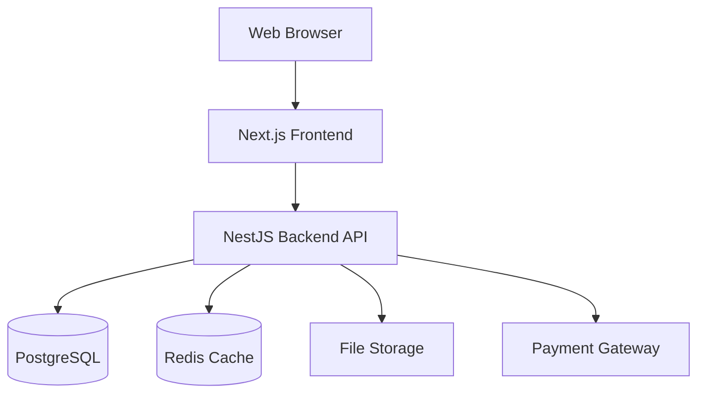

# Design Document

## Overview

This design document outlines the architecture and implementation approach for a full-featured e-commerce platform for handmade products. The system follows a modern microservices-inspired architecture with a clear separation between the frontend (Next.js) and backend (NestJS), connected via RESTful APIs. The platform supports bilingual content (Vietnamese and English), implements secure payment processing, and provides comprehensive administrative tools.

### Technology Stack

- **Frontend**: Next.js 14+ with App Router, React 18+, TypeScript
- **Backend**: NestJS with TypeScript
- **Database**: PostgreSQL 15+
- **Styling**: TailwindCSS 3+
- **ORM**: Prisma or TypeORM
- **Authentication**: JWT with refresh tokens
- **Payment Gateway**: Stripe or PayPal integration
- **File Storage**: AWS S3 or local storage with CDN
- **Caching**: Redis for session and cart management
- **Search**: PostgreSQL full-text search or Elasticsearch

## Architecture

### High-Level Architecture



### System Layers

1. **Presentation Layer** (Next.js)
   - Server-side rendering for SEO
   - Client-side interactivity
   - Responsive UI components
   - Internationalization (i18n)

2. **API Layer** (NestJS)
   - RESTful endpoints
   - Authentication & authorization
   - Business logic
   - Data validation

3. **Data Layer** (PostgreSQL)
   - Relational data storage
   - Transaction management
   - Data integrity constraints

4. **Cache Layer** (Redis)
   - Session storage
   - Shopping cart persistence
   - API response caching

### Deployment Architecture

- **Frontend**: Vercel or self-hosted with nginx
- **Backend**: Supervisor on linux
- **Database**: Managed PostgreSQL (AWS RDS, Google Cloud SQL)
- **Redis**: Managed Redis (AWS ElastiCache, Redis Cloud)
- **CDN**: CloudFront or Cloudflare for static assets

## Components and Interfaces

### Frontend Components (Next.js)

#### 1. Product Catalog Module

**Pages:**
- `/` - Homepage with featured products
- `/products` - Product listing with filters
- `/products/[slug]` - Product detail page
- `/categories/[slug]` - Category listing page

**Components:**
- `ProductCard` - Display product thumbnail, title, price
- `ProductGrid` - Grid layout for product listings
- `ProductDetail` - Full product information display
- `ProductGallery` - Image carousel for product photos
- `CategoryNav` - Category navigation menu
- `SearchBar` - Search input with autocomplete
- `FilterPanel` - Filter and sort controls

#### 2. Shopping Cart Module

**Pages:**
- `/cart` - Shopping cart page

**Components:**
- `CartItem` - Individual cart item with quantity controls
- `CartSummary` - Order total and checkout button
- `CartDrawer` - Slide-out cart preview
- `MiniCart` - Header cart icon with item count

#### 3. Checkout Module

**Pages:**
- `/checkout` - Multi-step checkout process
- `/checkout/success` - Order confirmation page

**Components:**
- `CheckoutStepper` - Progress indicator
- `ShippingForm` - Address and contact information
- `ShippingOptions` - Delivery method selection
- `PaymentForm` - Payment information input
- `OrderReview` - Final order summary
- `OrderConfirmation` - Success message and order details

#### 4. User Account Module

**Pages:**
- `/login` - Login page
- `/register` - Registration page
- `/account` - Account dashboard
- `/account/orders` - Order history
- `/account/addresses` - Saved addresses
- `/account/wishlist` - Wishlist page
- `/account/profile` - Profile settings

**Components:**
- `LoginForm` - Email/password login
- `RegisterForm` - New user registration
- `ProfileForm` - Edit profile information
- `AddressForm` - Add/edit shipping addresses
- `OrderList` - Display order history
- `OrderDetail` - Individual order information
- `WishlistGrid` - Wishlist product display

#### 5. Review System Module

**Components:**
- `ReviewList` - Display product reviews
- `ReviewForm` - Submit new review
- `RatingStars` - Star rating display and input
- `ReviewSummary` - Average rating and count

#### 6. CMS Pages Module

**Pages:**
- `/about` - About page
- `/contact` - Contact page
- `/faq` - FAQ page
- `/privacy` - Privacy policy
- `/terms` - Terms of service
- `/shipping` - Shipping policy
- `/returns` - Return policy

**Components:**
- `ContactForm` - Customer inquiry form
- `FAQAccordion` - Expandable FAQ items
- `RichTextContent` - Rendered CMS content

#### 7. Admin Module

**Pages:**
- `/admin` - Admin dashboard
- `/admin/products` - Product management
- `/admin/products/new` - Create product
- `/admin/products/[id]/edit` - Edit product
- `/admin/orders` - Order management
- `/admin/customers` - Customer management
- `/admin/content` - CMS content management
- `/admin/promotions` - Discount code management
- `/admin/analytics` - Analytics dashboard

**Components:**
- `AdminNav` - Admin navigation sidebar
- `ProductForm` - Create/edit product form
- `OrderTable` - Order list with filters
- `OrderStatusUpdate` - Change order status
- `CustomerTable` - Customer list
- `PromotionForm` - Create/edit promotions
- `AnalyticsDashboard` - Charts and metrics
- `ContentEditor` - Rich text editor for CMS

### Backend API (NestJS)

#### Module Structure

```
src/
├── auth/                 # Authentication module
├── users/                # User management
├── products/             # Product catalog
├── categories/           # Product categories
├── cart/                 # Shopping cart
├── orders/               # Order processing
├── payments/             # Payment integration
├── reviews/              # Product reviews
├── wishlist/             # User wishlists
├── promotions/           # Discount codes
├── content/              # CMS content
├── analytics/            # Analytics tracking
├── shipping/             # Shipping integration
├── notifications/        # Email notifications
└── common/               # Shared utilities
```

#### API Endpoints

**Authentication & Users**
- `POST /auth/register` - Register new user
- `POST /auth/login` - User login
- `POST /auth/refresh` - Refresh access token
- `POST /auth/logout` - User logout
- `GET /users/profile` - Get user profile
- `PUT /users/profile` - Update profile
- `GET /users/addresses` - Get saved addresses
- `POST /users/addresses` - Add new address
- `PUT /users/addresses/:id` - Update address
- `DELETE /users/addresses/:id` - Delete address

**Products**
- `GET /products` - List products (with filters, search, pagination)
- `GET /products/:slug` - Get product details
- `POST /products` - Create product (admin)
- `PUT /products/:id` - Update product (admin)
- `DELETE /products/:id` - Delete product (admin)
- `POST /products/:id/images` - Upload product images (admin)

**Categories**
- `GET /categories` - List all categories
- `GET /categories/:slug` - Get category with products
- `POST /categories` - Create category (admin)
- `PUT /categories/:id` - Update category (admin)
- `DELETE /categories/:id` - Delete category (admin)

**Cart**
- `GET /cart` - Get current cart
- `POST /cart/items` - Add item to cart
- `PUT /cart/items/:id` - Update cart item quantity
- `DELETE /cart/items/:id` - Remove cart item
- `DELETE /cart` - Clear cart

**Orders**
- `POST /orders` - Create new order
- `GET /orders` - List user orders
- `GET /orders/:id` - Get order details
- `GET /admin/orders` - List all orders (admin)
- `PUT /admin/orders/:id/status` - Update order status (admin)

**Payments**
- `POST /payments/intent` - Create payment intent
- `POST /payments/webhook` - Payment gateway webhook
- `POST /payments/refund` - Process refund (admin)

**Reviews**
- `GET /products/:id/reviews` - Get product reviews
- `POST /products/:id/reviews` - Submit review
- `PUT /reviews/:id` - Update review
- `DELETE /reviews/:id` - Delete review
- `POST /reviews/:id/helpful` - Mark review helpful

**Wishlist**
- `GET /wishlist` - Get user wishlist
- `POST /wishlist/items` - Add item to wishlist
- `DELETE /wishlist/items/:id` - Remove from wishlist

**Promotions**
- `POST /promotions/validate` - Validate discount code
- `GET /admin/promotions` - List promotions (admin)
- `POST /admin/promotions` - Create promotion (admin)
- `PUT /admin/promotions/:id` - Update promotion (admin)
- `DELETE /admin/promotions/:id` - Delete promotion (admin)

**Content**
- `GET /content/pages/:slug` - Get CMS page
- `GET /content/faq` - Get FAQ items
- `POST /admin/content/pages` - Create page (admin)
- `PUT /admin/content/pages/:id` - Update page (admin)

**Analytics**
- `POST /analytics/events` - Track event
- `GET /admin/analytics/dashboard` - Get dashboard metrics (admin)
- `GET /admin/analytics/sales` - Get sales reports (admin)

**Shipping**
- `POST /shipping/calculate` - Calculate shipping cost
- `POST /shipping/label` - Generate shipping label (admin)

**Notifications**
- `POST /contact` - Submit contact form
- `POST /admin/notifications/email` - Send email (admin)

## Data Models

### User Model
```typescript
interface User {
  id: string;
  email: string;
  passwordHash: string;
  firstName: string;
  lastName: string;
  role: 'customer' | 'admin';
  isEmailVerified: boolean;
  createdAt: Date;
  updatedAt: Date;
}
```

### Address Model
```typescript
interface Address {
  id: string;
  userId: string;
  fullName: string;
  phone: string;
  addressLine1: string;
  addressLine2?: string;
  city: string;
  state: string;
  postalCode: string;
  country: string;
  isDefault: boolean;
}
```

### Category Model
```typescript
interface Category {
  id: string;
  slug: string;
  nameEn: string;
  nameVi: string;
  descriptionEn?: string;
  descriptionVi?: string;
  parentId?: string;
  imageUrl?: string;
  displayOrder: number;
  isActive: boolean;
}
```

### Product Model
```typescript
interface Product {
  id: string;
  slug: string;
  sku: string;
  nameEn: string;
  nameVi: string;
  descriptionEn: string;
  descriptionVi: string;
  price: number;
  compareAtPrice?: number;
  costPrice?: number;
  stockQuantity: number;
  lowStockThreshold: number;
  weight?: number;
  dimensions?: {
    length: number;
    width: number;
    height: number;
  };
  categoryId: string;
  images: ProductImage[];
  isActive: boolean;
  isFeatured: boolean;
  createdAt: Date;
  updatedAt: Date;
}
```

### ProductImage Model
```typescript
interface ProductImage {
  id: string;
  productId: string;
  url: string;
  altTextEn?: string;
  altTextVi?: string;
  displayOrder: number;
}
```

### Cart Model
```typescript
interface Cart {
  id: string;
  userId?: string;
  sessionId?: string;
  items: CartItem[];
  expiresAt: Date;
  createdAt: Date;
  updatedAt: Date;
}
```

### CartItem Model
```typescript
interface CartItem {
  id: string;
  cartId: string;
  productId: string;
  quantity: number;
  price: number;
}
```

### Order Model
```typescript
interface Order {
  id: string;
  orderNumber: string;
  userId?: string;
  email: string;
  status: 'pending' | 'processing' | 'shipped' | 'delivered' | 'cancelled' | 'refunded';
  items: OrderItem[];
  subtotal: number;
  shippingCost: number;
  taxAmount: number;
  discountAmount: number;
  total: number;
  shippingAddress: Address;
  billingAddress: Address;
  shippingMethod: string;
  paymentMethod: string;
  paymentStatus: 'pending' | 'paid' | 'failed' | 'refunded';
  paymentIntentId?: string;
  notes?: string;
  createdAt: Date;
  updatedAt: Date;
}
```

### OrderItem Model
```typescript
interface OrderItem {
  id: string;
  orderId: string;
  productId: string;
  productNameEn: string;
  productNameVi: string;
  sku: string;
  quantity: number;
  price: number;
  total: number;
}
```

### Review Model
```typescript
interface Review {
  id: string;
  productId: string;
  userId: string;
  orderId: string;
  rating: number;
  title: string;
  comment: string;
  isVerifiedPurchase: boolean;
  helpfulCount: number;
  isApproved: boolean;
  createdAt: Date;
  updatedAt: Date;
}
```

### Wishlist Model
```typescript
interface Wishlist {
  id: string;
  userId: string;
  items: WishlistItem[];
}
```

### WishlistItem Model
```typescript
interface WishlistItem {
  id: string;
  wishlistId: string;
  productId: string;
  addedAt: Date;
}
```

### Promotion Model
```typescript
interface Promotion {
  id: string;
  code: string;
  type: 'percentage' | 'fixed';
  value: number;
  minOrderAmount?: number;
  maxDiscountAmount?: number;
  usageLimit?: number;
  usageCount: number;
  perCustomerLimit?: number;
  startDate: Date;
  endDate: Date;
  isActive: boolean;
}
```

### Content Model
```typescript
interface Content {
  id: string;
  slug: string;
  type: 'page' | 'faq' | 'banner';
  titleEn: string;
  titleVi: string;
  contentEn: string;
  contentVi: string;
  isPublished: boolean;
  publishedAt?: Date;
  createdAt: Date;
  updatedAt: Date;
}
```

### AnalyticsEvent Model
```typescript
interface AnalyticsEvent {
  id: string;
  eventType: 'page_view' | 'product_view' | 'add_to_cart' | 'purchase' | 'search';
  userId?: string;
  sessionId: string;
  productId?: string;
  orderId?: string;
  metadata?: Record<string, any>;
  createdAt: Date;
}
```

## Internationalization Strategy

### Implementation Approach

1. **Single File Locale Management**
   - Use Next.js i18n with `next-intl` or `react-i18next`
   - Store translations in JSON files: `locales/en.json` and `locales/vi.json`
   - Implement locale detection from URL path or browser settings

2. **Database Content**
   - Store bilingual content in separate columns (e.g., `nameEn`, `nameVi`)
   - API returns both languages, frontend selects based on active locale
   - Admin interface allows editing both languages simultaneously

3. **URL Structure**
   - Use path-based routing: `/en/products`, `/vi/products`
   - Default locale (Vietnamese) can omit prefix: `/products` → `/vi/products`
   - Implement `hreflang` tags for SEO

4. **Locale Switching**
   - Language selector in header
   - Persist preference in cookie
   - Maintain current page when switching languages

### Translation File Structure

```json
{
  "common": {
    "addToCart": "Add to Cart",
    "search": "Search",
    "login": "Login"
  },
  "product": {
    "price": "Price",
    "inStock": "In Stock",
    "outOfStock": "Out of Stock"
  },
  "checkout": {
    "shippingAddress": "Shipping Address",
    "paymentMethod": "Payment Method"
  }
}
```

## Error Handling

### Frontend Error Handling

1. **API Error Responses**
   - Display user-friendly error messages
   - Log errors to monitoring service (Sentry)
   - Implement retry logic for transient failures

2. **Form Validation**
   - Client-side validation with immediate feedback
   - Display field-level error messages
   - Prevent submission until valid

3. **Network Errors**
   - Show offline indicator
   - Queue actions for retry when connection restored
   - Graceful degradation for non-critical features

### Backend Error Handling

1. **Exception Filters**
   - Global exception filter for consistent error responses
   - Custom exceptions for business logic errors
   - HTTP status codes aligned with error types

2. **Validation**
   - Use class-validator for DTO validation
   - Return detailed validation errors
   - Sanitize input to prevent injection attacks

3. **Database Errors**
   - Handle constraint violations gracefully
   - Implement transaction rollback on failures
   - Log database errors for debugging

### Error Response Format

```typescript
interface ErrorResponse {
  statusCode: number;
  message: string;
  error: string;
  timestamp: string;
  path: string;
  details?: any;
}
```

## Security Considerations

### Authentication & Authorization

1. **JWT Implementation**
   - Access tokens (15 minutes expiry)
   - Refresh tokens (7 days expiry, stored in httpOnly cookie)
   - Token rotation on refresh

2. **Password Security**
   - bcrypt hashing with salt rounds of 10
   - Password strength requirements
   - Rate limiting on login attempts

3. **Role-Based Access Control**
   - Customer role: access own data only
   - Admin role: full system access
   - Middleware guards on protected routes

### Data Protection

1. **Encryption**
   - HTTPS/TLS for all communications
   - Encrypt sensitive data at rest
   - Secure payment information handling (PCI compliance)

2. **Input Validation**
   - Sanitize all user inputs
   - Parameterized database queries
   - XSS protection

3. **CORS Configuration**
   - Whitelist allowed origins
   - Restrict methods and headers
   - Credentials support for authenticated requests

### API Security

1. **Rate Limiting**
   - Implement per-IP rate limits
   - Stricter limits on authentication endpoints
   - Throttle expensive operations

2. **CSRF Protection**
   - CSRF tokens for state-changing operations
   - SameSite cookie attribute

3. **API Keys**
   - Secure storage of third-party API keys
   - Environment-based configuration
   - Key rotation policy

## Testing Strategy

### Frontend Testing

1. **Unit Tests**
   - Jest for component logic
   - React Testing Library for component rendering
   - Test utility functions and hooks
   - Target: 70% code coverage

2. **Integration Tests**
   - Test component interactions
   - Mock API calls with MSW
   - Test form submissions and validations

3. **E2E Tests**
   - Playwright or Cypress for critical user flows
   - Test checkout process end-to-end
   - Test authentication flows
   - Run on CI/CD pipeline

### Backend Testing

1. **Unit Tests**
   - Jest for service and controller logic
   - Mock dependencies
   - Test business logic thoroughly
   - Target: 80% code coverage

2. **Integration Tests**
   - Test API endpoints with supertest
   - Use test database
   - Test authentication and authorization
   - Test database operations

3. **E2E Tests**
   - Test complete API workflows
   - Test payment integration (sandbox mode)
   - Test order processing flow

### Testing Checklist

- [ ] Product search and filtering
- [ ] Add to cart and cart management
- [ ] Guest and authenticated checkout
- [ ] Payment processing
- [ ] Order creation and status updates
- [ ] User registration and login
- [ ] Admin product management
- [ ] Discount code application
- [ ] Review submission and display
- [ ] Wishlist functionality
- [ ] Mobile responsiveness
- [ ] Accessibility compliance
- [ ] Internationalization switching
- [ ] Error handling scenarios

## Performance Optimization

### Frontend Optimization

1. **Next.js Features**
   - Server-side rendering for initial load
   - Static generation for content pages
   - Incremental static regeneration for product pages
   - Image optimization with next/image

2. **Code Splitting**
   - Dynamic imports for heavy components
   - Route-based code splitting
   - Lazy load below-the-fold content

3. **Caching**
   - Browser caching for static assets
   - Service worker for offline support
   - Cache API responses with SWR or React Query

4. **Asset Optimization**
   - Compress images (WebP format)
   - Minify CSS and JavaScript
   - Use CDN for static assets
   - Implement lazy loading for images

### Backend Optimization

1. **Database Optimization**
   - Index frequently queried columns
   - Optimize complex queries
   - Use database connection pooling
   - Implement query result caching

2. **Caching Strategy**
   - Redis for session storage
   - Cache product catalog data
   - Cache category trees
   - Implement cache invalidation on updates

3. **API Optimization**
   - Implement pagination for list endpoints
   - Use field selection to reduce payload size
   - Compress responses with gzip
   - Implement API response caching

4. **Background Jobs**
   - Queue email notifications
   - Process analytics asynchronously
   - Generate reports in background
   - Use Bull or similar job queue

### Performance Targets

- Homepage load: < 2 seconds
- Product page load: < 2.5 seconds
- API response time: < 200ms (p95)
- Time to interactive: < 3 seconds
- Lighthouse score: > 90

## Deployment Strategy

### Environment Setup

1. **Development**
   - Local PostgreSQL and Redis
   - Hot reload for both frontend and backend
   - Mock payment gateway

2. **Staging**
   - Mirror production configuration
   - Use staging payment gateway
   - Test data seeding

3. **Production**
   - Managed database and cache services
   - CDN for static assets
   - Production payment gateway
   - Monitoring and logging

### CI/CD Pipeline

1. **Build Process**
   - Run linting and type checking
   - Run unit and integration tests
   - Build Docker images
   - Push to container registry

2. **Deployment Process**
   - Deploy backend API first
   - Run database migrations
   - Deploy frontend application
   - Smoke tests after deployment

3. **Rollback Strategy**
   - Keep previous deployment artifacts
   - Database migration rollback scripts
   - Blue-green deployment for zero downtime

### Monitoring & Logging

1. **Application Monitoring**
   - Error tracking with Sentry
   - Performance monitoring with New Relic or DataDog
   - Uptime monitoring with Pingdom

2. **Logging**
   - Structured logging with Winston
   - Centralized log aggregation
   - Log retention policy

3. **Alerts**
   - Error rate thresholds
   - Response time degradation
   - Database connection issues
   - Payment gateway failures

## Third-Party Integrations

### Payment Gateway (Stripe)

1. **Integration Points**
   - Payment intent creation
   - Webhook handling for payment events
   - Refund processing
   - Customer portal for saved cards

2. **Implementation**
   - Use Stripe SDK for backend
   - Stripe Elements for frontend
   - Handle 3D Secure authentication
   - Test with Stripe test mode

### Email Service (SendGrid or AWS SES)

1. **Email Types**
   - Order confirmation
   - Shipping notification
   - Password reset
   - Welcome email
   - Contact form submissions

2. **Implementation**
   - Template-based emails
   - Support for both locales
   - Track email delivery status
   - Handle bounces and complaints

### Shipping Provider (Optional)

1. **Integration Points**
   - Real-time shipping rate calculation
   - Shipping label generation
   - Tracking number updates

2. **Implementation**
   - Abstract shipping provider interface
   - Support multiple providers
   - Fallback to manual shipping

### Analytics (Google Analytics 4)

1. **Tracking Events**
   - Page views
   - Product views
   - Add to cart
   - Purchase completion
   - Search queries

2. **Implementation**
   - Google Tag Manager integration
   - Enhanced e-commerce tracking
   - Custom event tracking

## Migration & Data Seeding

### Initial Data Setup

1. **Categories**
   - Seed initial product categories
   - Create category hierarchy

2. **Products**
   - Import product catalog
   - Upload product images
   - Set initial inventory levels

3. **Content Pages**
   - Create legal pages
   - Set up FAQ content
   - Configure homepage banners

4. **Admin User**
   - Create initial admin account
   - Set up admin permissions

### Data Migration Strategy

1. **Database Migrations**
   - Use Prisma migrations or TypeORM migrations
   - Version control migration files
   - Test migrations on staging first

2. **Data Import**
   - CSV import for bulk products
   - Image batch upload utility
   - Validation before import

## Accessibility Implementation

### WCAG 2.1 AA Compliance

1. **Keyboard Navigation**
   - All interactive elements accessible via keyboard
   - Visible focus indicators
   - Skip navigation links

2. **Screen Reader Support**
   - Semantic HTML elements
   - ARIA labels and roles
   - Alt text for all images
   - Form labels and error messages

3. **Visual Design**
   - Color contrast ratios meet WCAG standards
   - Text resizable up to 200%
   - No information conveyed by color alone

4. **Forms**
   - Clear labels and instructions
   - Error messages associated with fields
   - Required field indicators

## SEO Implementation

### On-Page SEO

1. **Meta Tags**
   - Dynamic title and description per page
   - Open Graph tags for social sharing
   - Twitter Card tags

2. **Structured Data**
   - Product schema markup
   - Breadcrumb schema
   - Organization schema
   - Review schema

3. **URL Structure**
   - SEO-friendly URLs with slugs
   - Canonical URLs
   - Proper use of hreflang tags

### Technical SEO

1. **Sitemap**
   - XML sitemap generation
   - Include all public pages
   - Update frequency configuration

2. **Robots.txt**
   - Allow search engine crawling
   - Disallow admin and checkout pages

3. **Performance**
   - Fast page load times
   - Mobile-friendly design
   - Core Web Vitals optimization

This design provides a comprehensive blueprint for implementing the handmade e-commerce platform with all required features, following best practices for scalability, security, and maintainability.
