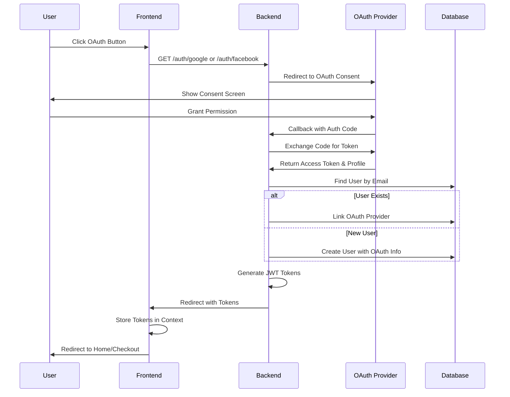
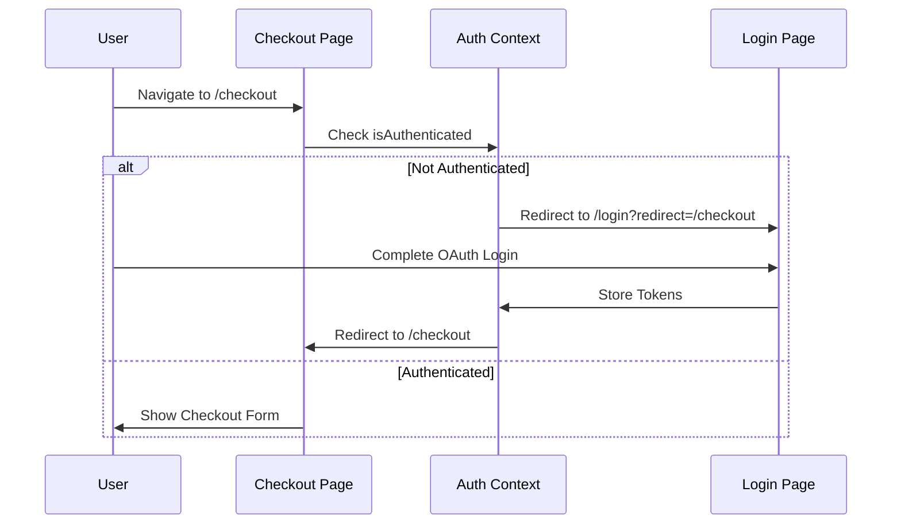

# Design Document: Hybrid Authentication System

## Overview

This design document outlines the implementation of a hybrid authentication system that supports both OAuth authentication (Google and Facebook) and traditional email/password authentication. The solution integrates Passport.js OAuth strategies in the NestJS backend, maintains email/password authentication endpoints, updates the React frontend to support both authentication methods, protects the checkout route with authentication, and ensures seamless user experience across all authentication providers.

The key architectural changes include:
- Adding OAuth provider strategies (Google and Facebook) to the backend
- Maintaining email/password authentication endpoints and logic
- Updating the database schema to support OAuth provider information
- Modifying the frontend login page to display both OAuth buttons and email/password form
- Adding registration page for email/password sign-up
- Protecting the checkout route with authentication middleware
- Implementing email-based account linking for users with the same email across all authentication methods

## Architecture

### High-Level Architecture


### Authentication Flow



### Checkout Protection Flow



## Components and Interfaces

### Backend Components

#### 1. OAuth Strategies

**Google Strategy (`backend/src/auth/strategies/google.strategy.ts`)**
```typescript
interface GoogleProfile {
  id: string;
  emails: Array<{ value: string; verified: boolean }>;
  name: { givenName: string; familyName: string };
  displayName: string;
  photos: Array<{ value: string }>;
}

class GoogleStrategy extends PassportStrategy(Strategy, 'google') {
  constructor(configService: ConfigService, authService: AuthService);
  async validate(
    accessToken: string,
    refreshToken: string,
    profile: GoogleProfile,
    done: VerifyCallback
  ): Promise<any>;
}
```

**Facebook Strategy (`backend/src/auth/strategies/facebook.strategy.ts`)**
```typescript
interface FacebookProfile {
  id: string;
  emails: Array<{ value: string }>;
  name: { givenName: string; familyName: string };
  displayName: string;
  photos: Array<{ value: string }>;
}

class FacebookStrategy extends PassportStrategy(Strategy, 'facebook') {
  constructor(configService: ConfigService, authService: AuthService);
  async validate(
    accessToken: string,
    refreshToken: string,
    profile: FacebookProfile,
    done: VerifyCallback
  ): Promise<any>;
}
```

#### 2. Auth Service Updates

**Auth Service Methods (`backend/src/auth/auth.service.ts`)**
```typescript
interface OAuthUserData {
  email: string;
  firstName: string;
  lastName: string;
  provider: 'google' | 'facebook';
  providerId: string;
  username?: string;
  isEmailVerified: boolean;
}

interface RegisterData {
  email: string;
  password: string;
  firstName: string;
  lastName: string;
}

class AuthService {
  // Email/Password Authentication
  async register(registerData: RegisterData): Promise<AuthResponse>;
  async validateEmailPassword(email: string, password: string): Promise<User>;
  async hashPassword(password: string): Promise<string>;
  async comparePasswords(plainPassword: string, hashedPassword: string): Promise<boolean>;

  // OAuth Authentication
  async validateOAuthUser(oauthData: OAuthUserData): Promise<AuthResponse>;
  async findOrCreateOAuthUser(oauthData: OAuthUserData): Promise<User>;
  async linkOAuthProvider(userId: string, provider: string, providerId: string): Promise<User>;

  // Common
  async generateTokens(user: User): Promise<{ accessToken: string; refreshToken: string }>;
  async findUserByEmail(email: string): Promise<User | null>;
}
```

#### 3. Auth Controller Updates

**Authentication Endpoints (`backend/src/auth/auth.controller.ts`)**
```typescript
interface RegisterDto {
  email: string;
  password: string;
  firstName: string;
  lastName: string;
}

interface LoginDto {
  email: string;
  password: string;
}

@Controller('auth')
class AuthController {
  // Email/Password Authentication
  @Post('register')
  async register(@Body() registerDto: RegisterDto): Promise<AuthResponse>;

  @Post('login')
  async login(@Body() loginDto: LoginDto): Promise<AuthResponse>;

  // Google OAuth
  @Get('google')
  @UseGuards(AuthGuard('google'))
  googleAuth(): void;

  @Get('google/callback')
  @UseGuards(AuthGuard('google'))
  googleAuthCallback(@Req() req, @Res() res): Promise<void>;

  // Facebook OAuth
  @Get('facebook')
  @UseGuards(AuthGuard('facebook'))
  facebookAuth(): void;

  @Get('facebook/callback')
  @UseGuards(AuthGuard('facebook'))
  facebookAuthCallback(@Req() req, @Res() res): Promise<void>;
}
```

### Frontend Components

#### 1. Updated Login Page

**Login Page (`frontend/app/[locale]/login/page.tsx`)**
```typescript
interface LoginPageProps {
  searchParams: { redirect?: string };
}

interface LoginFormData {
  email: string;
  password: string;
}

function LoginPage({ searchParams }: LoginPageProps) {
  const [formData, setFormData] = useState<LoginFormData>({ email: '', password: '' });
  const [error, setError] = useState('');
  const [isLoading, setIsLoading] = useState(false);

  const handleEmailPasswordLogin = async (e: FormEvent) => {
    e.preventDefault();
    setIsLoading(true);
    setError('');

    try {
      const response = await authApi.login(formData.email, formData.password);
      // Store tokens and redirect
      localStorage.setItem('accessToken', response.accessToken);
      localStorage.setItem('refreshToken', response.refreshToken);

      const redirectUrl = searchParams.redirect || '/';
      router.push(redirectUrl);
    } catch (err) {
      setError('Invalid email or password');
    } finally {
      setIsLoading(false);
    }
  };

  const handleGoogleLogin = () => {
    const redirectUrl = searchParams.redirect || '/';
    window.location.href = `${API_URL}/auth/google?redirect=${redirectUrl}`;
  };

  const handleFacebookLogin = () => {
    const redirectUrl = searchParams.redirect || '/';
    window.location.href = `${API_URL}/auth/facebook?redirect=${redirectUrl}`;
  };

  return (
    <div>
      {/* Email/Password Form */}
      <form onSubmit={handleEmailPasswordLogin}>
        <input
          type="email"
          value={formData.email}
          onChange={(e) => setFormData({ ...formData, email: e.target.value })}
          placeholder="Email"
          required
        />
        <input
          type="password"
          value={formData.password}
          onChange={(e) => setFormData({ ...formData, password: e.target.value })}
          placeholder="Password"
          required
        />
        <button type="submit" disabled={isLoading}>
          {isLoading ? 'Signing in...' : 'Sign in'}
        </button>
        {error && <div className="error">{error}</div>}
      </form>

      {/* Divider */}
      <div className="divider">OR</div>

      {/* OAuth Buttons */}
      <button onClick={handleGoogleLogin}>Sign in with Google</button>
      <button onClick={handleFacebookLogin}>Sign in with Facebook</button>

      {/* Register Link */}
      <Link href="/register">Don't have an account? Register</Link>
    </div>
  );
}
```

#### 1a. Registration Page

**Registration Page (`frontend/app/[locale]/register/page.tsx`)**
```typescript
interface RegisterFormData {
  email: string;
  password: string;
  confirmPassword: string;
  firstName: string;
  lastName: string;
}

interface PasswordValidation {
  minLength: boolean;
  hasUpperCase: boolean;
  hasLowerCase: boolean;
  hasNumber: boolean;
}

function RegisterPage() {
  const [formData, setFormData] = useState<RegisterFormData>({
    email: '',
    password: '',
    confirmPassword: '',
    firstName: '',
    lastName: '',
  });
  const [errors, setErrors] = useState<Record<string, string>>({});
  const [isLoading, setIsLoading] = useState(false);
  const [passwordValidation, setPasswordValidation] = useState<PasswordValidation>({
    minLength: false,
    hasUpperCase: false,
    hasLowerCase: false,
    hasNumber: false,
  });

  const validatePassword = (password: string): PasswordValidation => {
    return {
      minLength: password.length >= 8,
      hasUpperCase: /[A-Z]/.test(password),
      hasLowerCase: /[a-z]/.test(password),
      hasNumber: /[0-9]/.test(password),
    };
  };

  const handlePasswordChange = (password: string) => {
    setFormData({ ...formData, password });
    setPasswordValidation(validatePassword(password));
  };

  const handleSubmit = async (e: FormEvent) => {
    e.preventDefault();
    setErrors({});

    // Validate passwords match
    if (formData.password !== formData.confirmPassword) {
      setErrors({ confirmPassword: 'Passwords do not match' });
      return;
    }

    // Validate password requirements
    const validation = validatePassword(formData.password);
    if (!Object.values(validation).every(Boolean)) {
      setErrors({ password: 'Password does not meet requirements' });
      return;
    }

    setIsLoading(true);

    try {
      const response = await authApi.register({
        email: formData.email,
        password: formData.password,
        firstName: formData.firstName,
        lastName: formData.lastName,
      });

      // Store tokens and redirect
      localStorage.setItem('accessToken', response.accessToken);
      localStorage.setItem('refreshToken', response.refreshToken);
      router.push('/');
    } catch (err: any) {
      if (err.response?.status === 409) {
        setErrors({ email: 'Email already registered' });
      } else {
        setErrors({ general: 'Registration failed. Please try again.' });
      }
    } finally {
      setIsLoading(false);
    }
  };

  return (
    <div>
      <form onSubmit={handleSubmit}>
        <input
          type="text"
          value={formData.firstName}
          onChange={(e) => setFormData({ ...formData, firstName: e.target.value })}
          placeholder="First Name"
          required
        />
        <input
          type="text"
          value={formData.lastName}
          onChange={(e) => setFormData({ ...formData, lastName: e.target.value })}
          placeholder="Last Name"
          required
        />
        <input
          type="email"
          value={formData.email}
          onChange={(e) => setFormData({ ...formData, email: e.target.value })}
          placeholder="Email"
          required
        />
        {errors.email && <div className="error">{errors.email}</div>}

        <input
          type="password"
          value={formData.password}
          onChange={(e) => handlePasswordChange(e.target.value)}
          placeholder="Password"
          required
        />
        {/* Password validation indicators */}
        <div className="password-requirements">
          <div className={passwordValidation.minLength ? 'valid' : 'invalid'}>
            At least 8 characters
          </div>
          <div className={passwordValidation.hasUpperCase ? 'valid' : 'invalid'}>
            One uppercase letter
          </div>
          <div className={passwordValidation.hasLowerCase ? 'valid' : 'invalid'}>
            One lowercase letter
          </div>
          <div className={passwordValidation.hasNumber ? 'valid' : 'invalid'}>
            One number
          </div>
        </div>

        <input
          type="password"
          value={formData.confirmPassword}
          onChange={(e) => setFormData({ ...formData, confirmPassword: e.target.value })}
          placeholder="Confirm Password"
          required
        />
        {errors.confirmPassword && <div className="error">{errors.confirmPassword}</div>}

        <button type="submit" disabled={isLoading}>
          {isLoading ? 'Creating account...' : 'Register'}
        </button>
        {errors.general && <div className="error">{errors.general}</div>}
      </form>

      <Link href="/login">Already have an account? Sign in</Link>
    </div>
  );
}
```

#### 2. Updated Auth Context

**Auth Context (`frontend/contexts/AuthContext.tsx`)**
```typescript
interface AuthContextType {
  user: User | null;
  isLoading: boolean;
  isAuthenticated: boolean;
  login: (email: string, password: string) => Promise<void>;
  register: (data: RegisterData) => Promise<void>;
  logout: () => Promise<void>;
  refreshUser: () => Promise<void>;
}

function AuthProvider({ children }: { children: ReactNode }) {
  const [user, setUser] = useState<User | null>(null);
  const [isLoading, setIsLoading] = useState(true);

  // Handle OAuth callback tokens from URL
  useEffect(() => {
    const params = new URLSearchParams(window.location.search);
    const accessToken = params.get('accessToken');
    const refreshToken = params.get('refreshToken');

    if (accessToken && refreshToken) {
      // Store tokens and fetch user
      localStorage.setItem('accessToken', accessToken);
      localStorage.setItem('refreshToken', refreshToken);
      fetchUser();

      // Clean URL
      window.history.replaceState({}, '', window.location.pathname);
    }
  }, []);

  const login = async (email: string, password: string) => {
    const response = await authApi.login(email, password);
    localStorage.setItem('accessToken', response.accessToken);
    localStorage.setItem('refreshToken', response.refreshToken);
    await fetchUser();
  };

  const register = async (data: RegisterData) => {
    const response = await authApi.register(data);
    localStorage.setItem('accessToken', response.accessToken);
    localStorage.setItem('refreshToken', response.refreshToken);
    await fetchUser();
  };

  const logout = async () => {
    const refreshToken = localStorage.getItem('refreshToken');
    if (refreshToken) {
      await authApi.logout(refreshToken);
    }
    localStorage.removeItem('accessToken');
    localStorage.removeItem('refreshToken');
    setUser(null);
  };

  const fetchUser = async () => {
    try {
      const userData = await authApi.getCurrentUser();
      setUser(userData);
    } catch (error) {
      console.error('Failed to fetch user:', error);
      setUser(null);
    } finally {
      setIsLoading(false);
    }
  };

  return (
    <AuthContext.Provider value={{ user, isLoading, isAuthenticated: !!user, login, register, logout, refreshUser: fetchUser }}>
      {children}
    </AuthContext.Provider>
  );
}
```

#### 3. Protected Checkout Route

**Checkout Protection (`frontend/app/[locale]/checkout/page.tsx`)**
```typescript
function CheckoutPage() {
  const { isAuthenticated, isLoading } = useAuth();
  const router = useRouter();
  const pathname = usePathname();

  useEffect(() => {
    if (!isLoading && !isAuthenticated) {
      router.push(`/login?redirect=${encodeURIComponent(pathname)}`);
    }
  }, [isAuthenticated, isLoading, router, pathname]);

  if (isLoading) {
    return <LoadingSpinner />;
  }

  if (!isAuthenticated) {
    return null;
  }

  return <CheckoutContent />;
}
```

#### 4. Updated Auth API

**Auth API Client (`frontend/lib/auth-api.ts`)**
```typescript
interface RegisterData {
  email: string;
  password: string;
  firstName: string;
  lastName: string;
}

interface AuthResponse {
  accessToken: string;
  refreshToken: string;
  user: User;
}

export const authApi = {
  register: async (data: RegisterData): Promise<AuthResponse> => {
    const response = await apiClient.post('/auth/register', data);
    return response.data;
  },

  login: async (email: string, password: string): Promise<AuthResponse> => {
    const response = await apiClient.post('/auth/login', { email, password });
    return response.data;
  },

  logout: async (refreshToken: string): Promise<void> => {
    await apiClient.post('/auth/logout', { refreshToken });
  },

  refreshToken: async (refreshToken: string): Promise<AuthResponse> => {
    const response = await apiClient.post('/auth/refresh', { refreshToken });
    return response.data;
  },

  getCurrentUser: async (): Promise<User> => {
    const response = await apiClient.get('/auth/me');
    return response.data;
  },
};
```

### Admin Components

#### Admin Customer View Updates

**Customer List (`frontend/app/[locale]/admin/customers/page.tsx`)**
```typescript
interface CustomerListItem {
  id: string;
  email: string;
  firstName: string;
  lastName: string;
  oauthProviders: Array<{
    provider: 'google' | 'facebook';
    providerId: string;
    username?: string;
  }>;
  createdAt: string;
}

function CustomerList() {
  return (
    <table>
      <thead>
        <tr>
          <th>Name</th>
          <th>Email</th>
          <th>OAuth Providers</th>
          <th>Created</th>
        </tr>
      </thead>
      <tbody>
        {customers.map(customer => (
          <tr key={customer.id}>
            <td>{customer.firstName} {customer.lastName}</td>
            <td>{customer.email}</td>
            <td>
              {customer.oauthProviders.map(p => (
                <span key={p.provider}>{p.provider}</span>
              ))}
            </td>
            <td>{formatDate(customer.createdAt)}</td>
          </tr>
        ))}
      </tbody>
    </table>
  );
}
```

## Data Models

### Updated User Model

**Prisma Schema Changes (`backend/prisma/schema.prisma`)**
```prisma
model User {
  id                String    @id @default(uuid())
  email             String    @unique
  passwordHash      String?   // Made nullable for OAuth users
  firstName         String
  lastName          String
  username          String?   // Added for OAuth username
  role              UserRole  @default(CUSTOMER)
  isEmailVerified   Boolean   @default(false)

  // OAuth fields
  googleId          String?   @unique
  facebookId        String?   @unique

  createdAt         DateTime  @default(now())
  updatedAt         DateTime  @updatedAt

  addresses         Address[]
  orders            Order[]
  reviews           Review[]
  wishlist          Wishlist?
  carts             Cart[]
  analyticsEvents   AnalyticsEvent[]

  @@index([email])
  @@index([googleId])
  @@index([facebookId])
  @@map("users")
}
```

### Migration Strategy

**Database Migration**
1. Add nullable `googleId` field to User table
2. Add nullable `facebookId` field to User table
3. Add nullable `username` field to User table
4. Make `passwordHash` field nullable
5. Add indexes on `googleId` and `facebookId`
6. Existing users with passwords remain unchanged
7. New OAuth users will have null `passwordHash`

## Correctness Properties

*A property is a characteristic or behavior that should hold true across all valid executions of a system-essentially, a formal statement about what the system should do. Properties serve as the bridge between human-readable specifications and machine-verifiable correctness guarantees.*

### Property 1: OAuth Callback Profile Processing
*For any* valid OAuth callback from Google or Facebook, the system should receive and correctly extract the user's profile information including email, first name, and last name.
**Validates: Requirements 1.2, 2.2, 5.4**

### Property 2: OAuth Token Generation
*For any* successful OAuth authentication (Google or Facebook), the system should create or retrieve the user account and issue both an access token and a refresh token.
**Validates: Requirements 1.3, 2.3, 5.5**

### Property 3: OAuth Post-Authentication Redirect
*For any* successful OAuth authentication, the system should redirect the user to the homepage (or specified redirect URL) with authenticated session state.
**Validates: Requirements 1.4, 2.4**

### Property 4: OAuth Error Handling
*For any* failed OAuth authentication attempt, the system should display an appropriate error message and remain on the login page.
**Validates: Requirements 1.5, 2.5**

### Property 5: Checkout Authentication Requirement
*For any* unauthenticated user attempting to access the checkout page, the system should redirect to the login page with the checkout URL as the redirect parameter.
**Validates: Requirements 4.1**

### Property 6: Post-Login Checkout Redirect
*For any* user who authenticates from a checkout redirect, the system should redirect back to the checkout page after successful authentication.
**Validates: Requirements 4.2, 14.1**

### Property 7: Session Expiration Handling
*For any* authenticated user whose session expires during checkout, the system should redirect to the login page with a session expiration message.
**Validates: Requirements 4.4**

### Property 8: OAuth Token Validation
*For any* OAuth callback received by the Auth Controller, the Auth Service should validate the OAuth token with the provider.
**Validates: Requirements 5.3**

### Property 9: OAuth User Creation with Defaults
*For any* first-time OAuth user, the system should create a new user account with email verification set to true, role set to CUSTOMER, and all profile information from the OAuth provider.
**Validates: Requirements 6.1, 6.4, 6.5**

### Property 10: OAuth Provider Information Storage
*For any* OAuth user creation, the system should store the OAuth provider name, provider user ID, and username (if available) in the user record.
**Validates: Requirements 6.2, 6.6, 6.7**

### Property 11: Returning OAuth User Handling
*For any* user authenticating via OAuth with an existing OAuth account, the system should retrieve the existing user account and issue new tokens without creating a duplicate.
**Validates: Requirements 6.3**

### Property 12: Email-Based Account Linking
*For any* OAuth authentication where the email matches an existing user account, the system should link the OAuth provider credentials to the existing account rather than creating a duplicate.
**Validates: Requirements 12.1, 12.2, 12.4**

### Property 13: Multi-Provider Account Consistency
*For any* user with multiple OAuth providers linked (Google and Facebook), authenticating via either provider should return the same user account and maintain both provider IDs in the user record.
**Validates: Requirements 12.3, 12.5**

### Property 14: Cart Preservation During Authentication
*For any* user's cart, when the user authenticates via OAuth after being redirected from checkout, the cart contents should remain unchanged.
**Validates: Requirements 14.2**

### Property 15: Order Association with User Account
*For any* authenticated user completing checkout, the system should associate the created order with the user's account.
**Validates: Requirements 14.3**

### Property 16: Email/Password Registration
*For any* valid registration data (email, password, first name, last name), the system should create a new user account with hashed password and issue authentication tokens.
**Validates: Requirements 15.3**

### Property 17: Password Hashing Security
*For any* password stored in the database, the password should be hashed using bcrypt and never stored in plain text.
**Validates: Requirements 8.5**

### Property 18: Email/Password Login Validation
*For any* login attempt with valid credentials, the system should authenticate the user and issue tokens; for invalid credentials, the system should reject authentication.
**Validates: Requirements 3.2, 3.3**

### Property 19: Password Validation Requirements
*For any* password during registration, if it does not meet minimum requirements (8 characters, uppercase, lowercase, number), the system should reject the registration.
**Validates: Requirements 16.1, 16.2, 16.3**

### Property 20: Password Confirmation Matching
*For any* registration attempt, if the password and confirm password fields do not match, the system should reject the registration.
**Validates: Requirements 16.4**

### Property 21: Duplicate Email Prevention
*For any* registration attempt with an email that already exists, the system should reject the registration and display an appropriate error message.
**Validates: Requirements 15.4**

### Property 22: Hybrid Account Linking
*For any* user who registers with email/password using an email that exists via OAuth, or vice versa, the system should link the credentials to the existing account.
**Validates: Requirements 18.1, 18.2, 18.3**

### Property 23: Multi-Method Authentication
*For any* user with both OAuth and email/password credentials linked, the user should be able to authenticate using any of the linked methods.
**Validates: Requirements 18.3, 18.4**

## Error Handling

### OAuth Provider Errors

**Error Scenarios:**
1. **User Cancels OAuth Flow**: User clicks "Cancel" on OAuth consent screen
   - Response: Redirect to login page with message "Authentication cancelled"
   - HTTP Status: N/A (handled via redirect)

2. **OAuth Provider Unavailable**: Google/Facebook service is down
   - Response: Display error message "Unable to connect to authentication provider. Please try again later."
   - HTTP Status: 503 Service Unavailable
   - Retry: Allow user to retry authentication

3. **Invalid OAuth Credentials**: Backend OAuth credentials are invalid
   - Response: Log error, display generic message "Authentication failed. Please contact support."
   - HTTP Status: 500 Internal Server Error
   - Action: Alert administrators

4. **Email Not Provided by Provider**: OAuth provider doesn't return email
   - Response: Display error "Email address is required. Please grant email permission."
   - HTTP Status: 400 Bad Request
   - Action: Prompt user to retry with email permission

5. **Network Timeout**: OAuth callback times out
   - Response: Display error "Authentication timed out. Please try again."
   - HTTP Status: 408 Request Timeout
   - Retry: Allow user to retry authentication

### Email/Password Authentication Errors

**Error Scenarios:**
1. **Invalid Credentials**: User enters wrong email or password
   - Response: Display error "Invalid email or password"
   - HTTP Status: 401 Unauthorized
   - Action: Allow user to retry

2. **Email Already Registered**: User attempts to register with existing email
   - Response: Display error "Email already registered"
   - HTTP Status: 409 Conflict
   - Action: Suggest logging in instead

3. **Weak Password**: User enters password that doesn't meet requirements
   - Response: Display specific validation errors
   - HTTP Status: 400 Bad Request
   - Action: Show password requirements

4. **Password Mismatch**: Passwords don't match during registration
   - Response: Display error "Passwords do not match"
   - HTTP Status: 400 Bad Request
   - Action: Allow user to re-enter

5. **Unverified Email**: User attempts to log in with unverified email
   - Response: Display error "Please verify your email address"
   - HTTP Status: 403 Forbidden
   - Action: Provide resend verification link

### Authentication State Errors

**Error Scenarios:**
1. **Session Expired During Checkout**: User's JWT expires while on checkout page
   - Response: Redirect to login with message "Your session has expired. Please log in again."
   - Preserve: Cart contents and checkout redirect URL

2. **Invalid Tokens in URL**: Malformed tokens in OAuth callback URL
   - Response: Redirect to login with error message "Invalid authentication response."
   - HTTP Status: 400 Bad Request

3. **Token Refresh Failure**: Refresh token is invalid or expired
   - Response: Clear stored tokens, redirect to login
   - Message: "Please log in again to continue."

### Database Errors

**Error Scenarios:**
1. **Duplicate OAuth Provider ID**: Attempt to link OAuth ID that's already linked to another account
   - Response: Display error "This account is already linked to another user."
   - HTTP Status: 409 Conflict
   - Action: Suggest using the other authentication method

2. **User Creation Failure**: Database error during user creation
   - Response: Display error "Unable to create account. Please try again."
   - HTTP Status: 500 Internal Server Error
   - Action: Log error for investigation

3. **Account Linking Failure**: Error updating user with OAuth provider info
   - Response: Display error "Unable to link account. Please try again."
   - HTTP Status: 500 Internal Server Error
   - Action: Rollback any partial changes

### Frontend Error Handling

**Error Display Strategy:**
- Use toast notifications for transient errors
- Use inline error messages for form-related errors
- Provide clear "Retry" buttons for recoverable errors
- Log errors to console for debugging
- Track errors in analytics for monitoring

## Testing Strategy

### Unit Testing

**Backend Unit Tests:**
1. **OAuth Strategy Tests**
   - Test Google strategy validates profile correctly
   - Test Facebook strategy validates profile correctly
   - Test strategy handles missing email gracefully
   - Test strategy extracts username correctly

2. **Auth Service Tests**
   - Test `findOrCreateOAuthUser` creates new user for new email
   - Test `findOrCreateOAuthUser` links provider to existing user
   - Test `linkOAuthProvider` updates user with provider info
   - Test token generation for OAuth users
   - Test error handling for invalid OAuth data

3. **Auth Controller Tests**
   - Test OAuth callback redirects with tokens
   - Test OAuth callback handles errors
   - Test registration endpoint creates user and returns tokens
   - Test login endpoint validates credentials and returns tokens
   - Test login endpoint rejects invalid credentials
   - Test registration endpoint rejects duplicate emails

**Frontend Unit Tests:**
1. **Login Page Tests**
   - Test Google button initiates OAuth flow
   - Test Facebook button initiates OAuth flow
   - Test email/password form submission calls login API
   - Test redirect parameter is preserved
   - Test error messages display for invalid credentials
   - Test loading state during authentication

2. **Registration Page Tests**
   - Test form submission calls register API
   - Test password validation indicators update correctly
   - Test password mismatch error displays
   - Test duplicate email error displays
   - Test successful registration redirects to homepage

3. **Auth Context Tests**
   - Test OAuth callback tokens are extracted from URL
   - Test tokens are stored in localStorage
   - Test user is fetched after token storage
   - Test URL is cleaned after token extraction
   - Test login method stores tokens and fetches user
   - Test register method stores tokens and fetches user

3. **Checkout Protection Tests**
   - Test unauthenticated users are redirected to login
   - Test redirect parameter includes checkout URL
   - Test authenticated users can access checkout
   - Test loading state is shown during auth check

### Property-Based Testing

**Testing Framework:** fast-check (JavaScript/TypeScript property-based testing library)

**Property Test Configuration:**
- Minimum iterations: 100 runs per property
- Use custom generators for OAuth profile data
- Use custom generators for user data
- Test with various edge cases (empty strings, special characters, etc.)

**Property Tests:**

1. **Property 1: OAuth Provider Uniqueness**
   - Generate random OAuth provider IDs and types
   - Attempt to create multiple users with same provider ID
   - Verify only one user exists with that provider ID

2. **Property 2: Email-Based Account Linking**
   - Generate random email addresses
   - Create user with email via one OAuth provider
   - Authenticate with same email via different provider
   - Verify single user account with both providers linked

3. **Property 3: OAuth User Creation**
   - Generate random valid OAuth profile data
   - Create user via OAuth
   - Verify user has email verified = true and role = CUSTOMER

4. **Property 4: Checkout Authentication Requirement**
   - Generate random authentication states
   - Attempt to access checkout
   - Verify unauthenticated requests redirect to login

5. **Property 5: OAuth Token Generation**
   - Generate random OAuth authentication data
   - Complete OAuth flow
   - Verify both access and refresh tokens are generated

6. **Property 6: Email/Password Registration**
   - Generate random valid registration data
   - Send POST to /auth/register
   - Verify user created with hashed password and tokens returned

7. **Property 7: OAuth Provider Information Storage**
   - Generate random OAuth profile data with username
   - Complete OAuth authentication
   - Verify provider name, ID, and username are stored

8. **Property 8: Admin OAuth Visibility**
   - Generate random users with multiple OAuth providers
   - Fetch user data as admin
   - Verify all OAuth providers are included in response

9. **Property 9: Post-Login Redirect Preservation**
   - Generate random redirect URLs
   - Initiate login from checkout
   - Complete OAuth authentication
   - Verify redirect to original URL

10. **Property 10: Cart Preservation During Authentication**
    - Generate random cart contents
    - Redirect to login from checkout
    - Complete OAuth or email/password authentication
    - Verify cart contents unchanged

11. **Property 11: Password Hashing**
    - Generate random passwords
    - Register users with those passwords
    - Verify passwords are hashed in database (not plain text)
    - Verify hashed passwords can be validated

12. **Property 12: Hybrid Account Linking**
    - Generate random email addresses
    - Create user with email via OAuth
    - Register with same email via email/password
    - Verify single user account with both methods linked

### Integration Testing

**E2E Test Scenarios:**
1. **Complete Google OAuth Flow**
   - User clicks Google button
   - Completes OAuth consent
   - Returns to application authenticated
   - Can access checkout

2. **Complete Facebook OAuth Flow**
   - User clicks Facebook button
   - Completes OAuth consent
   - Returns to application authenticated
   - Can access checkout

3. **Account Linking Flow**
   - User authenticates with Google
   - Logs out
   - Authenticates with Facebook using same email
   - Verify same user account

4. **Checkout Protection Flow**
   - Unauthenticated user navigates to checkout
   - Redirected to login
   - Completes OAuth
   - Redirected back to checkout
   - Cart preserved

5. **Email/Password Registration and Login Flow**
   - User navigates to registration page
   - Fills out registration form
   - Creates account successfully
   - Logs out
   - Logs back in with email/password
   - Can access checkout

6. **Hybrid Account Linking Flow**
   - User registers with email/password
   - Logs out
   - Authenticates with OAuth using same email
   - Verify same user account
   - Can authenticate with either method

7. **Admin View Authentication Methods**
   - Admin logs in
   - Views customer list
   - Sees OAuth provider badges and email/password indicators
   - Views customer detail
   - Sees all linked authentication methods

### Manual Testing Checklist

**OAuth Authentication:**
- [ ] Google OAuth flow works in development
- [ ] Facebook OAuth flow works in development
- [ ] Google OAuth flow works in production
- [ ] Facebook OAuth flow works in production

**Email/Password Authentication:**
- [ ] Registration page displays correctly
- [ ] Registration with valid data creates account
- [ ] Registration with duplicate email shows error
- [ ] Password validation indicators work correctly
- [ ] Password mismatch shows error
- [ ] Login with valid credentials works
- [ ] Login with invalid credentials shows error
- [ ] Login page shows both OAuth and email/password options

**Hybrid Features:**
- [ ] Same email links OAuth and email/password accounts
- [ ] Users can authenticate with any linked method
- [ ] Admin sees all authentication methods for users

**General:**
- [ ] Checkout requires authentication
- [ ] Checkout redirect preserves cart
- [ ] Error messages display correctly
- [ ] Session expiration handled gracefully
- [ ] Forgot password link displays (if implemented)

## Implementation Notes

### Environment Variables

**Backend (.env)**
```
# Google OAuth
GOOGLE_CLIENT_ID=your_google_client_id
GOOGLE_CLIENT_SECRET=your_google_client_secret
GOOGLE_CALLBACK_URL=http://localhost:3001/auth/google/callback

# Facebook OAuth
FACEBOOK_APP_ID=your_facebook_app_id
FACEBOOK_APP_SECRET=your_facebook_app_secret
FACEBOOK_CALLBACK_URL=http://localhost:3001/auth/facebook/callback

# Frontend URL for redirects
FRONTEND_URL=http://localhost:3000
```

**Frontend (.env.local)**
```
NEXT_PUBLIC_API_URL=http://localhost:3001
```

### OAuth Provider Setup

**Google Cloud Console:**
1. Create new project or select existing
2. Enable Google+ API
3. Create OAuth 2.0 credentials
4. Add authorized redirect URIs
5. Copy client ID and secret

**Facebook Developers:**
1. Create new app or select existing
2. Add Facebook Login product
3. Configure OAuth redirect URIs
4. Copy app ID and secret
5. Submit app for review (for production)

### Security Considerations

1. **HTTPS in Production**: All OAuth callbacks must use HTTPS
2. **State Parameter**: Use state parameter to prevent CSRF attacks
3. **Token Storage**: Store tokens securely (httpOnly cookies in production)
4. **Token Expiration**: Implement proper token refresh logic
5. **Rate Limiting**: Apply rate limiting to OAuth endpoints
6. **Input Validation**: Validate all OAuth profile data
7. **Error Messages**: Don't expose sensitive information in errors

### Deployment Checklist

- [ ] Update OAuth callback URLs for production domain
- [ ] Configure environment variables in production
- [ ] Run database migration
- [ ] Test OAuth flows in staging environment
- [ ] Submit Facebook app for review
- [ ] Verify Google OAuth consent screen
- [ ] Update documentation
- [ ] Train support team on OAuth-only authentication
- [ ] Communicate changes to users
- [ ] Monitor error logs after deployment

### Rollback Plan

If issues arise after deployment:
1. Revert database migration (restore passwordHash requirement)
2. Redeploy previous version of backend
3. Redeploy previous version of frontend
4. Restore registration and login endpoints
5. Communicate status to users
6. Investigate and fix issues
7. Redeploy with fixes

### Performance Considerations

1. **OAuth Callback Speed**: Optimize user creation/linking queries
2. **Token Generation**: Cache JWT signing keys
3. **Database Indexes**: Ensure indexes on googleId and facebookId
4. **Frontend Loading**: Show loading states during OAuth redirects
5. **Error Recovery**: Implement exponential backoff for retries

### Accessibility Considerations

1. **OAuth Buttons**: Use proper ARIA labels
2. **Keyboard Navigation**: Ensure buttons are keyboard accessible
3. **Screen Readers**: Provide descriptive text for OAuth flows
4. **Error Messages**: Ensure errors are announced to screen readers
5. **Loading States**: Provide accessible loading indicators

### Internationalization

**Translation Keys to Add:**
```json
{
  "auth": {
    "signInWithGoogle": {
      "en": "Sign in with Google",
      "vi": "Đăng nhập bằng Google"
    },
    "signInWithFacebook": {
      "en": "Sign in with Facebook",
      "vi": "Đăng nhập bằng Facebook"
    },
    "email": {
      "en": "Email",
      "vi": "Email"
    },
    "password": {
      "en": "Password",
      "vi": "Mật khẩu"
    },
    "confirmPassword": {
      "en": "Confirm Password",
      "vi": "Xác nhận mật khẩu"
    },
    "firstName": {
      "en": "First Name",
      "vi": "Tên"
    },
    "lastName": {
      "en": "Last Name",
      "vi": "Họ"
    },
    "signIn": {
      "en": "Sign in",
      "vi": "Đăng nhập"
    },
    "register": {
      "en": "Register",
      "vi": "Đăng ký"
    },
    "orDivider": {
      "en": "OR",
      "vi": "HOẶC"
    },
    "dontHaveAccount": {
      "en": "Don't have an account?",
      "vi": "Chưa có tài khoản?"
    },
    "alreadyHaveAccount": {
      "en": "Already have an account?",
      "vi": "Đã có tài khoản?"
    },
    "invalidCredentials": {
      "en": "Invalid email or password",
      "vi": "Email hoặc mật khẩu không hợp lệ"
    },
    "emailAlreadyRegistered": {
      "en": "Email already registered",
      "vi": "Email đã được đăng ký"
    },
    "passwordsDoNotMatch": {
      "en": "Passwords do not match",
      "vi": "Mật khẩu không khớp"
    },
    "passwordRequirements": {
      "en": "Password requirements:",
      "vi": "Yêu cầu mật khẩu:"
    },
    "passwordMinLength": {
      "en": "At least 8 characters",
      "vi": "Ít nhất 8 ký tự"
    },
    "passwordUpperCase": {
      "en": "One uppercase letter",
      "vi": "Một chữ cái viết hoa"
    },
    "passwordLowerCase": {
      "en": "One lowercase letter",
      "vi": "Một chữ cái viết thường"
    },
    "passwordNumber": {
      "en": "One number",
      "vi": "Một số"
    },
    "authenticationRequired": {
      "en": "Please sign in to continue",
      "vi": "Vui lòng đăng nhập để tiếp tục"
    },
    "sessionExpired": {
      "en": "Your session has expired. Please sign in again.",
      "vi": "Phiên của bạn đã hết hạn. Vui lòng đăng nhập lại."
    },
    "authenticationCancelled": {
      "en": "Authentication was cancelled",
      "vi": "Xác thực đã bị hủy"
    },
    "authenticationFailed": {
      "en": "Authentication failed. Please try again.",
      "vi": "Xác thực thất bại. Vui lòng thử lại."
    },
    "registrationFailed": {
      "en": "Registration failed. Please try again.",
      "vi": "Đăng ký thất bại. Vui lòng thử lại."
    },
    "forgotPassword": {
      "en": "Forgot password?",
      "vi": "Quên mật khẩu?"
    }
  },
  "admin": {
    "oauthProviders": {
      "en": "OAuth Providers",
      "vi": "Nhà cung cấp OAuth"
    },
    "authenticationMethods": {
      "en": "Authentication Methods",
      "vi": "Phương thức xác thực"
    },
    "emailPassword": {
      "en": "Email/Password",
      "vi": "Email/Mật khẩu"
    },
    "google": {
      "en": "Google",
      "vi": "Google"
    },
    "facebook": {
      "en": "Facebook",
      "vi": "Facebook"
    }
  }
}
```
