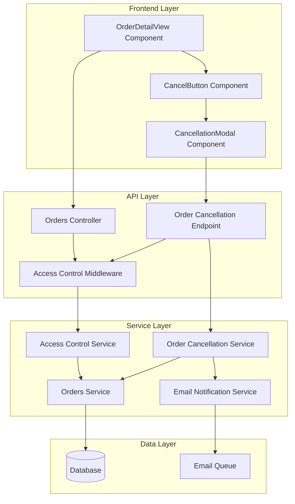
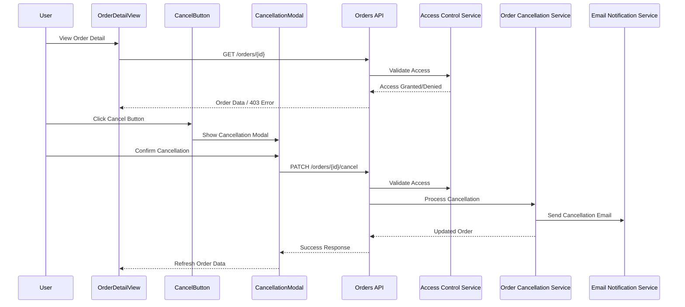

# Design Document

## Overview

This design document outlines the implementation approach for order access control and cancellation functionality in the e-commerce application. The solution enhances the existing order management system by adding robust access control validation and user-friendly order cancellation capabilities, while also improving translation accuracy and currency formatting consistency.

The design leverages the existing OrderDetailView component architecture and extends the current order API with new endpoints and services. The implementation follows the established patterns in the codebase for authentication, authorization, email notifications, and UI components.

## Architecture

### High-Level Architecture



### Component Interaction Flow



## Components and Interfaces

### Frontend Components

#### Enhanced OrderDetailView Component

The existing OrderDetailView component will be enhanced to include access control validation and cancellation functionality:

```typescript
interface OrderDetailViewProps {
  orderId: string;
  locale: 'en' | 'vi';
  showSuccessBanner?: boolean;
  showBankTransferForPaidOrders?: boolean;
}

interface OrderDetailViewState {
  order: Order | null;
  isLoading: boolean;
  error: string | null;
  showCancellationModal: boolean;
  isCancelling: boolean;
  cancellationError: string | null;
}
```

#### CancelButton Component

A new component for the order cancellation button:

```typescript
interface CancelButtonProps {
  order: Order;
  onCancel: () => void;
  disabled?: boolean;
  locale: 'en' | 'vi';
}

// Component will determine visibility based on:
// - Order status (PENDING or PROCESSING only)
// - User permissions (owner or admin)
// - Order cancellation eligibility
```

#### CancellationModal Component

A confirmation modal for order cancellation:

```typescript
interface CancellationModalProps {
  isOpen: boolean;
  onClose: () => void;
  onConfirm: () => Promise<void>;
  order: Order;
  locale: 'en' | 'vi';
  isLoading?: boolean;
  error?: string | null;
}
```

### Backend Services

#### Access Control Service

Handles order access validation:

```typescript
interface AccessControlService {
  validateOrderAccess(
    orderId: string,
    userId?: string,
    userRole?: UserRole,
    sessionId?: string
  ): Promise<boolean>;

  canCancelOrder(
    orderId: string,
    userId?: string,
    userRole?: UserRole
  ): Promise<boolean>;
}
```

#### Order Cancellation Service

Manages the order cancellation process:

```typescript
interface OrderCancellationService {
  cancelOrder(
    orderId: string,
    userId?: string,
    userRole?: UserRole,
    reason?: string
  ): Promise<Order>;

  isOrderCancellable(order: Order): boolean;

  sendCancellationNotifications(order: Order): Promise<void>;
}
```

### API Endpoints

#### Enhanced Order Access Endpoint

```typescript
// GET /orders/{id}
// Enhanced with access control validation
interface OrderAccessResponse {
  order: Order;
  permissions: {
    canView: boolean;
    canCancel: boolean;
    canModify: boolean;
  };
}
```

#### Order Cancellation Endpoint

```typescript
// PATCH /orders/{id}/cancel
interface CancelOrderRequest {
  reason?: string;
}

interface CancelOrderResponse {
  order: Order;
  message: string;
  emailSent: boolean;
}
```

## Data Models

### Enhanced Order Model

The existing Order model will be extended with cancellation-related fields:

```typescript
interface Order {
  // Existing fields...
  id: string;
  orderNumber: string;
  status: OrderStatus;
  paymentStatus: PaymentStatus;
  // ... other existing fields

  // New fields for cancellation tracking
  cancelledAt?: Date;
  cancellationReason?: string;
  cancelledBy?: string; // userId or 'admin'
}
```

### Access Control Context

```typescript
interface OrderAccessContext {
  userId?: string;
  userRole?: UserRole;
  sessionId?: string;
  ipAddress?: string;
  userAgent?: string;
}
```

### Email Template Data

```typescript
interface CancellationEmailData {
  orderNumber: string;
  customerName: string;
  orderDate: string;
  cancelledAt: string;
  orderTotal: number;
  refundAmount: number;
  refundMethod: string;
  estimatedRefundDate: string;
}

interface StatusUpdateEmailData {
  orderNumber: string;
  customerName: string;
  orderDate: string;
  newStatus: string;
  orderTotal: number;
  trackOrderUrl: string;
}
```

## Correctness Properties

*A property is a characteristic or behavior that should hold true across all valid executions of a system-essentially, a formal statement about what the system should do. Properties serve as the bridge between human-readable specifications and machine-verifiable correctness guarantees.*

## Correctness Properties

*A property is a characteristic or behavior that should hold true across all valid executions of a system-essentially, a formal statement about what the system should do. Properties serve as the bridge between human-readable specifications and machine-verifiable correctness guarantees.*

### Property 1: Order Access Control Validation
*For any* order and user combination, access should be granted if and only if the user is the order owner, an administrator, or a guest user with matching session for guest orders
**Validates: Requirements 1.1, 1.2, 1.4, 5.2, 8.1, 8.4**

### Property 2: Access Control Error Handling
*For any* unauthorized access attempt, the system should return a 403 Forbidden error and appropriate error messaging
**Validates: Requirements 1.3, 5.5**

### Property 3: Access Control Consistency
*For any* order access validation, the same access control rules should apply to both order detail pages and order confirmation pages
**Validates: Requirements 1.5**

### Property 4: Cancel Button Visibility Rules
*For any* order and authorized user, the cancel button should be visible if and only if the order status is PENDING or PROCESSING and the user has cancellation permissions
**Validates: Requirements 2.1, 2.2, 2.5, 4.2**

### Property 5: Cancellation Modal Workflow
*For any* cancel button interaction, clicking the button should display a confirmation modal with "Confirm Cancellation" and "Keep Order" options
**Validates: Requirements 2.3, 3.1, 3.2, 3.3**

### Property 6: Modal Interaction Behavior
*For any* cancellation modal interaction, clicking "Keep Order" should close the modal without changes, and clicking "Confirm Cancellation" should trigger the cancellation process
**Validates: Requirements 3.4, 3.5**

### Property 7: Order Cancellation Business Rules
*For any* order cancellation request, the system should only allow cancellation if the order status is PENDING or PROCESSING
**Validates: Requirements 4.1, 5.3**

### Property 8: Cancellation State Transition
*For any* successful order cancellation, the order status should be updated to CANCELLED and the cancel button should be hidden
**Validates: Requirements 4.3, 7.3, 7.4**

### Property 9: Email Notification Triggers
*For any* successful order cancellation or payment status update, the system should send appropriate notification emails to customers and administrators
**Validates: Requirements 4.4, 6.1, 6.1.1, 6.1.4, 6.1.5, 6.4**

### Property 10: Email Content Structure
*For any* status update email, the content should include only essential information: status, order overview (number, date, VND-formatted total), and track order button
**Validates: Requirements 6.2, 6.1.2, 6.2.1, 6.2.2, 6.2.3, 6.2.4**

### Property 11: Email Localization
*For any* email notification, the content should be sent in the customer's preferred language with accurate translations for all status values
**Validates: Requirements 6.3, 6.1.3, 9.1, 9.2, 9.3**

### Property 12: Currency Formatting Consistency
*For any* monetary value displayed on order-related pages, the system should use formatCurrency with VND formatting including proper thousand separators
**Validates: Requirements 10.1, 10.2, 10.3, 10.4, 10.5**

### Property 13: API Response Format
*For any* successful cancellation API request, the response should include the updated order object with CANCELLED status and confirmation message
**Validates: Requirements 5.4**

### Property 14: Error Handling and Logging
*For any* cancellation failure or access control violation, the system should display appropriate error messages and create audit log entries
**Validates: Requirements 4.5, 4.6, 7.6, 8.5**

### Property 15: Rate Limiting Protection
*For any* series of cancellation requests from the same user, excessive requests should be blocked to prevent abuse
**Validates: Requirements 8.3**

### Property 16: UI State Management
*For any* cancellation process, the system should provide loading states during processing and update UI state appropriately upon completion
**Validates: Requirements 7.5, 7.6**

### Property 17: Translation Completeness
*For any* order or payment status value, translation keys should exist for both English and Vietnamese languages
**Validates: Requirements 9.4**

## Error Handling

### Access Control Errors

The system implements comprehensive error handling for access control violations:

#### Unauthorized Access (403 Forbidden)
- **Trigger**: User attempts to access order they don't own
- **Response**: HTTP 403 with localized error message
- **Frontend**: Redirect to error page with appropriate messaging
- **Logging**: Security audit log entry with user details and attempted order ID

#### Order Not Found (404 Not Found)
- **Trigger**: Request for non-existent order ID
- **Response**: HTTP 404 with localized error message
- **Frontend**: Display "Order not found" message with navigation options

#### Session Validation Errors
- **Trigger**: Guest user session mismatch or expiration
- **Response**: HTTP 401 with session refresh instructions
- **Frontend**: Prompt for order lookup or account login

### Cancellation Errors

#### Order Not Cancellable (400 Bad Request)
- **Trigger**: Attempt to cancel order with non-cancellable status
- **Response**: HTTP 400 with status-specific error message
- **Frontend**: Display current order status and available actions
- **Examples**: "Order already shipped", "Order already cancelled"

#### Cancellation Processing Errors (500 Internal Server Error)
- **Trigger**: Database errors, email service failures, or system issues
- **Response**: HTTP 500 with generic error message
- **Frontend**: Display retry option and support contact information
- **Logging**: Detailed error logs for debugging

#### Rate Limiting Errors (429 Too Many Requests)
- **Trigger**: Excessive cancellation requests from same user
- **Response**: HTTP 429 with retry-after header
- **Frontend**: Display cooldown message with retry timer

### Email Service Errors

#### Email Delivery Failures
- **Handling**: Graceful degradation - cancellation proceeds but email failure is logged
- **Retry Logic**: Automatic retry with exponential backoff
- **Fallback**: Admin notification for manual follow-up
- **User Notification**: Success message with note about email delivery

#### Template Rendering Errors
- **Handling**: Fallback to simplified email template
- **Logging**: Template error details for debugging
- **Monitoring**: Alert system administrators of template issues

## Testing Strategy

### Dual Testing Approach

The implementation uses both unit testing and property-based testing for comprehensive coverage:

#### Unit Tests
Unit tests focus on specific examples, edge cases, and integration points:

- **Access Control Examples**: Test specific user-order combinations
- **Cancellation Workflows**: Test complete cancellation flows with mock data
- **Email Template Rendering**: Test email generation with sample order data
- **Error Scenarios**: Test specific error conditions and responses
- **UI Component Behavior**: Test component rendering and user interactions

#### Property-Based Tests

Property-based tests verify universal properties across all inputs with minimum 100 iterations per test:

**Access Control Properties**:
- Generate random users (authenticated, guest, admin) and orders
- Verify access control rules hold for all combinations
- Test session validation for guest users

**Cancellation Properties**:
- Generate orders with various statuses and test cancellation eligibility
- Verify state transitions always follow business rules
- Test email notifications are triggered correctly

**Currency Formatting Properties**:
- Generate random monetary values and verify VND formatting
- Test formatting consistency across all components
- Verify thousand separator placement

**Translation Properties**:
- Generate all possible status combinations
- Verify translations exist for both English and Vietnamese
- Test translation consistency across components

**Email Content Properties**:
- Generate random order data and verify email content structure
- Test that simplified emails contain only required elements
- Verify track order URLs are correctly generated

### Property Test Configuration

Each property test is configured with:
- **Minimum 100 iterations** for thorough randomized testing
- **Tagged with feature and property reference**: `Feature: order-access-control-and-cancellation, Property X: [property description]`
- **Comprehensive input generation** covering edge cases and boundary conditions
- **Clear failure reporting** with counterexamples for debugging

### Integration Testing

#### End-to-End Cancellation Flow
- Test complete user journey from order view to cancellation confirmation
- Verify email delivery and content accuracy
- Test access control at each step

#### Cross-Component Consistency
- Verify currency formatting consistency between OrderDetailView and emails
- Test translation consistency across all order-related components
- Validate access control consistency between detail and confirmation pages

#### Performance Testing
- Test system behavior under high cancellation request volume
- Verify rate limiting effectiveness
- Test email queue performance with bulk cancellations

### Security Testing

#### Access Control Validation
- Test privilege escalation attempts
- Verify session hijacking protection
- Test CSRF protection on cancellation endpoints

#### Input Validation
- Test malformed order IDs and user inputs
- Verify SQL injection protection
- Test XSS prevention in error messages

#### Rate Limiting
- Test rate limiting effectiveness under various attack patterns
- Verify legitimate users aren't blocked by rate limiting
- Test rate limit bypass attempts

### Accessibility Testing

#### Modal Accessibility
- Test keyboard navigation through cancellation modal
- Verify screen reader compatibility
- Test focus management and ARIA labels

#### Error Message Accessibility
- Verify error messages are announced by screen readers
- Test high contrast mode compatibility
- Validate color-blind friendly error indicators

### Monitoring and Observability

#### Metrics Collection
- Track cancellation success/failure rates
- Monitor access control violation frequency
- Measure email delivery success rates
- Track API response times for cancellation endpoints

#### Alerting
- Alert on high cancellation failure rates
- Monitor for unusual access control violation patterns
- Alert on email service degradation
- Track rate limiting activation frequency

#### Audit Logging
- Log all order access attempts with user context
- Record all cancellation attempts and outcomes
- Track email notification delivery status
- Maintain security audit trail for compliance