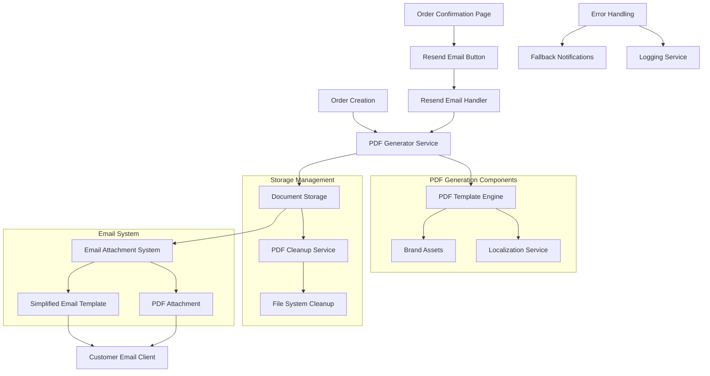

# Design Document

## Overview

This design implements a two-step email system with PDF order attachments that addresses HTML syntax errors with the swaks email command. The solution separates order confirmation from invoice delivery, ensuring customers always receive immediate confirmation while providing professional PDF documentation when pricing is finalized.

The design builds upon the existing email infrastructure and order management system, introducing:
1. **Confirmation emails** (always sent without PDF) to acknowledge order receipt
2. **Invoice emails** (sent with PDF attachment) containing complete pricing and order details
3. **Automatic invoice delivery** for orders with set prices
4. **Admin-controlled invoice delivery** for quote orders after pricing

Key improvements include:
- Two-step email process for clear customer communication
- Professional PDF generation with consistent branding
- Simplified HTML email templates that avoid swaks syntax errors
- Comprehensive order information in printable format
- Temporary file storage with automatic cleanup
- Multi-language support for both English and Vietnamese
- Cross-platform compatibility for viewing and printing

## Architecture



## Components and Interfaces

### 1. PDF Generator Service

**Purpose**: Generate professional, branded PDF documents from order data

**Interface**:
```typescript
interface PDFGeneratorService {
  generateOrderPDF(orderData: OrderPDFData, locale: 'en' | 'vi'): Promise<PDFGenerationResult>;
  validateOrderData(orderData: OrderPDFData): ValidationResult;
  generateInvoicePDF(orderData: OrderPDFData, locale: 'en' | 'vi'): Promise<PDFGenerationResult>;
}

interface OrderPDFData {
  orderNumber: string;
  orderDate: string;
  customerInfo: {
    name: string;
    email: string;
    phone?: string;
  };
  billingAddress: AddressData;
  shippingAddress: AddressData;
  items: OrderItemData[];
  pricing: {
    subtotal: number;
    shippingCost: number;
    taxAmount?: number;
    discountAmount?: number;
    total: number;
  };
  paymentMethod: PaymentMethodData;
  shippingMethod: ShippingMethodData;
  businessInfo: BusinessInfoData;
  locale: 'en' | 'vi';
}

interface PDFGenerationResult {
  success: boolean;
  filePath?: string;
  fileName?: string;
  fileSize?: number;
  error?: string;
  metadata: {
    generatedAt: Date;
    locale: string;
    orderNumber: string;
  };
}

interface PaymentMethodData {
  type: 'bank_transfer' | 'cash_on_delivery' | 'qr_code';
  displayName: string;
  details?: string;
  qrCodeUrl?: string;
  instructions?: string;
  status: 'pending' | 'completed' | 'failed';
}
```

### 2. Email Attachment System

**Purpose**: Send confirmation emails without attachments and invoice emails with PDF attachments

**Interface**:
```typescript
interface EmailAttachmentSystem {
  sendOrderConfirmation(
    customerEmail: string,
    orderData: OrderPDFData,
    locale: 'en' | 'vi'
  ): Promise<EmailSendResult>;

  sendInvoiceEmailWithPDF(
    customerEmail: string,
    pdfFilePath: string,
    orderData: OrderPDFData,
    locale: 'en' | 'vi'
  ): Promise<EmailSendResult>;

  generateConfirmationEmailTemplate(
    orderData: OrderPDFData,
    locale: 'en' | 'vi'
  ): SimplifiedEmailTemplate;

  generateInvoiceEmailTemplate(
    orderData: OrderPDFData,
    locale: 'en' | 'vi'
  ): SimplifiedEmailTemplate;
}

interface EmailSendResult {
  success: boolean;
  messageId?: string;
  error?: string;
  attachmentSize?: number;
  deliveryStatus: 'sent' | 'failed' | 'queued';
  timestamp: Date;
  emailType: 'confirmation' | 'invoice';
}

interface SimplifiedEmailTemplate {
  subject: string;
  textContent: string;
  htmlContent: string; // Minimal HTML to avoid swaks errors
}
```

### 3. Document Storage Service

**Purpose**: Manage temporary PDF file storage and cleanup

**Interface**:
```typescript
interface DocumentStorageService {
  storePDF(pdfBuffer: Buffer, orderNumber: string): Promise<StorageResult>;
  retrievePDF(filePath: string): Promise<Buffer>;
  schedulePDFCleanup(filePath: string, retentionHours: number): Promise<void>;
  cleanupExpiredPDFs(): Promise<CleanupResult>;
  validateStorageCapacity(): Promise<StorageCapacityResult>;
}

interface StorageResult {
  success: boolean;
  filePath?: string;
  fileName?: string;
  fileSize?: number;
  error?: string;
}

interface CleanupResult {
  filesRemoved: number;
  spaceFreed: number;
  errors: string[];
}
```

### 4. PDF Template Engine

**Purpose**: Generate consistent, branded PDF layouts using file-based HTML templates

**Interface**:
```typescript
interface PDFTemplateEngine {
  createOrderTemplate(data: OrderPDFData, locale: 'en' | 'vi'): PDFTemplate;
  createInvoiceTemplate(data: OrderPDFData, locale: 'en' | 'vi'): PDFTemplate;
  applyBranding(template: PDFTemplate): PDFTemplate;
  validateTemplate(template: PDFTemplate): ValidationResult;
  generateHTMLFromOrderData(orderData: OrderPDFData, locale: 'en' | 'vi'): Promise<string>;
  loadTemplateFile(templateName: string): Promise<string>;
  processTemplateVariables(template: string, data: OrderPDFData, locale: 'en' | 'vi'): string;
}

interface PDFTemplateLoaderService {
  loadTemplate(templateName: 'order-confirmation' | 'invoice'): Promise<string>;
  loadStylesheet(): Promise<string>;
  validateTemplate(template: string): ValidationResult;
  cacheTemplate(templateName: string, content: string): void;
  invalidateCache(templateName?: string): void;
}

interface PDFTemplate {
  header: PDFSection;
  content: PDFSection[];
  footer: PDFSection;
  styling: PDFStyling;
  metadata: PDFMetadata;
  templateFile?: string; // Path to template file
  variables?: Record<string, any>; // Template variables
}

interface PDFStyling {
  fonts: {
    primary: string;
    heading: string;
    monospace: string;
  };
  colors: {
    primary: string;
    secondary: string;
    text: string;
    background: string;
    border: string;
  };
  spacing: {
    small: number;
    medium: number;
    large: number;
  };
  pageFormat: {
    size: 'A4' | 'Letter';
    orientation: 'portrait' | 'landscape';
    margins: {
      top: number;
      right: number;
      bottom: number;
      left: number;
    };
  };
  cssFile?: string; // Path to CSS file
}

interface TemplateVariableProcessor {
  processVariables(template: string, data: OrderPDFData, locale: 'en' | 'vi'): string;
  processConditionals(template: string, data: any): string;
  processLoops(template: string, data: any): string;
  escapeHtml(value: string): string;
  formatValue(value: any, type: 'currency' | 'date' | 'text', locale: 'en' | 'vi'): string;
}

**Template Processing Order**:
1. `processLoops` - Processes `{{#each}}` blocks and calls `processConditionals` for content within each iteration
2. `processConditionals` - Processes `{{#if}}` blocks (both standalone and within loops)
3. `processVariables` - Replaces variable placeholders with actual values
4. `formatValue` and `escapeHtml` - Applied during variable replacement
```

**Template File Structure**:
- `backend/src/pdf-generator/templates/order-confirmation.html` - Order confirmation template
- `backend/src/pdf-generator/templates/invoice.html` - Invoice template
- `backend/src/pdf-generator/templates/pdf-styles.css` - Shared CSS styles

**Template Syntax**:
- Variable placeholders: `{{variableName}}`
- Nested objects: `{{customer.name}}`
- Conditionals: `{{#if condition}}...{{/if}}`
- Conditionals with else: `{{#if condition}}...{{else}}...{{/if}}`
- Loops: `{{#each items}}...{{/each}}`
- Localized text: `{{t 'translationKey'}}`

### 6. Quote Item Utilities

**Purpose**: Utility functions for handling quote item detection and validation (extracted from existing sanitizeOrderData logic)

**Interface**:
```typescript
interface QuoteItemUtils {
  hasQuoteItems(orderData: OrderPDFData): boolean;
  validateAllItemsPriced(orderData: OrderPDFData): boolean;
  canGeneratePDF(orderData: OrderPDFData): boolean;
  canChangeOrderStatus(orderData: OrderPDFData): boolean;
}
```

### 7. Admin Pricing Interface (Frontend Only)

**Purpose**: Frontend interface logic for managing quote item pricing using existing backend APIs

**Interface**:
```typescript
interface AdminPricingInterface {
  shouldShowPricingForm(order: OrderData): boolean;
  shouldShowResendButton(order: OrderData): boolean;
  canEditOrderStatus(order: OrderData): boolean;
}
```

### 5. Invoice Email Handler

**Purpose**: Handle invoice email requests for orders with finalized pricing

**Interface**:
```typescript
interface InvoiceEmailHandler {
  handleInvoiceRequest(
    orderNumber: string,
    customerEmail: string,
    locale: 'en' | 'vi'
  ): Promise<InvoiceResult>;

  validateInvoiceRequest(
    orderNumber: string,
    customerEmail: string
  ): Promise<ValidationResult>;

  checkRateLimit(customerEmail: string): Promise<RateLimitResult>;
}

interface InvoiceResult {
  success: boolean;
  message: string;
  rateLimited?: boolean;
  error?: string;
  pdfGenerated?: boolean;
}

interface RateLimitResult {
  allowed: boolean;
  remainingAttempts: number;
  resetTime: Date;
}
```

## Data Models

### Enhanced Order Data Structures

```typescript
interface OrderItemData {
  id: string;
  name: string;
  description?: string;
  sku?: string;
  quantity: number;
  unitPrice: number;
  totalPrice: number;
  imageUrl?: string;
  category?: string;
  isQuoteItem?: boolean;
  hasPrice?: boolean;
  priceSetBy?: string;
  priceSetAt?: Date;
}

interface AddressData {
  fullName: string;
  addressLine1: string;
  addressLine2?: string;
  city: string;
  state: string;
  postalCode: string;
  country: string;
  phone?: string;
}

interface ShippingMethodData {
  name: string;
  description?: string;
  estimatedDelivery?: string;
  trackingNumber?: string;
  carrier?: string;
}

interface BusinessInfoData {
  companyName: string;
  logoUrl?: string;
  contactEmail: string;
  contactPhone?: string;
  website?: string;
  address: AddressData;
  returnPolicy?: string;
  termsAndConditions?: string;
}

interface PDFMetadata {
  title: string;
  author: string;
  subject: string;
  creator: string;
  producer: string;
  creationDate: Date;
  keywords: string[];
}
```

## Correctness Properties

*A property is a characteristic or behavior that should hold true across all valid executions of a system-essentially, a formal statement about what the system should do. Properties serve as the bridge between human-readable specifications and machine-verifiable correctness guarantees.*

### Property 1: Comprehensive PDF generation
*For any* order data, when a PDF is generated, the resulting document should contain all required order information including customer details, items, pricing, and payment information
**Validates: Requirements 1.1, 1.2**

### Property 2: Professional PDF formatting
*For any* generated PDF, the document should use consistent branding, typography, and layout with AlaCraft logo and brand colors
**Validates: Requirements 1.3, 2.1, 2.2**

### Property 3: Required PDF fields presence
*For any* generated PDF, the document should include order date, order number, and customer contact information
**Validates: Requirements 1.4**

### Property 4: Standard printing format
*For any* generated PDF, the document should be formatted for A4 or Letter size paper with proper margins
**Validates: Requirements 1.5**

### Property 5: Payment method consistency
*For any* generated PDF, the payment method details should match exactly what is shown on the order confirmation page
**Validates: Requirements 1.6**

### Property 6: Professional footer inclusion
*For any* generated PDF, the document should include professional footer information with contact details and business information
**Validates: Requirements 2.3**

### Property 7: Product information formatting
*For any* generated PDF, product information should be formatted with clear descriptions, quantities, and pricing
**Validates: Requirements 2.4**

### Property 8: Terms and conditions inclusion
*For any* generated PDF, the document should include terms and conditions or order policies as appropriate
**Validates: Requirements 2.5**

### Property 9: Localization support
*For any* customer locale preference, the PDF should be generated in the appropriate language (English or Vietnamese)
**Validates: Requirements 2.6**

### Property 10: Simplified email templates
*For any* order email sent, the email should use simplified HTML templates that avoid swaks command syntax errors
**Validates: Requirements 3.1**

### Property 11: PDF attachment inclusion
*For any* order email sent, the email should have the generated PDF document properly attached
**Validates: Requirements 3.2**

### Property 12: Attachment explanation
*For any* order email sent, the email should include a brief text message explaining that order details are in the attached PDF
**Validates: Requirements 3.3**

### Property 13: Email client compatibility
*For any* order email sent, the PDF attachment should be properly encoded and compatible with all major email clients
**Validates: Requirements 3.4**

### Property 14: Attachment failure handling
*For any* email attachment failure, the system should handle the error gracefully and provide fallback notification methods
**Validates: Requirements 3.5**

### Property 15: Email delivery verification
*For any* order email sent, the system should verify successful delivery and log any failures for monitoring
**Validates: Requirements 3.6**

### Property 16: Order type handling
*For any* order type (single items, multiple items, zero-price products), the PDF generator should handle the order appropriately
**Validates: Requirements 4.1**

### Property 17: Payment method formatting
*For any* payment method type (bank transfer, cash on delivery, QR code), the PDF should format the payment information correctly
**Validates: Requirements 4.2**

### Property 18: Shipping information completeness
*For any* order with shipping information, the PDF should include complete shipping addresses and delivery method details
**Validates: Requirements 4.3**

### Property 19: Product image handling
*For any* order with product images, the PDF should include images when available and handle missing images gracefully
**Validates: Requirements 4.4**

### Property 20: PDF generation error handling
*For any* PDF generation failure, the system should log detailed error information and provide fallback notification methods
**Validates: Requirements 4.5**

### Property 21: Data validation before generation
*For any* PDF generation request, the system should validate all required data is present before creating the document
**Validates: Requirements 4.6**

### Property 22: Unique file storage
*For any* generated PDF, the document should be stored temporarily with a unique filename in the designated directory
**Validates: Requirements 5.1**

### Property 23: Cleanup scheduling
*For any* successfully sent PDF email, the PDF file should be scheduled for deletion after the specified retention period
**Validates: Requirements 5.2**

### Property 24: Expired file cleanup
*For any* PDF cleanup operation, files older than the retention period should be removed to prevent storage bloat
**Validates: Requirements 5.3**

### Property 25: Storage capacity handling
*For any* storage capacity limit reached, the system should implement appropriate error handling and cleanup procedures
**Validates: Requirements 5.4**

### Property 26: File security measures
*For any* PDF file access, the system should ensure proper file permissions and security measures
**Validates: Requirements 5.5**

### Property 27: Filename conflict handling
*For any* duplicate filename scenario, the system should handle filename conflicts appropriately
**Validates: Requirements 5.6**

### Property 28: Order item information completeness
*For any* PDF containing order items, the document should display product names, descriptions, quantities, unit prices, and total prices clearly
**Validates: Requirements 6.1**

### Property 29: Customer information completeness
*For any* PDF containing customer information, the document should include customer name, email, phone number, and both billing and shipping addresses
**Validates: Requirements 6.2**

### Property 30: Payment information completeness
*For any* PDF containing payment information, the document should show payment method, payment status, and any relevant payment instructions or QR codes
**Validates: Requirements 6.3**

### Property 31: Shipping information completeness
*For any* PDF containing shipping information, the document should include shipping method, estimated delivery date, and tracking information when available
**Validates: Requirements 6.4**

### Property 32: Order summary clarity
*For any* PDF containing order summary, the document should show subtotal, shipping costs, taxes, discounts, and final total with clear calculations
**Validates: Requirements 6.5**

### Property 33: Business information inclusion
*For any* PDF containing business information, the document should include company contact details, return policy information, and customer service contact methods
**Validates: Requirements 6.6**

### Property 34: Email client PDF compatibility
*For any* PDF attached to an email, the attachment should be compatible with all major email clients including Gmail, Outlook, and Apple Mail
**Validates: Requirements 7.1**

### Property 35: Mobile PDF readability
*For any* PDF opened on mobile devices, the document should be readable and navigable on small screens
**Validates: Requirements 7.2**

### Property 36: Desktop PDF optimization
*For any* PDF opened on desktop computers, the document should provide optimal viewing experience with proper zoom and navigation
**Validates: Requirements 7.3**

### Property 37: Print compatibility
*For any* PDF printed, the document should print clearly on standard paper sizes with proper margins
**Validates: Requirements 7.4**

### Property 38: PDF accessibility compliance
*For any* PDF accessed by users with accessibility needs, the document should include proper text structure and accessibility features
**Validates: Requirements 7.5**

### Property 39: Large file handling
*For any* PDF attachment that is too large, the system should implement appropriate compression or alternative delivery methods
**Validates: Requirements 7.6**

### Property 40: PDF regeneration on resend
*For any* resend email button click, the system should regenerate the order PDF with current order information
**Validates: Requirements 8.2**

### Property 41: Resend email delivery
*For any* resend email button click, the system should send a new order confirmation email with the PDF attachment to the customer's email address
**Validates: Requirements 8.3**

### Property 42: Resend success feedback
*For any* successful resend email process, the interface should display a success message confirming the email was sent
**Validates: Requirements 8.4**

### Property 43: Resend error feedback
*For any* failed resend email process, the interface should display an appropriate error message and suggest alternative contact methods
**Validates: Requirements 8.5**

### Property 44: Resend rate limiting
*For any* multiple resend email button clicks, the system should implement rate limiting to prevent spam and system abuse
**Validates: Requirements 8.6**

### Property 45: Standard order email with PDF
*For any* order containing only priced items, the email system should send order confirmation email with PDF attachment using the standard flow
**Validates: Requirements 9.1**

### Property 46: Quote order email without PDF
*For any* order containing any quote items (items without prices), the email system should send order confirmation email without PDF attachment
**Validates: Requirements 9.2**

### Property 47: Order status restriction for quote items
*For any* order containing quote items, the order management system should prevent admin users from changing order status until all items have prices set
**Validates: Requirements 9.3**

### Property 48: Quote item price updates
*For any* admin price setting operation for quote items, the order management system should update the item prices in the order
**Validates: Requirements 9.4**

### Property 49: Resend button visibility for priced orders
*For any* order where all items have prices set, the admin interface should display a "Resend Order Confirmation Email" button
**Validates: Requirements 9.5**

### Property 50: Admin resend with PDF attachment
*For any* admin resend confirmation button click for a fully-priced order, the email system should send order confirmation email with PDF attachment containing current pricing information
**Validates: Requirements 9.6**

### Property 51: Price input fields for quote items
*For any* order with quote items being viewed in admin interface, the interface should display price input fields for items without prices
**Validates: Requirements 10.1**

### Property 52: Price validation for quote items
*For any* admin price entry for quote items, the order management system should validate that prices are positive numbers
**Validates: Requirements 10.2**

### Property 53: Order total recalculation
*For any* admin price saving operation for quote items, the order management system should update the order total calculations including taxes and shipping
**Validates: Requirements 10.3**

### Property 54: Admin controls enablement for priced orders
*For any* order where all quote items have prices set, the admin interface should enable order status changes and display the resend email button
**Validates: Requirements 10.4**

### Property 55: PDF generation with current pricing
*For any* admin resend email click for a fully-priced order, the PDF generator service should create a PDF with all current pricing information
**Validates: Requirements 10.5**

### Property 56: Admin resend success confirmation
*For any* successful resend email operation, the admin interface should display confirmation that the customer has been notified with updated pricing
**Validates: Requirements 10.6**

### Property 57: Multiple price updates allowed
*For any* quote item with previously set prices, the admin interface should allow editing and updating the prices multiple times
**Validates: Requirements 10.7**

### Property 59: Universal confirmation email without attachment
*For any* order placed, the email system should send a confirmation email without PDF attachment to acknowledge receipt
**Validates: Requirements 9.1, 11.1**

### Property 60: Automatic invoice email for priced orders
*For any* order containing only priced items, the email system should automatically send an invoice email with PDF attachment after the confirmation email
**Validates: Requirements 9.2, 11.2**

### Property 61: Single confirmation email for quote orders
*For any* order containing quote items, the email system should send only the confirmation email without PDF attachment
**Validates: Requirements 9.3, 11.3**

### Property 62: Order status restriction for quote items
*For any* order containing quote items, the order management system should prevent admin users from changing order status until all items have prices set
**Validates: Requirements 9.4**

### Property 63: Quote item price updates
*For any* admin price setting operation for quote items, the order management system should update the item prices in the order
**Validates: Requirements 9.5**

### Property 64: Send invoice email button visibility
*For any* order where all items have prices set, the admin interface should display a "Send Invoice Email" button instead of a resend button
**Validates: Requirements 9.6**

### Property 65: Price input fields for quote items
*For any* order with quote items being viewed in admin interface, the interface should display price input fields for items without prices
**Validates: Requirements 10.1**

### Property 66: Price validation for quote items
*For any* admin price entry for quote items, the order management system should validate that prices are positive numbers
**Validates: Requirements 10.2**

### Property 67: Order total recalculation after pricing
*For any* admin price saving operation for quote items, the order management system should update the order total calculations including taxes and shipping
**Validates: Requirements 10.3**

### Property 68: Admin controls enablement for fully priced orders
*For any* order where all quote items have prices set, the admin interface should enable order status changes and display the send invoice email button
**Validates: Requirements 10.4**

### Property 69: PDF generation for invoice emails
*For any* admin "Send Invoice Email" click for a fully-priced order, the PDF generator service should create a PDF with all current pricing information
**Validates: Requirements 10.5**

### Property 70: Admin invoice email success confirmation
*For any* successful invoice email operation, the admin interface should display confirmation that the customer has been notified with updated pricing
**Validates: Requirements 10.6**

### Property 71: Multiple price updates capability
*For any* quote item with previously set prices, the admin interface should allow editing and updating the prices multiple times
**Validates: Requirements 10.7**

### Property 72: Price history maintenance
*For any* quote item price update operation, the order management system should recalculate totals and maintain price history for audit purposes
**Validates: Requirements 10.8**

### Property 73: Invoice email after admin pricing
*For any* admin price setting completion for quote items, the email system should send an invoice email with PDF attachment containing the final pricing
**Validates: Requirements 11.4**

### Property 74: Complete order details in invoice PDF
*For any* invoice email sent, the PDF attachment should contain complete order details including all pricing information
**Validates: Requirements 11.5**

### Property 75: Current pricing accuracy in multiple PDFs
*For any* multiple invoice emails for the same order, each PDF should reflect the current pricing at the time it was generated
**Validates: Requirements 11.6**

### Property 76: Template variable replacement completeness
*For any* template file and order data, all template variables should be replaced with appropriate values and no placeholder variables should remain in the final HTML
**Validates: Requirements 1.1, 6.1, 6.2**

### Property 77: Template file loading reliability
*For any* template file request, the system should either successfully load the template or provide a clear error message with fallback handling
**Validates: Requirements 4.5, 4.6**

### Property 78: Template conditional rendering accuracy
*For any* template with conditional sections, the conditions should be evaluated correctly based on the order data and only appropriate sections should be rendered
**Validates: Requirements 4.4, 6.1**

### Property 79: Template loop processing correctness
*For any* template with loop sections (like order items), all items should be rendered with correct data and formatting
**Validates: Requirements 6.1, 6.5**

### Property 80: Template localization consistency
*For any* template rendered in a specific locale, all text elements should be in the correct language and formatting should follow locale conventions
**Validates: Requirements 2.6**

## Error Handling

### PDF Generation Errors
- **Data Validation Failures**: Validate all required order data before PDF generation
- **Template Rendering Issues**: Provide fallback templates if primary template fails
- **Image Loading Failures**: Include placeholder images and graceful degradation
- **Font Loading Problems**: Use system fonts as fallbacks for custom fonts

### Email Attachment Errors
- **Attachment Size Limits**: Compress PDFs or use alternative delivery methods
- **Email Client Compatibility**: Test with major email clients and provide fallbacks
- **SMTP Delivery Failures**: Implement retry logic and fallback notification methods
- **Encoding Issues**: Use proper MIME types and base64 encoding for attachments

### Storage Management Errors
- **Disk Space Issues**: Implement cleanup procedures and capacity monitoring
- **File Permission Problems**: Ensure proper file system permissions
- **Concurrent Access**: Handle multiple processes accessing the same files
- **Cleanup Failures**: Log cleanup errors and implement manual cleanup procedures

### Resend Functionality Errors
- **Rate Limiting**: Prevent abuse with configurable rate limits
- **Order Not Found**: Handle cases where order data is not available
- **Email Validation**: Validate email addresses before sending
- **Authentication**: Ensure only authorized users can resend emails

## Testing Strategy

### Dual Testing Approach
The testing strategy combines unit testing and property-based testing to ensure comprehensive coverage of PDF generation, email attachment, and storage management functionality.

**Unit Testing Focus**:
- Specific PDF generation scenarios with known order data
- Email attachment edge cases and error conditions
- File storage and cleanup operations
- Resend functionality with various user inputs

**Property-Based Testing Focus**:
- Universal PDF generation properties across all order types
- Email attachment compatibility across different email clients
- Storage management behavior across different file sizes and types
- Rate limiting and security properties across different usage patterns

### Property-Based Testing Framework
- **Framework**: Use `fast-check` for TypeScript property-based testing
- **Test Configuration**: Run minimum 100 iterations per property test
- **Generator Strategy**: Create smart generators for order data that cover edge cases including zero-price products, multiple payment methods, and various address formats
- **Validation Approach**: Parse generated PDFs and verify content, structure, and formatting

### Unit Testing Framework
- **Framework**: Use Jest for unit testing with PDF parsing libraries
- **Coverage Areas**: PDF generation methods, email sending, file storage operations, error scenarios
- **Mock Strategy**: Mock external dependencies (file system, email service) while testing core logic
- **Assertion Strategy**: Use PDF content extraction to verify document structure and content

### Integration Testing
- **PDF Generation Pipeline**: Test complete flow from order data to PDF file
- **Email Attachment Flow**: Test complete flow from PDF generation to email delivery
- **Storage Management**: Test file creation, cleanup, and capacity management
- **Resend Functionality**: Test complete resend flow including rate limiting

### Testing Requirements
- Each correctness property must be implemented by a single property-based test
- Property-based tests must be tagged with format: '**Feature: order-pdf-attachment, Property {number}: {property_text}**'
- Tests must run minimum 100 iterations to ensure statistical confidence
- Unit tests must cover specific examples and edge cases not covered by properties
- All tests must validate real functionality without mocks for core PDF generation logic