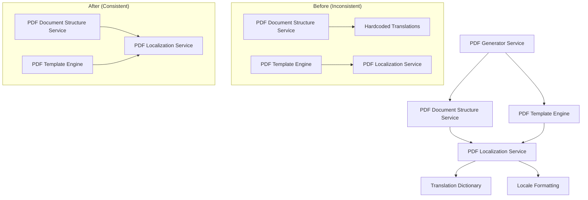

# Design Document

## Overview

This design addresses the inconsistent localization implementation in the PDF generation system, specifically focusing on the shipping information section. The current implementation has a split approach where the PDF Template Engine correctly uses the centralized PDF Localization Service, while the PDF Document Structure Service uses hardcoded conditional logic for translations.

The solution involves refactoring the PDF Document Structure Service to use the existing PDF Localization Service for all shipping-related translations, ensuring consistency across all PDF components and improving maintainability.

## Architecture

The fix will be implemented within the existing PDF generation architecture by modifying the PDF Document Structure Service to use the PDF Localization Service:



## Components and Interfaces

### Modified PDF Document Structure Service

**Updated Method:**
- `generateShippingSection(orderData: OrderPDFData, locale: 'en' | 'vi'): string`

**New Dependencies:**
- Inject `PDFLocalizationService` into the constructor
- Use `translate()` method for all shipping-related text

**Updated Implementation Pattern:**
```typescript
// Before (hardcoded)
const isVietnamese = locale === 'vi';
const title = isVietnamese ? 'Thông tin vận chuyển' : 'Shipping Information';

// After (using localization service)
const title = this.localizationService.translate('shippingInformation', locale);
```

### Existing PDF Localization Service

**Translation Keys Used:**
- `shippingInformation`: Section title
- `shippingMethod`: Shipping method label
- `description`: Description label
- `estimatedDelivery`: Estimated delivery label
- `trackingNumber`: Tracking number label
- `carrier`: Carrier label

**No Changes Required:**
The PDF Localization Service already contains all necessary translation keys for shipping information. No modifications are needed to this service.

## Data Models

No new data models are required. The existing interfaces remain unchanged:

```typescript
interface OrderPDFData {
  // ... existing fields
  shippingMethod: ShippingMethodData;
}

interface ShippingMethodData {
  name: string;
  description?: string;
  estimatedDelivery?: string;
  trackingNumber?: string;
  carrier?: string;
}
```

## Correctness Properties

*A property is a characteristic or behavior that should hold true across all valid executions of a system-essentially, a formal statement about what the system should do. Properties serve as the bridge between human-readable specifications and machine-verifiable correctness guarantees.*

<function_calls>
<invoke name="prework">
<parameter name="featureName">pdf-shipping-localization-fix

### Property 1: Localization service usage for shipping sections
*For any* shipping section generation, the PDF Document Structure Service should use the PDF Localization Service translate method and produce output that matches what the localization service would generate
**Validates: Requirements 1.1**

### Property 2: Translation key usage for shipping labels
*For any* shipping information label, the PDF Document Structure Service should retrieve the text through the localization service using the proper translation keys
**Validates: Requirements 1.2**

### Property 3: Consistent localization patterns across components
*For any* shipping content formatting, the PDF Document Structure Service should use the same localization patterns as other PDF components like the PDF Template Engine
**Validates: Requirements 1.3**

### Property 4: Cross-section translation consistency
*For any* PDF sections that use common shipping-related terms, all sections should use identical translation keys and produce consistent translations
**Validates: Requirements 2.1**

### Property 5: Vietnamese locale shipping translations
*For any* shipping section generated in Vietnamese locale, all shipping-related text should match the Vietnamese translations defined in the localization service
**Validates: Requirements 2.2**

### Property 6: English locale shipping translations
*For any* shipping section generated in English locale, all shipping-related text should match the English translations defined in the localization service
**Validates: Requirements 2.3**

### Property 7: Service translation consistency
*For any* shipping content generated by both PDF Document Structure Service and PDF Template Engine with the same data and locale, both services should produce identical translations
**Validates: Requirements 2.5**

### Property 8: English locale shipping section correctness
*For any* PDF generation with English locale, the shipping section should display all labels and text in English using the localization service translations
**Validates: Requirements 3.1**

### Property 9: Vietnamese locale shipping section correctness
*For any* PDF generation with Vietnamese locale, the shipping section should display all labels and text in Vietnamese using the localization service translations
**Validates: Requirements 3.2**

### Property 10: Service output consistency
*For any* shipping section output comparison between PDF Document Structure Service and PDF Template Engine with the same locale, both should produce identical translations
**Validates: Requirements 3.3**

### Property 11: Translation key completeness
*For any* shipping-related translation key, the key should exist in both English and Vietnamese translation dictionaries in the localization service
**Validates: Requirements 3.4**

### Property 12: Fallback mechanism for missing keys
*For any* missing translation key, the localization service should fall back to the default locale gracefully without causing errors
**Validates: Requirements 3.5**

## Error Handling

The localization fix maintains existing error handling patterns while improving consistency:

### Translation Key Errors
- **Missing Keys**: The PDF Localization Service already has fallback mechanisms for missing translation keys
- **Invalid Locales**: The service normalizes invalid locales to supported formats
- **Null/Undefined Values**: Graceful handling of missing shipping data fields

### Service Integration Errors
- **Localization Service Unavailable**: Maintain existing error handling patterns
- **Translation Failures**: Log errors and use fallback text when translations fail
- **Dependency Injection Issues**: Proper error handling for service initialization

## Testing Strategy

### Dual Testing Approach
The testing strategy combines unit testing and property-based testing to ensure comprehensive coverage of the localization fix.

**Unit Testing Focus**:
- Specific shipping section generation with known data
- Translation key existence and correctness
- Service integration and dependency injection
- Error handling scenarios

**Property-Based Testing Focus**:
- Universal localization behavior across all shipping data variations
- Cross-service consistency between PDF Document Structure Service and PDF Template Engine
- Translation completeness across both supported locales
- Fallback behavior for edge cases

### Property-Based Testing Framework
- **Framework**: Use `fast-check` for TypeScript property-based testing
- **Test Configuration**: Run minimum 100 iterations per property test
- **Generator Strategy**: Create smart generators for shipping data that cover various combinations of optional fields (description, tracking number, carrier, estimated delivery)
- **Validation Approach**: Parse generated HTML content and verify translation usage and consistency

### Unit Testing Framework
- **Framework**: Use Jest for unit testing with HTML parsing capabilities
- **Coverage Areas**: Translation key usage, service integration, error scenarios
- **Mock Strategy**: Mock shipping data while testing real localization service integration
- **Assertion Strategy**: Use HTML content parsing to verify proper translation key usage

### Integration Testing
- **Cross-Service Consistency**: Test that both PDF Document Structure Service and PDF Template Engine produce identical translations
- **Locale Switching**: Test behavior when switching between English and Vietnamese locales
- **Translation Updates**: Verify that changes to the localization service are reflected in generated content

### Testing Requirements
- Each correctness property must be implemented by a single property-based test
- Property-based tests must be tagged with format: '**Feature: pdf-shipping-localization-fix, Property {number}: {property_text}**'
- Tests must run minimum 100 iterations to ensure statistical confidence
- Unit tests must cover specific examples and edge cases not covered by properties
- All tests must validate real functionality using the actual localization service

## Implementation Notes

### Backward Compatibility
The change maintains backward compatibility by:
- Keeping the same method signature for `generateShippingSection`
- Preserving existing HTML structure and CSS classes
- Not affecting other PDF generation functionality
- Using existing translation keys from the localization service

### Performance Considerations
- No additional performance overhead as the localization service is already available
- Reduced code complexity by eliminating conditional translation logic
- Consistent translation caching behavior across all PDF components

### Maintenance Benefits
- Centralized translation management in one service
- Eliminates duplicate translation logic
- Easier to add new shipping-related translations
- Consistent translation patterns across all PDF components
- Simplified testing and validation of translations