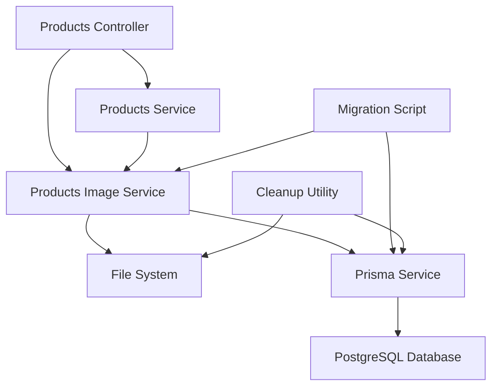

# Design Document

## Overview

This design document outlines the reorganization of the product image storage system from a flat directory structure to a hierarchical structure organized by product ID. The current implementation stores all product images in `uploads/products/` and thumbnails in `uploads/products/thumbnails/`, which can lead to performance issues as the number of images grows. The new structure will organize images as `uploads/products/[product-id]/` with thumbnails in `uploads/products/[product-id]/thumbnails/`, providing better file system performance, easier management, and simplified cleanup operations.

The implementation will include:
- Updated image upload service to use the new directory structure
- Migration script to move existing images to the new structure
- Database URL updates to reflect new paths
- Cleanup utilities to identify and remove orphaned images
- Backward compatibility during the transition period

## Architecture

### Current Architecture

```
uploads/
  products/
    [product-id]-[timestamp]-[random].jpg
    [product-id]-[timestamp]-[random].jpg
    ...
    thumbnails/
      [product-id]-[timestamp]-[random].jpg
      [product-id]-[timestamp]-[random].jpg
      ...
```

**Issues:**
- Single directory with potentially thousands of files
- Slower file system operations as directory grows
- Difficult to identify which images belong to which product
- Cleanup requires database queries to identify orphaned files
- No clear ownership of files by product

### New Architecture

```
uploads/
  products/
    [product-id-1]/
      [timestamp]-[random].jpg
      [timestamp]-[random].jpg
      thumbnails/
        [timestamp]-[random].jpg
        [timestamp]-[random].jpg
    [product-id-2]/
      [timestamp]-[random].jpg
      thumbnails/
        [timestamp]-[random].jpg
    ...
```

**Benefits:**
- Improved file system performance with smaller directories
- Clear ownership: each product has its own directory
- Simplified cleanup: delete entire directory when product is removed
- Easier to identify orphaned images
- Better organization for backups and migrations
- Filename can be shorter (no need to prefix with product ID)

### Component Interaction



## Components and Interfaces

### 1. ProductsImageService (Modified)

**Responsibilities:**
- Upload images to product-specific directories
- Generate thumbnails in product-specific subdirectories
- Update database with new URL format
- Delete product directories when images are removed
- Provide backward compatibility for legacy URLs

**Key Methods:**

```typescript
class ProductsImageService {
  // Updated to use product-specific directories
  async uploadProductImage(
    productId: string,
    file: Express.Multer.File,
    imageDto?: CreateProductImageDto
  ): Promise<ProductImage>

  // Updated to use product-specific directories
  async uploadMultipleImages(
    productId: string,
    files: Express.Multer.File[],
    startOrder: number,
    altTextEn?: string,
    altTextVi?: string,
    skipProductCheck?: boolean,
    prismaClient?: any
  ): Promise<{ images: ProductImage[], errors?: any[] }>

  // Updated to remove entire product directory if last image
  async deleteProductImage(
    productId: string,
    imageId: string
  ): Promise<{ message: string }>

  // Helper methods
  private getProductUploadDir(productId: string): string
  private getProductThumbnailDir(productId: string): string
  private ensureProductDirectories(productId: string): Promise<void>
}
```

### 2. ImageMigrationService (New)

**Responsibilities:**
- Migrate existing images from flat structure to hierarchical structure
- Update database URLs to reflect new paths
- Verify migration success
- Handle errors gracefully
- Provide rollback capability

**Interface:**

```typescript
interface MigrationResult {
  totalImages: number;
  migratedImages: number;
  failedImages: number;
  skippedImages: number;
  errors: Array<{
    imageId: string;
    filename: string;
    error: string;
  }>;
}

interface MigrationOptions {
  dryRun?: boolean;
  batchSize?: number;
  backupDatabase?: boolean;
}

class ImageMigrationService {
  async migrateImages(options?: MigrationOptions): Promise<MigrationResult>
  async verifyMigration(): Promise<{ valid: boolean; issues: string[] }>
  async rollback(): Promise<void>

  private async extractProductIdFromFilename(filename: string): Promise<string | null>
  private async moveImageFiles(
    productId: string,
    oldPath: string,
    newPath: string
  ): Promise<void>
  private async updateDatabaseUrls(
    imageId: string,
    newUrl: string
  ): Promise<void>
}
```

### 3. ImageCleanupService (New)

**Responsibilities:**
- Identify orphaned image directories
- Remove directories for deleted products
- Generate cleanup reports

**Interface:**

```typescript
interface CleanupResult {
  orphanedDirectories: string[];
  totalSize: number;
  recommendations: string[];
}

class ImageCleanupService {
  async findOrphanedDirectories(): Promise<CleanupResult>
  async removeOrphanedDirectory(productId: string): Promise<void>
  async cleanupAllOrphaned(confirm: boolean): Promise<CleanupResult>
}
```

## Data Models

### ProductImage Model (Existing - No Changes)

```typescript
model ProductImage {
  id            String   @id @default(uuid())
  productId     String
  url           String   // Will be updated to new format
  altTextEn     String?
  altTextVi     String?
  displayOrder  Int      @default(0)
  createdAt     DateTime @default(now())
  updatedAt     DateTime @updatedAt

  product       Product  @relation(fields: [productId], references: [id], onDelete: Cascade)

  @@index([productId])
  @@map("product_images")
}
```

**URL Format Changes:**
- Old: `/uploads/products/[product-id]-[timestamp]-[random].jpg`
- New: `/uploads/products/[product-id]/[timestamp]-[random].jpg`

### Migration Tracking (Optional)

For tracking migration progress, we could add a simple table:

```typescript
model ImageMigrationLog {
  id            String   @id @default(uuid())
  imageId       String
  oldUrl        String
  newUrl        String
  status        String   // 'pending', 'completed', 'failed'
  error         String?
  migratedAt    DateTime?
  createdAt     DateTime @default(now())
}
```

This is optional and can be implemented if detailed tracking is needed.

##Corr
ectness Properties

*A property is a characteristic or behavior that should hold true across all valid executions of a system—essentially, a formal statement about what the system should do. Properties serve as the bridge between human-readable specifications and machine-verifiable correctness guarantees.*

### Property Reflection

After analyzing all acceptance criteria, the following redundancies were identified:
- Criteria 1.2 is redundant with 1.1 (both test that images are stored in product-specific directories)
- Criteria 1.1, 1.3, and 1.4 can be combined into a comprehensive property about correct directory structure
- Criteria 2.6 is a verification step that's covered by 2.5 (database URLs matching file locations)
- Criteria 6.1-6.5 are meta-requirements about testing, not system properties

### Upload Properties

**Property 1: Image storage directory structure**
*For any* product and uploaded image, the system should store the original image in `uploads/products/[product-id]/[filename]` and the thumbnail in `uploads/products/[product-id]/thumbnails/[filename]`, and the database URL should match the actual file path.
**Validates: Requirements 1.1, 1.2, 1.3, 1.4**

**Property 2: Multiple images same directory**
*For any* product with multiple images, all images for that product should be stored in the same product-specific directory.
**Validates: Requirements 1.5**

### Migration Properties

**Property 3: Migration identifies all images**
*For any* set of images in the flat directory structure, the migration process should identify all images that have valid product IDs in their filenames.
**Validates: Requirements 2.1**

**Property 4: Product ID extraction**
*For any* image filename in the format `[product-id]-[timestamp]-[random].jpg`, the migration process should correctly extract the product ID.
**Validates: Requirements 2.2**

**Property 5: Directory creation during migration**
*For any* image being migrated, if the target product directory does not exist, the migration process should create it before moving the image.
**Validates: Requirements 2.3**

**Property 6: Paired file migration**
*For any* image being migrated, both the original image and its corresponding thumbnail should be moved to the new location together.
**Validates: Requirements 2.4**

**Property 7: Database URL update consistency**
*For any* migrated image, the URL in the database should be updated to match the new file location, and the file should exist at that location.
**Validates: Requirements 2.5, 2.6**

**Property 8: Migration result accuracy**
*For any* migration execution, the reported counts (total, migrated, failed, skipped) should sum correctly and match the actual number of images processed.
**Validates: Requirements 2.8**

### Migration Safety Properties

**Property 9: File copy before delete**
*For any* image being migrated, the new file should exist and be readable before the original file is deleted.
**Validates: Requirements 3.2**

### Cleanup Properties

**Property 10: Product deletion cleanup**
*For any* product being deleted, if the product has a directory in the uploads folder, the entire directory and all its contents should be removed.
**Validates: Requirements 4.1**

**Property 11: Directory discovery completeness**
*For any* cleanup execution, all product directories in the uploads folder should be identified and checked.
**Validates: Requirements 4.2**

**Property 12: Orphan detection**
*For any* product directory in the uploads folder, if the product ID does not exist in the database, the directory should be marked as orphaned.
**Validates: Requirements 4.3, 4.4**

**Property 13: Orphan reporting completeness**
*For any* cleanup execution, all orphaned directories should be included in the cleanup report.
**Validates: Requirements 4.5**

### Backward Compatibility Properties

**Property 14: Hierarchical location priority**
*For any* image retrieval request, the system should check the new hierarchical location before checking the legacy flat directory location.
**Validates: Requirements 5.1**

**Property 15: Legacy fallback**
*For any* image that exists only in the legacy flat directory location, the system should successfully retrieve it from that location.
**Validates: Requirements 5.2**

**Property 16: Legacy access logging**
*For any* image served from the legacy flat directory location, a warning should be logged.
**Validates: Requirements 5.3**

## Error Handling

### Upload Errors

1. **Invalid File Type**
   - Validate MIME type before processing
   - Return clear error message
   - Do not create directories or database records

2. **File Size Exceeded**
   - Check file size before processing
   - Return clear error message with size limit
   - Do not create directories or database records

3. **Disk Space Issues**
   - Catch file system errors during write
   - Clean up partial uploads
   - Return appropriate error message

4. **Database Transaction Failures**
   - Rollback database changes
   - Clean up uploaded files
   - Return error with details

### Migration Errors

1. **Invalid Filename Format**
   - Log filename and skip migration
   - Continue with other images
   - Include in migration report

2. **File Copy Failures**
   - Halt migration for that image
   - Preserve original file
   - Log error with details
   - Continue with other images

3. **Database Update Failures**
   - Rollback transaction
   - Do not delete original files
   - Log error with details
   - Allow retry

4. **Insufficient Permissions**
   - Check permissions before starting
   - Provide clear error message
   - Suggest remediation steps

### Cleanup Errors

1. **Permission Denied**
   - Log error with directory path
   - Continue with other directories
   - Include in cleanup report

2. **Directory Not Empty (Unexpected Files)**
   - Log warning
   - Skip deletion
   - Include in cleanup report for manual review

## Testing Strategy

### Unit Testing

We will write unit tests for specific scenarios and edge cases:

**Upload Tests:**
- Test uploading a single image creates correct directory structure
- Test uploading multiple images to the same product
- Test error handling for invalid file types
- Test error handling for oversized files
- Test cleanup on database transaction failure

**Migration Tests:**
- Test migration with empty source directory
- Test migration with invalid filenames
- Test migration with missing thumbnails
- Test database backup creation
- Test rollback functionality

**Cleanup Tests:**
- Test cleanup with no orphaned directories
- Test cleanup with multiple orphaned directories
- Test cleanup report generation

### Property-Based Testing

We will use property-based testing to verify universal properties across many inputs. The testing library will be **fast-check** for TypeScript/Node.js, which provides excellent support for property-based testing with custom generators.

**Configuration:**
- Each property-based test will run a minimum of 100 iterations
- Tests will use custom generators for product IDs, filenames, and file buffers
- Each test will be tagged with the format: `**Feature: product-image-storage-reorganization, Property {number}: {property_text}**`

**Property Test Coverage:**

1. **Property 1: Image storage directory structure** - Generate random products and images, upload them, verify directory structure and database URLs
2. **Property 2: Multiple images same directory** - Generate random products with multiple images, verify all in same directory
3. **Property 3: Migration identifies all images** - Generate random sets of valid image files, verify all are identified
4. **Property 4: Product ID extraction** - Generate random filenames with product IDs, verify correct extraction
5. **Property 5: Directory creation during migration** - Generate random images for non-existent directories, verify creation
6. **Property 6: Paired file migration** - Generate random image pairs, verify both are migrated together
7. **Property 7: Database URL update consistency** - Generate random images, migrate them, verify database URLs match file locations
8. **Property 8: Migration result accuracy** - Generate random image sets, verify migration counts are accurate
9. **Property 9: File copy before delete** - Generate random images, verify new file exists before old is deleted
10. **Property 10: Product deletion cleanup** - Generate random products with images, delete them, verify directories removed
11. **Property 11: Directory discovery completeness** - Generate random product directories, verify all are discovered
12. **Property 12: Orphan detection** - Generate directories for non-existent products, verify marked as orphaned
13. **Property 13: Orphan reporting completeness** - Generate random orphaned directories, verify all in report
14. **Property 14: Hierarchical location priority** - Generate images in both locations, verify new location checked first
15. **Property 15: Legacy fallback** - Generate images in legacy location only, verify successful retrieval
16. **Property 16: Legacy access logging** - Generate images in legacy location, verify warnings logged

### Integration Testing

Integration tests will verify the complete flow:

1. **End-to-End Upload Flow**
   - Create product → Upload images → Verify storage → Verify database → Retrieve images

2. **End-to-End Migration Flow**
   - Seed legacy images → Run migration → Verify new structure → Verify database → Verify retrieval

3. **End-to-End Cleanup Flow**
   - Create orphaned directories → Run cleanup → Verify detection → Verify reporting

### Test Data Generators

For property-based testing, we'll create custom generators:

```typescript
// Generator for valid product IDs (UUIDs)
const productIdGenerator = fc.uuid();

// Generator for image filenames
const imageFilenameGenerator = fc.tuple(
  productIdGenerator,
  fc.integer({ min: 1000000000000, max: 9999999999999 }),
  fc.hexaString({ minLength: 6, maxLength: 6 })
).map(([id, timestamp, random]) => `${id}-${timestamp}-${random}.jpg`);

// Generator for image buffers (small test images)
const imageBufferGenerator = fc.constant(
  Buffer.from('fake-image-data')
);

// Generator for product with multiple images
const productWithImagesGenerator = fc.tuple(
  productIdGenerator,
  fc.array(imageBufferGenerator, { minLength: 1, maxLength: 10 })
);
```

## Implementation Phases

### Phase 1: Update Upload Service
- Modify `ProductsImageService` to use product-specific directories
- Update path generation logic
- Update directory creation logic
- Maintain backward compatibility for reads

### Phase 2: Create Migration Service
- Implement `ImageMigrationService`
- Add database backup functionality
- Add file migration logic
- Add verification logic
- Create migration CLI command

### Phase 3: Create Cleanup Service
- Implement `ImageCleanupService`
- Add orphan detection logic
- Add cleanup reporting
- Create cleanup CLI command

### Phase 4: Testing
- Write unit tests for all services
- Write property-based tests for all properties
- Write integration tests for complete flows
- Perform manual testing

### Phase 5: Migration Execution
- Run migration in staging environment
- Verify results
- Run migration in production
- Monitor for issues

### Phase 6: Cleanup
- Remove backward compatibility code
- Remove legacy directory structure
- Update documentation

## Rollback Plan

If issues are discovered after migration:

1. **Immediate Rollback**
   - Restore database from backup
   - Keep both old and new files (no data loss)
   - Revert code to previous version

2. **Partial Rollback**
   - Identify problematic images
   - Restore their database URLs
   - Keep files in both locations temporarily

3. **Forward Fix**
   - Fix migration script
   - Re-run migration for failed images
   - Verify results

## Performance Considerations

### File System Performance

- **Before**: Single directory with N files → O(N) lookup time
- **After**: N directories with ~M files each → O(M) lookup time per directory
- Expected improvement: Significant for N > 1000 files

### Migration Performance

- Process images in batches (default: 50 images per batch)
- Use parallel file operations where safe
- Use database transactions for batch updates
- Estimated time: ~1-2 seconds per image (including thumbnail generation)

### Storage Requirements

- During migration: 2x storage (old + new files)
- After migration: Same storage as before
- Recommend 50% free space before starting migration

## Security Considerations

1. **Path Traversal Prevention**
   - Validate product IDs are valid UUIDs
   - Sanitize all file paths
   - Never use user input directly in paths

2. **File Permissions**
   - Ensure proper permissions on created directories
   - Restrict access to upload directories
   - Use appropriate umask settings

3. **Database Security**
   - Use parameterized queries
   - Validate all inputs
   - Use transactions for atomicity

## Monitoring and Logging

### Key Metrics

- Upload success/failure rate
- Migration progress and errors
- Legacy fallback usage (should decrease over time)
- Orphaned directory count

### Log Levels

- **INFO**: Normal operations (upload, migration progress)
- **WARN**: Legacy fallback usage, non-critical errors
- **ERROR**: Upload failures, migration failures, cleanup errors

### Alerts

- High rate of upload failures
- Migration stalled or failing
- Increasing orphaned directories
- Continued legacy fallback usage after migration
