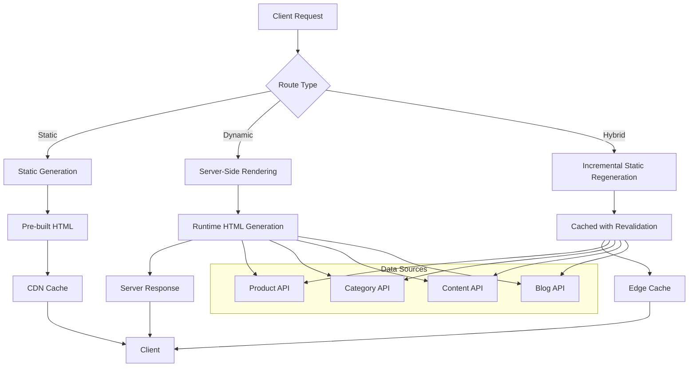

# Design Document: SSR Enhancement for Ecommerce SEO

## Overview

This design document outlines the comprehensive enhancement of Server-Side Rendering (SSR) capabilities for the Next.js ecommerce frontend. The enhancement will transform the current partially SSR-enabled application into a fully optimized, search engine-friendly platform that leverages Next.js 15 App Router features for maximum SEO performance and user experience.

The design focuses on implementing server-side rendering for all critical ecommerce pages, optimizing Core Web Vitals, implementing comprehensive structured data markup, and creating a robust caching strategy that balances performance with data freshness.

## Architecture

### Current State Analysis

The existing application already has:
- ✅ Next.js App Router with basic SSR layout
- ✅ Internationalization with static params generation
- ✅ Basic SEO metadata generation
- ✅ Footer settings fetched server-side
- ✅ Some structured data implementation

### Enhanced SSR Architecture



### Rendering Strategy Matrix

| Page Type | Rendering Method | Revalidation | Reason |
|-----------|------------------|--------------|---------|
| Homepage | ISR | 300s (5 min) | Featured products change frequently |
| Product Detail | ISR | 600s (10 min) | Product data updates periodically |
| Category Pages | ISR | 900s (15 min) | Product listings change regularly |
| Blog Posts | Static | On-demand | Content rarely changes after publish |
| Static Pages | Static | Build time | Content changes infrequently |
| Search Results | SSR | No cache | Dynamic, user-specific content |
| User Dashboard | SSR | No cache | User-specific, real-time data |

## Components and Interfaces

### 1. Enhanced Page Components

#### Product Detail Page Enhancement
```typescript
// app/[locale]/products/[slug]/page.tsx
interface ProductPageProps {
  params: Promise<{ locale: string; slug: string }>;
}

interface ProductData {
  id: string;
  name: string;
  description: string;
  price: number;
  images: ProductImage[];
  category: Category;
  availability: 'InStock' | 'OutOfStock' | 'PreOrder';
  reviews: Review[];
  rating: number;
  brand: string;
  sku: string;
}

// Server-side data fetching
async function getProductData(slug: string): Promise<ProductData | null> {
  const baseUrl = process.env.NEXT_PUBLIC_API_URL || 'http://localhost:3001';
  const response = await fetch(`${baseUrl}/products/slug/${slug}`, {
    next: { revalidate: 600 } // 10 minutes ISR
  });

  if (!response.ok) return null;
  return response.json();
}

export async function generateMetadata({ params }: ProductPageProps): Promise<Metadata> {
  const { locale, slug } = await params;
  const product = await getProductData(slug);

  if (!product) return { title: 'Product Not Found' };

  return generateProductSEOMetadata({
    product,
    locale,
    path: `/products/${slug}`
  });
}

export async function generateStaticParams() {
  // Generate static params for popular products only
  // Other products will be generated on-demand with ISR
  const popularProducts = await getPopularProductSlugs();
  return popularProducts.map(slug => ({ slug }));
}
```

#### Category Page Enhancement
```typescript
// app/[locale]/categories/[slug]/page.tsx
interface CategoryPageProps {
  params: Promise<{ locale: string; slug: string }>;
  searchParams: Promise<{ page?: string; sort?: string; filter?: string }>;
}

interface CategoryData {
  id: string;
  name: string;
  description: string;
  image: string;
  products: Product[];
  totalProducts: number;
  breadcrumbs: Breadcrumb[];
}

async function getCategoryData(
  slug: string,
  page: number = 1,
  sort?: string,
  filter?: string
): Promise<CategoryData | null> {
  const baseUrl = process.env.NEXT_PUBLIC_API_URL || 'http://localhost:3001';
  const params = new URLSearchParams({
    page: page.toString(),
    ...(sort && { sort }),
    ...(filter && { filter })
  });

  const response = await fetch(`${baseUrl}/categories/slug/${slug}?${params}`, {
    next: { revalidate: 900 } // 15 minutes ISR
  });

  if (!response.ok) return null;
  return response.json();
}
```

#### Homepage Enhancement
```typescript
// app/[locale]/page.tsx
interface HomepageData {
  featuredProducts: Product[];
  promotionalBanners: Banner[];
  homepageSections: HomepageSection[];
  categories: Category[];
}

async function getHomepageData(): Promise<HomepageData> {
  const baseUrl = process.env.NEXT_PUBLIC_API_URL || 'http://localhost:3001';

  const [featuredProducts, banners, sections, categories] = await Promise.all([
    fetch(`${baseUrl}/products/featured`, { next: { revalidate: 300 } }),
    fetch(`${baseUrl}/banners/active`, { next: { revalidate: 300 } }),
    fetch(`${baseUrl}/homepage-sections`, { next: { revalidate: 300 } }),
    fetch(`${baseUrl}/categories`, { next: { revalidate: 900 } })
  ]);

  return {
    featuredProducts: await featuredProducts.json(),
    promotionalBanners: await banners.json(),
    homepageSections: await sections.json(),
    categories: await categories.json()
  };
}
```

### 2. SEO and Metadata System

#### Enhanced SEO Utility Functions
```typescript
// lib/seo-enhanced.ts
interface SEOMetadataOptions {
  title: string;
  description: string;
  locale: string;
  path: string;
  type: 'website' | 'product' | 'article' | 'category';
  image?: string;
  price?: number;
  availability?: string;
  rating?: number;
  reviewCount?: number;
}

export function generateEnhancedSEOMetadata(options: SEOMetadataOptions): Metadata {
  const { title, description, locale, path, type, image, price, availability, rating, reviewCount } = options;
  const siteUrl = process.env.NEXT_PUBLIC_SITE_URL || '';
  const fullUrl = `${siteUrl}${locale === 'vi' ? '' : `/${locale}`}${path}`;

  const metadata: Metadata = {
    title,
    description,
    alternates: {
      canonical: fullUrl,
      languages: {
        'vi': `${siteUrl}${path}`,
        'en': `${siteUrl}/en${path}`,
        'x-default': `${siteUrl}${path}`
      }
    },
    openGraph: {
      title,
      description,
      url: fullUrl,
      type: type === 'product' ? 'product' : 'website',
      locale: locale === 'vi' ? 'vi_VN' : 'en_US',
      siteName: 'Handmade Ecommerce',
      ...(image && { images: [{ url: image, width: 1200, height: 630 }] })
    },
    twitter: {
      card: 'summary_large_image',
      title,
      description,
      ...(image && { images: [image] })
    },
    robots: {
      index: true,
      follow: true,
      googleBot: {
        index: true,
        follow: true,
        'max-video-preview': -1,
        'max-image-preview': 'large',
        'max-snippet': -1,
      }
    }
  };

  // Add product-specific metadata
  if (type === 'product' && price !== undefined) {
    metadata.openGraph = {
      ...metadata.openGraph,
      type: 'product',
      // @ts-ignore - OpenGraph product properties
      'product:price:amount': price,
      'product:price:currency': 'VND',
      'product:availability': availability || 'in stock'
    };
  }

  return metadata;
}
```

### 3. Structured Data System

#### Product Schema Generator
```typescript
// lib/structured-data.ts
export function generateProductSchema(product: ProductData, locale: string) {
  const baseUrl = process.env.NEXT_PUBLIC_SITE_URL || '';

  return {
    '@context': 'https://schema.org',
    '@type': 'Product',
    name: product.name,
    description: product.description,
    image: product.images.map(img => `${baseUrl}${img.url}`),
    sku: product.sku,
    brand: {
      '@type': 'Brand',
      name: product.brand
    },
    offers: {
      '@type': 'Offer',
      price: product.price,
      priceCurrency: 'VND',
      availability: `https://schema.org/${product.availability}`,
      url: `${baseUrl}${locale === 'vi' ? '' : `/${locale}`}/products/${product.slug}`,
      seller: {
        '@type': 'Organization',
        name: 'Handmade Ecommerce'
      }
    },
    aggregateRating: product.reviews.length > 0 ? {
      '@type': 'AggregateRating',
      ratingValue: product.rating,
      reviewCount: product.reviews.length,
      bestRating: 5,
      worstRating: 1
    } : undefined,
    review: product.reviews.map(review => ({
      '@type': 'Review',
      reviewRating: {
        '@type': 'Rating',
        ratingValue: review.rating,
        bestRating: 5,
        worstRating: 1
      },
      author: {
        '@type': 'Person',
        name: review.authorName
      },
      reviewBody: review.comment,
      datePublished: review.createdAt
    }))
  };
}

export function generateCategorySchema(category: CategoryData, locale: string) {
  const baseUrl = process.env.NEXT_PUBLIC_SITE_URL || '';

  return {
    '@context': 'https://schema.org',
    '@type': 'CollectionPage',
    name: category.name,
    description: category.description,
    url: `${baseUrl}${locale === 'vi' ? '' : `/${locale}`}/categories/${category.slug}`,
    mainEntity: {
      '@type': 'ItemList',
      numberOfItems: category.totalProducts,
      itemListElement: category.products.map((product, index) => ({
        '@type': 'ListItem',
        position: index + 1,
        item: {
          '@type': 'Product',
          name: product.name,
          url: `${baseUrl}${locale === 'vi' ? '' : `/${locale}`}/products/${product.slug}`,
          image: product.images[0]?.url,
          offers: {
            '@type': 'Offer',
            price: product.price,
            priceCurrency: 'VND'
          }
        }
      }))
    }
  };
}

export function generateBreadcrumbSchema(breadcrumbs: Breadcrumb[], locale: string) {
  const baseUrl = process.env.NEXT_PUBLIC_SITE_URL || '';

  return {
    '@context': 'https://schema.org',
    '@type': 'BreadcrumbList',
    itemListElement: breadcrumbs.map((crumb, index) => ({
      '@type': 'ListItem',
      position: index + 1,
      name: crumb.name,
      item: `${baseUrl}${locale === 'vi' ? '' : `/${locale}`}${crumb.path}`
    }))
  };
}
```

### 4. Sitemap Generation System

#### Dynamic Sitemap Generator
```typescript
// app/sitemap.ts
import { MetadataRoute } from 'next';

interface SitemapEntry {
  url: string;
  lastModified?: string | Date;
  changeFrequency?: 'always' | 'hourly' | 'daily' | 'weekly' | 'monthly' | 'yearly' | 'never';
  priority?: number;
}

async function getProductUrls(): Promise<SitemapEntry[]> {
  const baseUrl = process.env.NEXT_PUBLIC_SITE_URL || '';
  const apiUrl = process.env.NEXT_PUBLIC_API_URL || 'http://localhost:3001';

  try {
    const response = await fetch(`${apiUrl}/products/sitemap`);
    const products = await response.json();

    const urls: SitemapEntry[] = [];

    products.forEach((product: any) => {
      // Vietnamese (default) URL
      urls.push({
        url: `${baseUrl}/products/${product.slug}`,
        lastModified: product.updatedAt,
        changeFrequency: 'weekly',
        priority: 0.8
      });

      // English URL
      urls.push({
        url: `${baseUrl}/en/products/${product.slug}`,
        lastModified: product.updatedAt,
        changeFrequency: 'weekly',
        priority: 0.8
      });
    });

    return urls;
  } catch (error) {
    console.error('Error fetching product URLs for sitemap:', error);
    return [];
  }
}

async function getCategoryUrls(): Promise<SitemapEntry[]> {
  const baseUrl = process.env.NEXT_PUBLIC_SITE_URL || '';
  const apiUrl = process.env.NEXT_PUBLIC_API_URL || 'http://localhost:3001';

  try {
    const response = await fetch(`${apiUrl}/categories/sitemap`);
    const categories = await response.json();

    const urls: SitemapEntry[] = [];

    categories.forEach((category: any) => {
      urls.push({
        url: `${baseUrl}/categories/${category.slug}`,
        lastModified: category.updatedAt,
        changeFrequency: 'daily',
        priority: 0.7
      });

      urls.push({
        url: `${baseUrl}/en/categories/${category.slug}`,
        lastModified: category.updatedAt,
        changeFrequency: 'daily',
        priority: 0.7
      });
    });

    return urls;
  } catch (error) {
    console.error('Error fetching category URLs for sitemap:', error);
    return [];
  }
}

export default async function sitemap(): Promise<MetadataRoute.Sitemap> {
  const baseUrl = process.env.NEXT_PUBLIC_SITE_URL || '';

  const [productUrls, categoryUrls] = await Promise.all([
    getProductUrls(),
    getCategoryUrls()
  ]);

  const staticUrls: SitemapEntry[] = [
    {
      url: baseUrl,
      lastModified: new Date(),
      changeFrequency: 'daily',
      priority: 1
    },
    {
      url: `${baseUrl}/en`,
      lastModified: new Date(),
      changeFrequency: 'daily',
      priority: 1
    },
    {
      url: `${baseUrl}/products`,
      lastModified: new Date(),
      changeFrequency: 'daily',
      priority: 0.9
    },
    {
      url: `${baseUrl}/en/products`,
      lastModified: new Date(),
      changeFrequency: 'daily',
      priority: 0.9
    }
  ];

  return [...staticUrls, ...productUrls, ...categoryUrls];
}
```

## Data Models

### Enhanced Product Interface
```typescript
interface Product {
  id: string;
  slug: string;
  name: string;
  description: string;
  shortDescription?: string;
  price: number;
  compareAtPrice?: number;
  sku: string;
  brand: string;
  category: Category;
  images: ProductImage[];
  availability: 'InStock' | 'OutOfStock' | 'PreOrder';
  stockQuantity: number;
  weight?: number;
  dimensions?: ProductDimensions;
  tags: string[];
  seoTitle?: string;
  seoDescription?: string;
  reviews: Review[];
  rating: number;
  reviewCount: number;
  createdAt: string;
  updatedAt: string;
}

interface ProductImage {
  id: string;
  url: string;
  alt: string;
  width: number;
  height: number;
  isPrimary: boolean;
}

interface Category {
  id: string;
  slug: string;
  name: string;
  description?: string;
  image?: string;
  parentId?: string;
  seoTitle?: string;
  seoDescription?: string;
  productCount: number;
}

interface Review {
  id: string;
  rating: number;
  comment: string;
  authorName: string;
  authorEmail?: string;
  isVerified: boolean;
  createdAt: string;
}
```

### SEO Data Models
```typescript
interface SEOData {
  title: string;
  description: string;
  keywords?: string[];
  canonicalUrl: string;
  ogImage?: string;
  structuredData: any[];
  breadcrumbs: Breadcrumb[];
  hreflangLinks: HreflangLink[];
}

interface Breadcrumb {
  name: string;
  path: string;
}

interface HreflangLink {
  hreflang: string;
  href: string;
}
```

Now I'll use the prework tool to analyze the acceptance criteria for correctness properties:

<function_calls>
<invoke name="prework">
<parameter name="featureName">ssr-enhancement

## Correctness Properties

*A property is a characteristic or behavior that should hold true across all valid executions of a system-essentially, a formal statement about what the system should do. Properties serve as the bridge between human-readable specifications and machine-verifiable correctness guarantees.*

After analyzing the acceptance criteria, I've identified the following testable properties that can be validated through property-based testing. Performance-related criteria (Core Web Vitals) are excluded as they require specialized performance testing tools rather than property-based tests.

### Property Reflection

Before defining the final properties, I reviewed all testable criteria to eliminate redundancy:

- **HTML Content Properties**: Combined multiple criteria about HTML completeness into comprehensive properties
- **Metadata Properties**: Consolidated various meta tag requirements into unified properties
- **Structured Data Properties**: Combined schema validation across different content types
- **Caching Properties**: Unified cache behavior validation across different scenarios
- **Error Handling Properties**: Consolidated various error scenarios into comprehensive resilience properties

### Server-Side Rendering Properties

**Property 1: Complete HTML Content Rendering**
*For any* product, category, or homepage request, the server-rendered HTML should contain all essential content elements (titles, descriptions, prices, images, navigation) without requiring JavaScript execution
**Validates: Requirements 1.1, 2.1, 3.1, 4.1**

**Property 2: Server-Side API Data Fetching**
*For any* page requiring dynamic data, the SSR system should fetch all necessary data from backend APIs during server-side rendering before sending HTML to the client
**Validates: Requirements 1.2, 2.2, 3.2, 4.2**

**Property 3: Critical Content Visibility**
*For any* server-rendered page, all above-the-fold content should be visible and functional without JavaScript execution
**Validates: Requirements 3.5**

### SEO and Metadata Properties

**Property 4: Complete Meta Tag Generation**
*For any* page, the server-rendered HTML should include all required meta tags (title, description, Open Graph, Twitter Cards, canonical URLs) with content appropriate to the page type
**Validates: Requirements 1.3, 2.3, 4.4, 7.1, 7.3, 7.4**

**Property 5: Multilingual Meta Tag Support**
*For any* page rendered in Vietnamese or English, the meta tags should contain language-appropriate content and proper hreflang attributes
**Validates: Requirements 3.4, 7.5**

**Property 6: Structured Data Completeness**
*For any* product, category, blog post, or homepage, the server-rendered HTML should include valid Schema.org structured data appropriate to the content type
**Validates: Requirements 1.4, 2.4, 3.3, 4.3, 7.2**

**Property 7: Availability-Based Structured Data**
*For any* product with specific availability status (in stock, out of stock, pre-order), the structured data should accurately reflect that availability status
**Validates: Requirements 1.5**

### Pagination and Navigation Properties

**Property 8: Pagination Link Generation**
*For any* paginated category or blog listing page, the server-rendered HTML should include proper canonical URLs and rel="next/prev" link tags when applicable
**Validates: Requirements 2.5, 4.5**

### Caching and Performance Properties

**Property 9: Appropriate Caching Strategy Implementation**
*For any* page type, the SSR system should implement the correct caching strategy (static generation, ISR, or SSR) based on content update frequency and apply proper cache headers
**Validates: Requirements 5.4, 5.5, 8.1, 8.2, 8.3, 8.4**

**Property 10: Cache Invalidation on Data Changes**
*For any* product or category data update, the caching system should invalidate related cached pages and regenerate them with updated content
**Validates: Requirements 8.5**

### Sitemap Properties

**Property 11: Comprehensive Sitemap Generation**
*For any* active product, category, or blog post, the generated sitemap should include the corresponding URLs with appropriate priority values and last modification dates
**Validates: Requirements 6.1, 6.3**

**Property 12: Dynamic Sitemap Updates**
*For any* new product, category, or blog post added to the system, the sitemap should automatically include the new URLs on the next generation
**Validates: Requirements 6.2**

**Property 13: Content-Type Specific Sitemaps**
*For any* content type (products, categories, blog posts), separate sitemaps should be generated and properly referenced in robots.txt
**Validates: Requirements 6.4, 6.5**

### Mobile Optimization Properties

**Property 14: Mobile-Responsive Server Rendering**
*For any* page rendered on mobile devices, the server-generated HTML should display correctly and include proper viewport meta tags without requiring JavaScript
**Validates: Requirements 9.1, 9.2**

**Property 15: Mobile-Optimized Content**
*For any* page with images, the server-rendered HTML should include responsive image attributes and mobile-specific structured data when applicable
**Validates: Requirements 9.3, 9.4**

### Error Handling and Resilience Properties

**Property 16: Graceful API Failure Handling**
*For any* server-side API call that fails or times out, the SSR system should either fall back to client-side rendering with appropriate loading states or provide graceful degradation while maintaining site functionality
**Validates: Requirements 10.1, 10.3, 10.4, 10.5**

**Property 17: Error Logging and Monitoring**
*For any* SSR error or performance issue, the system should log appropriate error information and tracking metrics for monitoring purposes
**Validates: Requirements 10.2, 12.1, 12.3**

**Property 18: Performance Monitoring Setup**
*For any* server-rendered page, the system should track and log performance metrics and provide alerting capabilities when performance degrades
**Validates: Requirements 12.2, 12.4, 12.5**

### URL Structure and SEO Properties

**Property 19: SEO-Friendly URL Generation**
*For any* server-rendered page, the URL should follow SEO best practices (readable, hierarchical, consistent) and include proper canonical URLs
**Validates: Requirements 11.1, 11.3**

**Property 20: Multilingual URL Structure**
*For any* page available in multiple languages, the URL structure should correctly implement locale-based routing with consistent trailing slash handling
**Validates: Requirements 11.4, 11.5**

**Property 21: URL Redirect Management**
*For any* changed or moved URL, the system should implement proper 301 redirects to maintain SEO value and user experience
**Validates: Requirements 11.2**

## Error Handling

### Server-Side Rendering Error Scenarios

1. **API Timeout Handling**
   - Implement configurable timeouts for all API calls (default: 5 seconds)
   - Fall back to cached data or client-side rendering when timeouts occur
   - Log timeout events for monitoring

2. **API Failure Fallbacks**
   - Graceful degradation when product/category APIs are unavailable
   - Serve cached versions when possible
   - Display appropriate error messages to users
   - Maintain site navigation and basic functionality

3. **Data Validation Errors**
   - Validate API response structure before rendering
   - Handle missing or malformed data gracefully
   - Provide default values for critical fields

4. **Memory and Performance Issues**
   - Implement memory limits for large data sets
   - Use streaming for large responses
   - Monitor server resource usage

### Error Recovery Strategies

```typescript
// Error boundary for SSR components
class SSRErrorBoundary extends React.Component {
  constructor(props) {
    super(props);
    this.state = { hasError: false, error: null };
  }

  static getDerivedStateFromError(error) {
    return { hasError: true, error };
  }

  componentDidCatch(error, errorInfo) {
    // Log error to monitoring service
    console.error('SSR Error:', error, errorInfo);

    // Send to error tracking service
    if (typeof window !== 'undefined') {
      // Client-side error tracking
    } else {
      // Server-side error logging
    }
  }

  render() {
    if (this.state.hasError) {
      return (
        <div className="error-fallback">
          <h2>Something went wrong</h2>
          <p>Please try refreshing the page</p>
        </div>
      );
    }

    return this.props.children;
  }
}
```

## Testing Strategy

### Dual Testing Approach

The SSR enhancement will be validated through both unit tests and property-based tests, as they serve complementary purposes:

- **Unit tests**: Verify specific examples, edge cases, and error conditions
- **Property tests**: Verify universal properties across all inputs
- Together they provide comprehensive coverage

### Property-Based Testing Configuration

- **Testing Library**: fast-check for TypeScript/JavaScript property-based testing
- **Test Iterations**: Minimum 100 iterations per property test
- **Test Environment**: Node.js environment simulating server-side rendering
- **Mock Strategy**: Mock external APIs while testing real rendering logic

### Property Test Implementation

Each correctness property will be implemented as a property-based test with the following structure:

```typescript
// Example property test structure
import fc from 'fast-check';
import { render } from '@testing-library/react';
import { ProductPage } from '@/app/[locale]/products/[slug]/page';

describe('SSR Enhancement Properties', () => {
  test('Property 1: Complete HTML Content Rendering', async () => {
    /**
     * Feature: ssr-enhancement, Property 1: Complete HTML Content Rendering
     * Validates: Requirements 1.1, 2.1, 3.1, 4.1
     */

    await fc.assert(
      fc.asyncProperty(
        fc.record({
          slug: fc.string({ minLength: 1, maxLength: 50 }),
          locale: fc.constantFrom('vi', 'en'),
          productData: fc.record({
            name: fc.string({ minLength: 1 }),
            description: fc.string({ minLength: 1 }),
            price: fc.float({ min: 0 }),
            images: fc.array(fc.record({
              url: fc.webUrl(),
              alt: fc.string()
            }), { minLength: 1 })
          })
        }),
        async ({ slug, locale, productData }) => {
          // Mock API response
          mockProductAPI(slug, productData);

          // Render page server-side
          const html = await renderToString(
            <ProductPage params={{ slug, locale }} />
          );

          // Verify all essential content is present
          expect(html).toContain(productData.name);
          expect(html).toContain(productData.description);
          expect(html).toContain(productData.price.toString());
          expect(html).toContain(productData.images[0].url);
        }
      ),
      { numRuns: 100 }
    );
  });
});
```

### Unit Testing Focus Areas

Unit tests will focus on:

1. **Specific Examples**: Test known product/category configurations
2. **Edge Cases**: Empty data, missing fields, special characters
3. **Error Conditions**: API failures, timeouts, malformed data
4. **Integration Points**: API client interactions, cache behavior
5. **Utility Functions**: SEO metadata generation, structured data creation

### Testing Environment Setup

```typescript
// Test environment configuration
export const testConfig = {
  apiUrl: 'http://localhost:3001',
  siteUrl: 'http://localhost:3000',
  defaultLocale: 'vi',
  supportedLocales: ['vi', 'en'],
  cacheTimeout: 300, // 5 minutes for testing
  apiTimeout: 1000 // 1 second for testing
};

// Mock API responses
export const mockAPIResponses = {
  products: generateMockProducts(100),
  categories: generateMockCategories(20),
  homepageData: generateMockHomepageData()
};
```

### Performance Testing Integration

While property-based tests focus on correctness, performance testing will be handled separately:

- **Lighthouse CI**: Automated Core Web Vitals testing
- **Load Testing**: Server-side rendering performance under load
- **Cache Performance**: Measuring cache hit rates and response times
- **Bundle Analysis**: Monitoring JavaScript bundle sizes and loading performance

The testing strategy ensures that both functional correctness and performance requirements are validated throughout the development process.