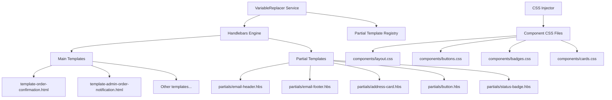
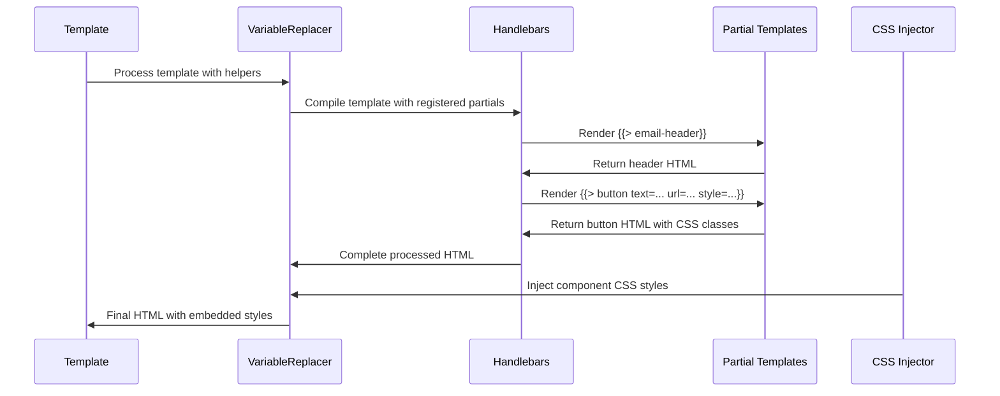

# Design Document: Variable Replacer HTML Cleanup

## Overview

This design document outlines the refactoring of the VariableReplacer service to remove all HTML generation and CSS styling methods, moving these responsibilities to dedicated Handlebars partial templates and CSS component files. The goal is to achieve complete separation of concerns where the VariableReplacer service handles only variable replacement and template processing, while all HTML structure and styling are defined in external files.

The refactoring will maintain backward compatibility and visual consistency while improving maintainability and allowing non-developers to modify email component markup and styling without touching TypeScript code.

## Architecture

### Current Architecture Issues

The current VariableReplacer service contains several methods that violate the separation of concerns principle:

```typescript
// HTML Generation Methods (to be removed)
- generateEmailHeader(): string
- generateEmailFooter(): string
- generateAddressCard(address, title, locale): string

// CSS Generation Methods (to be removed)
- getButtonStyles(style): string
- getStatusBadgeStyles(status): string

// Template Helpers that generate HTML (to be refactored)
- generateButton(text, url, style): string
- generateStatusBadge(status, locale): string
```

### Target Architecture



### Template Processing Flow



## Components and Interfaces

### 1. Partial Template System

**Directory Structure:**
```
backend/src/notifications/templates/
├── partials/
│   ├── email-header.hbs
│   ├── email-footer.hbs
│   ├── address-card.hbs
│   ├── button.hbs
│   └── status-badge.hbs
├── orders/
│   └── [existing templates]
└── auth/
    └── [existing templates]
```

**Partial Template Interfaces:**

```handlebars
<!-- partials/email-header.hbs -->
<div class="email-header">
  <h1 class="company-name">{{companyName}}</h1>
  <p class="company-tagline">{{tagline}}</p>
</div>

<!-- partials/email-footer.hbs -->
<div class="email-footer">
  <p class="copyright">© {{currentYear}} {{companyName}}. All rights reserved.</p>
  <p class="contact-info">
    <a href="mailto:{{supportEmail}}" class="footer-link">{{supportEmail}}</a>
    |
    <a href="{{websiteUrl}}" class="footer-link">{{websiteUrl}}</a>
  </p>
  <p class="disclaimer">{{disclaimer}}</p>
</div>

<!-- partials/button.hbs -->
<a href="{{url}}" class="btn btn-{{style}}">{{text}}</a>

<!-- partials/status-badge.hbs -->
<span class="badge badge-{{status}}">{{statusText}}</span>

<!-- partials/address-card.hbs -->
<div class="address-card">
  <h3 class="address-title">{{title}}</h3>
  <div class="address-content">
    {{#if fullName}}<div class="address-line">{{fullName}}</div>{{/if}}
    {{#if phone}}<div class="address-line">{{phone}}</div>{{/if}}
    {{#if addressLine1}}<div class="address-line">{{addressLine1}}</div>{{/if}}
    {{#if addressLine2}}<div class="address-line">{{addressLine2}}</div>{{/if}}
    {{#if city}}
      <div class="address-line">
        {{city}}{{#if state}}, {{state}}{{/if}}{{#if postalCode}} {{postalCode}}{{/if}}
      </div>
    {{/if}}
    {{#if country}}<div class="address-line">{{country}}</div>{{/if}}
  </div>
</div>
```

### 2. CSS Component System

**Directory Structure:**
```
backend/src/notifications/styles/
├── components/
│   ├── layout.css
│   ├── buttons.css
│   ├── badges.css
│   └── cards.css
├── orders/
│   └── [existing style files]
└── auth/
    └── [existing style files]
```

**CSS Component Files:**

```css
/* components/layout.css */
.email-header {
  text-align: center;
  margin-bottom: 24px;
}

.company-name {
  color: #2c3e50;
  font-family: 'Segoe UI', Tahoma, Geneva, Verdana, sans-serif;
  font-size: 28px;
  font-weight: 600;
  margin: 0;
  text-decoration: none;
}

.company-tagline {
  color: #7f8c8d;
  font-size: 14px;
  margin: 8px 0 0 0;
  font-style: italic;
}

.email-footer {
  text-align: center;
  color: #7f8c8d;
  font-size: 12px;
  line-height: 1.5;
  margin-top: 32px;
  padding-top: 24px;
  border-top: 1px solid #ecf0f1;
}

/* components/buttons.css */
.btn {
  display: inline-block;
  padding: 12px 24px;
  text-decoration: none;
  border-radius: 4px;
  font-weight: bold;
  text-align: center;
  font-size: 16px;
}

.btn-primary {
  background-color: #007bff;
  color: white;
}

.btn-secondary {
  background-color: #6c757d;
  color: white;
}

.btn-success {
  background-color: #28a745;
  color: white;
}

.btn-danger {
  background-color: #dc3545;
  color: white;
}

/* components/badges.css */
.badge {
  display: inline-block;
  padding: 4px 8px;
  border-radius: 4px;
  font-size: 12px;
  font-weight: bold;
}

.badge-pending {
  background-color: #ffc107;
  color: #212529;
}

.badge-confirmed {
  background-color: #28a745;
  color: white;
}

.badge-shipped {
  background-color: #17a2b8;
  color: white;
}

.badge-delivered {
  background-color: #28a745;
  color: white;
}

.badge-cancelled {
  background-color: #dc3545;
  color: white;
}

/* components/cards.css */
.address-card {
  background-color: #f8f9fa;
  padding: 20px;
  margin: 16px 0;
  border-radius: 8px;
  border-left: 4px solid #3498db;
  box-shadow: 0 2px 4px rgba(0,0,0,0.1);
}

.address-title {
  margin-top: 0;
  color: #2c3e50;
  font-family: 'Segoe UI', Tahoma, Geneva, Verdana, sans-serif;
  font-size: 16px;
  font-weight: 600;
}

.address-content {
  color: #34495e;
  font-size: 14px;
  line-height: 1.5;
}

.address-line {
  margin-bottom: 4px;
}
```

### 3. Refactored VariableReplacer Service

**Updated Service Interface:**

```typescript
@Injectable()
export class VariableReplacerService implements IVariableReplacer {
  private readonly handlebars: typeof Handlebars;
  private readonly compiledTemplates = new Map<string, HandlebarsTemplateDelegate>();
  private readonly registeredHelpers = new Set<string>();

  constructor(
    private readonly htmlEscapingService: HTMLEscapingService,
    private readonly designSystemInjector: DesignSystemInjector,
    private readonly emailTranslationService: EmailTranslationService,
    @Inject('VariableReplacerConfig') private readonly config: VariableReplacerConfig
  ) {
    this.handlebars = Handlebars.create();
    this.setupHandlebarsConfiguration();
    this.registerDefaultHelpers();
    this.registerPartialTemplates(); // New method
    this.registerSimpleHelpers(); // Simplified helpers
  }

  // Remove these methods:
  // - generateEmailHeader()
  // - generateEmailFooter()
  // - generateAddressCard()
  // - getButtonStyles()
  // - getStatusBadgeStyles()

  // Simplified helper registration
  private registerSimpleHelpers(): void {
    // Only data transformation helpers, no HTML generation
    this.registerHelper('formatCurrency', (amount: number, currency: string = 'VND') => {
      // Currency formatting logic only
    });

    this.registerHelper('formatDate', (date: string | Date) => {
      // Date formatting logic only
    });

    this.registerHelper('getStatusText', (status: string, locale: string) => {
      // Status text translation only
    });

    // Remove HTML-generating helpers:
    // - generateButton
    // - generateStatusBadge
    // - generateAddressCard
    // - emailHeader
    // - emailFooter
  }

  private registerPartialTemplates(): void {
    // Register all partial templates with Handlebars
    const partialTemplates = [
      'email-header',
      'email-footer',
      'address-card',
      'button',
      'status-badge'
    ];

    for (const partialName of partialTemplates) {
      const partialPath = path.join(this.templatesPath, 'partials', `${partialName}.hbs`);
      const partialContent = fs.readFileSync(partialPath, 'utf-8');
      this.handlebars.registerPartial(partialName, partialContent);
    }
  }
}
```

## Template Migration Strategy

### 1. Update Template Files

**Before (using helpers):**
```handlebars
{{{emailHeader}}}
{{{generateButton translations.viewOrder orderUrl "primary"}}}
{{generateStatusBadge data.status locale}}
{{{generateAddressCard data.shippingAddress translations.shippingAddress locale}}}
{{{emailFooter}}}
```

**After (using partials):**
```handlebars
{{> email-header companyName=translations.companyName tagline=translations.tagline}}

{{> button text=translations.viewOrder url=orderUrl style="primary"}}

{{> status-badge status=data.status statusText=(getStatusText data.status locale)}}

{{> address-card
    title=translations.shippingAddress
    fullName=data.shippingAddress.fullName
    phone=data.shippingAddress.phone
    addressLine1=data.shippingAddress.addressLine1
    addressLine2=data.shippingAddress.addressLine2
    city=data.shippingAddress.city
    state=data.shippingAddress.state
    postalCode=data.shippingAddress.postalCode
    country=data.shippingAddress.country}}

{{> email-footer
    currentYear=currentYear
    companyName=translations.companyName
    supportEmail=supportEmail
    websiteUrl=websiteUrl
    disclaimer=translations.disclaimer}}
```

### 2. CSS Integration

The CSS component files will be automatically injected by the existing CSS injection system. Each main template's corresponding CSS file will import the component CSS files:

```css
/* styles/orders/styles-order-confirmation.css */
@import '../components/layout.css';
@import '../components/buttons.css';
@import '../components/badges.css';
@import '../components/cards.css';

/* Template-specific styles */
.order-details {
  background-color: #f8f9fa;
  padding: 20px;
  margin: 20px 0;
  border-radius: 4px;
}
```

## Data Models

### Partial Template Context

```typescript
interface PartialTemplateContext {
  // Email Header Context
  emailHeader: {
    companyName: string;
    tagline: string;
  };

  // Email Footer Context
  emailFooter: {
    currentYear: number;
    companyName: string;
    supportEmail: string;
    websiteUrl: string;
    disclaimer: string;
  };

  // Button Context
  button: {
    text: string;
    url: string;
    style: 'primary' | 'secondary' | 'success' | 'danger';
  };

  // Status Badge Context
  statusBadge: {
    status: string;
    statusText: string;
  };

  // Address Card Context
  addressCard: {
    title: string;
    fullName?: string;
    phone?: string;
    addressLine1?: string;
    addressLine2?: string;
    city?: string;
    state?: string;
    postalCode?: string;
    country?: string;
  };
}
```

## Correctness Properties

*A property is a characteristic or behavior that should hold true across all valid executions of a system-essentially, a formal statement about what the system should do. Properties serve as the bridge between human-readable specifications and machine-verifiable correctness guarantees.*

### Property 1: HTML Generation Elimination
*For any* method in the VariableReplacer service, the method should not contain HTML markup generation or return HTML strings
**Validates: Requirements 1.1, 1.2, 1.3, 1.4, 1.5**

### Property 2: CSS Generation Elimination
*For any* method in the VariableReplacer service, the method should not contain CSS style generation or return CSS style strings
**Validates: Requirements 2.1, 2.2, 2.3, 2.4, 2.5, 2.6**

### Property 3: Partial Template Registration
*For any* partial template file in the partials directory, the template should be registered with Handlebars and available for use in main templates
**Validates: Requirements 3.1, 3.2, 3.3, 3.4, 3.5, 3.6**

### Property 4: CSS Class Usage
*For any* HTML element generated by partial templates, the element should use CSS classes instead of inline styles
**Validates: Requirements 4.1, 4.2, 4.3, 4.4, 4.5, 4.6, 4.7**

### Property 5: Template Helper Simplification
*For any* template helper function, the helper should return data values or render partial templates, not generate HTML markup
**Validates: Requirements 5.1, 5.2, 5.3, 5.4, 5.5, 5.6, 5.7**

### Property 6: Visual Output Consistency
*For any* email template, the generated HTML output should be visually identical to the output before refactoring
**Validates: Requirements 6.1, 6.2, 6.3, 6.4, 6.5, 6.6**

### Property 7: Directory Structure Compliance
*For any* partial template or CSS component file, the file should be located in the correct subdirectory according to the defined structure
**Validates: Requirements 7.1, 7.2, 7.3, 7.4, 7.5, 7.6, 7.7**

### Property 8: Error Handling Completeness
*For any* missing partial template or CSS component file, the system should provide appropriate error messages or fallback behavior
**Validates: Requirements 8.1, 8.2, 8.3, 8.4, 8.5, 8.6, 8.7**

## Error Handling

### Template Error Handling

```typescript
class PartialTemplateError extends Error {
  constructor(partialName: string, message: string) {
    super(`Partial template '${partialName}' error: ${message}`);
    this.name = 'PartialTemplateError';
  }
}

class CSSComponentError extends Error {
  constructor(componentName: string, message: string) {
    super(`CSS component '${componentName}' error: ${message}`);
    this.name = 'CSSComponentError';
  }
}
```

### Error Recovery Strategy

1. **Missing Partial Templates**: Throw error and fail fast (critical for functionality)
2. **Missing CSS Components**: Log warning and continue with default styles (graceful degradation)
3. **Invalid Partial Template**: Throw error with specific validation details
4. **Invalid CSS Component**: Log warning with validation details and continue

## Testing Strategy

### Unit Tests
- Test partial template registration and rendering
- Test CSS component file loading and validation
- Test helper function simplification (no HTML generation)
- Test error handling for missing files
- Test template context preparation

### Property-Based Tests
- Verify no HTML generation in VariableReplacer methods
- Verify no CSS generation in VariableReplacer methods
- Verify partial template availability and rendering
- Verify CSS class usage instead of inline styles
- Verify visual output consistency across template variations
- Verify directory structure compliance
- Verify error handling completeness

### Integration Tests
- Test complete email generation flow with partial templates
- Test CSS injection with component files
- Test template rendering with various data combinations
- Test error scenarios with missing files
- Test performance impact of partial template system

## Migration Plan

### Phase 1: Create Partial Templates and CSS Components
1. Create partial template files in `templates/partials/`
2. Create CSS component files in `styles/components/`
3. Register partial templates with Handlebars

### Phase 2: Update Template Files
1. Replace helper calls with partial template includes
2. Update CSS imports to include component files
3. Test visual consistency

### Phase 3: Refactor VariableReplacer Service
1. Remove HTML generation methods
2. Remove CSS generation methods
3. Simplify template helpers
4. Update helper registration

### Phase 4: Testing and Validation
1. Run comprehensive test suite
2. Validate visual output consistency
3. Test error handling scenarios
4. Performance testing

### Phase 5: Cleanup
1. Remove unused code and imports
2. Update documentation
3. Final validation